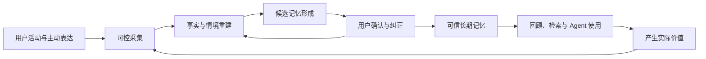

# Ameme 产品系统框架 v0.1

更新日期：2026-07-13  
状态：框架已于 2026-07-13 确认；进入 R0 用户任务与 R1 多端信息源调研，尚未定义 MVP

## 1. 为什么先做这张框架

Ameme 同时涉及多端采集、AI 理解、长期记忆、数据治理和多种用户场景。如果先从某个端或某项技术开始，很容易得到一个局部工具，而不是可以逐步扩展的个人记忆系统。

因此后续顺序调整为：

1. 定义稳定的能力层。
2. 定义用户在不同端和不同场景中的体验路径。
3. 把每个体验动作映射到数据对象、存储位置和权限。
4. 为每层定义目标、成熟度和验证问题。
5. 逐层调研和实验。
6. 从框架中裁出 Prototype、MVP 和可用版本。

## 2. 核心产品闭环

Ameme 的最小完整闭环不是“采集 -> 总结”，而是：

核心质量标准：

- 采集有边界。
- 事实有来源。
- 推断有置信度。
- 重要记忆可确认。
- 使用有权限。
- 删除能真正传播到索引、摘要和同步副本。

## 3. 能力分层

### L0：信任、身份与数据控制层

目标：让用户始终知道系统正在做什么，并真正控制数据。

核心能力：

- 用户身份、设备身份和授权主体。
- 分来源授权，而不是一次性取得所有权限。
- 采集状态可见、暂停、场景模式和排除规则。
- 敏感信息识别、端侧脱敏和禁止采集区域。
- 数据查看、纠正、删除、保留期、导入和导出。
- 本地密钥、云端加密、设备撤销和访问审计。

层目标：用户敢于持续开启至少一个数据来源；系统不存在用户无法解释或无法删除的数据。

关键指标：授权完成率、持续开启率、主动暂停/排除成功率、删除完成率、隐私事故数。

### L1：多源获取层

目标：用最低摩擦获得足以重建事件的信号，而不是默认保存一切。

来源类型：

- Desktop：活跃应用、窗口、浏览器、文件、Git、终端、日历、会议。
- Mobile：照片、地点/活动建议、健康摘要、截图、账单导入、语音补充。
- Communication：邮件、IM、会议转录和日历。
- Life services：游戏战绩、运动、音乐、出行和消费平台。
- Active capture：快捷键、分享菜单、语音、文本、截图和文件投递。
- Agent sources：ChatGPT、Claude、Codex 等经用户选择导出的会话或结果。

采集模式：

- Passive：用户授权后后台产生低风险信号。
- One-click：用户按一次按钮捕获当前上下文。
- Import：用户导入账单、聊天导出、照片或历史文件。
- Connector：通过官方 API 或 OAuth 同步。
- Prompted：系统在信息不足时提出一个可跳过的问题。

层目标：每个目标场景找到“最小充分数据组合”。

关键指标：有效信号覆盖率、无用信号比例、采集资源占用、权限拒绝率、数据源稳定性。

### L2：标准化与证据层

目标：把不同端的数据转换成统一、可追溯、可去重的事实对象。

核心能力：

- 统一时间、来源、设备、时区和用户主体。
- 内容指纹、事件去重、断点续传和顺序修复。
- 原始内容与解析结果绑定。
- 证据强度、数据敏感度和可使用范围标记。
- 来源适配器版本管理。

核心对象：`Signal` 和 `Event`。

层目标：同一事实不会因多端同步被重复计算；任何上层结论都能回到证据。

关键指标：解析成功率、重复率、时间线错序率、来源可追溯率、敏感度标记准确率。

### L3：情境理解层

目标：从离散事件中还原“用户在做什么、属于哪个场景、与谁和什么相关”。

核心能力：

- 活动分段和跨应用会话合并。
- 人物、项目、地点、应用、文档和主题实体识别。
- 工作、学习、生活、出行、娱乐等场景分类。
- 任务、决定、结果、承诺和未完成事项抽取。
- 多源冲突处理和不确定性表达。

核心对象：`Episode`、`Entity`、`Relation`。

层目标：让用户看到的是有意义的一段经历，而不是应用使用流水账。

关键指标：Episode 边界准确率、项目归属准确率、重要事项遗漏率、错误合并率、人工修正时间。

### L4：记忆形成与治理层

目标：决定哪些内容值得在未来被记住，以及记多久、以什么强度被使用。

核心能力：

- 区分事件记忆、语义事实、偏好、人物关系、目标、习惯和程序性知识。
- 重要性、新颖性、重复性、情绪/关系敏感度和未来价值评分。
- 候选记忆合并、版本、冲突、衰减、失效和归档。
- AI 推断、用户明确表达和系统事实分别标记。
- 高影响记忆进入确认队列。

核心对象：`MemoryCandidate`、`Memory`、`MemoryRevision`。

层目标：减少“记住了错误的我”和“永久保留过时判断”。

关键指标：记忆接受率、纠正率、冲突率、过期记忆召回率、每条有效记忆的处理成本。

### L5：检索、分析与上下文组装层

目标：针对具体任务取回正确、足够且获准使用的上下文。

核心能力：

- 精确、全文、语义、时间、实体关系和混合检索。
- 来源引用、置信度、时间有效性和权限过滤。
- 日/周/月回顾和跨周期模式分析。
- 为不同 Agent 和任务生成最小上下文包。
- 防止把推断当事实、把旧偏好当当前偏好。

核心对象：`Query`、`ContextPack`、`Insight`。

层目标：不是返回最多内容，而是让用户或 Agent 获得正确且可解释的帮助。

关键指标：有效召回率、错误引用率、上下文利用率、查询满意度、单次上下文成本。

### L6：产品体验与开放接口层

目标：把底层能力组合成不同用户能理解和反复使用的场景。

体验能力：

- 今日时间线与“我的一天”。
- 快速捕获与补充。
- 记忆确认、纠错和删除。
- 项目回顾、人物回顾、生活回顾和年度回顾。
- 搜索、对话和主动提醒。
- MCP、Skill、API 和导出。

层目标：形成一个用户会反复回来的价值闭环，而不是只有后台数据。

关键指标：核心路径完成率、次周/四周留存、回顾打开率、主动查询率、Agent 调用后的有用率、付费转化。

## 4. 多端职责

“多端”不意味着每个端复制同一套功能。建议职责如下：

端能力的设计依据不是技术能力的简单并集，而是三个因素：

1. 该端服务的目标用户及其高频任务。
2. 设备自身适合的交互属性，例如桌面适合持续工作上下文，手机适合现场捕获和轻量确认。
3. 该端能合法、稳定、可解释获得的信息源。

因此，同一能力在不同端可以采用不同实现、不同默认权限和不同数据粒度。

| 端 | 主要职责 | 典型场景 | 默认不承担 |
|---|---|---|---|
| Desktop Agent | 工作信号采集、本地处理、权限控制 | 浏览、文件、代码、文档、会议 | 大众生活入口 |
| Browser Extension | 当前网页语义、一键保存、域名排除 | 调研、阅读、网页任务 | 独立长期存储 |
| Mobile App | 生活捕获、确认、快速补充、通知 | 照片、位置建议、账单截图、语音 | 无边界后台读取其他 App |
| Web/Desktop UI | 时间线、回顾、搜索、设置和数据管理 | 日报、周报、项目历史 | 高权限系统采集 |
| Share Sheet / 系统快捷方式 | 一键把当前对象交给 Ameme | 图片、链接、文件、账单 | 被动长期监听 |
| MCP / Skill / API | 让用户选择的 AI 查询或写入上下文 | Coding Agent、写作、规划 | 绕过用户权限和审计 |

### 通用查看与隔离空间

查看和管理采用“通用 + 隔离”模型：

- 通用视图：在用户授权范围内提供统一时间线、统一搜索和跨场景回顾。
- 隔离空间：工作、个人、家庭、健康、财务以及用户自建空间分别拥有数据边界、密钥、保留期和共享策略。
- 跨空间使用：默认禁止；用户可对某次查询、某个 Agent 或某段时间建立临时授权。
- 云端共享：不是整库同步的同义词。用户可以只同步设备配置、结构化事件、已确认记忆、指定原始内容或加密备份中的一部分。

## 5. 用户体验路径与数据流

### 路径 A：首次建立信任

`安装 -> 选择目标场景 -> 只授权所需来源 -> 预览会采什么 -> 设置排除项 -> 生成第一段示例时间线`

涉及层：L0、L1、L2。  
产生数据：设备、授权、连接器配置、排除规则、少量 Signal/Event。  
成功标准：用户能复述采集边界，并能找到暂停和删除入口。

### 路径 B：工作中的无感记录

`桌面活动 -> 本地低风险信号 -> Event -> 自动分段为 Episode -> 今日时间线`

涉及层：L1、L2、L3。  
产生数据：窗口/文件/Git 等 Signal、Event、工作 Episode。  
成功标准：不要求用户重写当天经历，仍能覆盖主要工作事项。

### 路径 C：关键时刻一键记录

`快捷键/分享 -> 捕获当前页面或文件 -> 用户可补一句话 -> 绑定当前 Episode -> 提升重要性`

涉及层：L0 至 L4。  
产生数据：显式授权的内容、用户备注、重要性信号、MemoryCandidate。  
成功标准：一次操作在数秒内完成，并明显改善后续总结。

### 路径 D：晚间确认“我的一天”

`跨端时间线 -> AI 生成事实摘要与候选记忆 -> 用户接受/修改/删除/补充 -> 写入可信 Memory`

涉及层：L3、L4、L6。  
产生数据：摘要、修订、确认状态、反馈信号。  
成功标准：用户在很短时间内完成核对，且觉得重要事项没有被歪曲。

### 路径 E：需要时找回过去

`自然语言问题/按项目查看 -> 权限过滤 -> 混合检索 -> 带证据回答 -> 打开原始上下文`

涉及层：L0、L5、L6。  
产生数据：查询、结果反馈、可选的 Insight。  
成功标准：答案能解决当前任务，并能回到来源。

### 路径 F：在其他 AI 中调用

`Agent 请求 -> 展示请求目的和范围 -> 生成最小 ContextPack -> 返回带来源信息 -> 记录访问审计`

涉及层：L0、L5、L6。  
产生数据：授权、ContextPack、调用日志。  
成功标准：减少用户重复解释，同时不会把全部记忆暴露给一个任务。

### 路径 G：跨周期理解自己

`周/月/年触发 -> 聚合 Episode 和 Memory -> 生成可核验趋势 -> 用户标记有用/错误 -> 更新记忆治理`

涉及层：L4、L5、L6。  
产生数据：Insight、证据集合、用户反馈。  
成功标准：给出事实支持的变化和模式，而不是泛泛的性格判断。

## 6. 数据对象与存储分层

Ameme 不要求输入来源预先结构化。网页、截图、语音、照片、聊天导出、账单图片、文件、游戏页面和用户的一句话都可以作为输入。结构化是系统处理的结果，不是数据接入的前提。

统一处理链为：

`获取原始信息 -> 识别格式与来源 -> 分类和敏感度判断 -> 内容解析 -> 事实/情境抽取 -> 记忆判断 -> 分层存储 -> 按场景使用`

对无法可靠解析的数据，系统应保留原始证据和有限元数据，标记“待处理”或“低置信”，不能为了完成结构化而编造事实。

### 数据平面

| 数据层 | 主要内容 | 推荐位置 | 默认生命周期 | 关键要求 |
|---|---|---|---|---|
| P0 配置与密钥 | 身份、设备、授权、密钥、排除规则 | 本地安全存储；必要配置加密同步 | 账户/设备生命周期 | 密钥与业务数据分离 |
| P1 Raw Vault | 截图、音频、正文、导入文件等原始证据 | 默认本地加密；云端可选 | 短期或用户自定 | 高敏感、可单项删除 |
| P2 Event Store | 标准化 Signal/Event 与来源指针 | 本地数据库；可选加密同步 | 中期至长期 | 不可丢失来源和权限标签 |
| P3 Context Store | Episode、Entity、Relation | 本地为主；跨端需要同步 | 长期、可重建 | 保留模型版本与置信度 |
| P4 Memory Store | 候选、已确认记忆、版本与失效状态 | 用户主库；端到端加密同步候选 | 长期 | 事实/推断/确认严格区分 |
| P5 Derived Index | 全文、向量、图索引、缓存 | 尽量本地；按需在云端重建 | 可删除、可重建 | 不是唯一真相源 |
| P6 Output & Audit | 日报、Insight、ContextPack、访问/删除日志 | 本地 + 用户选择同步 | 分类型保留 | 输出也必须响应源数据删除 |

### 存储原则

1. 本地优先不等于永不使用云端；它表示高敏原始数据默认留在设备上，云端处理必须按任务授权。
2. 数据真相源与索引分开；向量库和图索引都不作为唯一存储。
3. 原始证据、AI 解析、AI 推断、用户确认使用不同字段和状态，不覆盖彼此。
4. 删除采用传播模型：源数据删除后，相关 Event、Episode、Memory、索引、摘要和同步副本都要重新计算或删除。
5. 跨端同步优先同步结构化事件和已确认记忆；是否同步原始内容由用户逐来源选择。
6. Notion、Obsidian 和文件目录作为导出/展示目标，不作为唯一底层数据库。

## 7. 各层成熟度目标

统一使用四级成熟度，避免某层做得很深、核心闭环却断裂：

| 等级 | 含义 | 通过条件 |
|---|---|---|
| M0 可行性 | 技术能跑通 | 用模拟/个人数据完成单次闭环 |
| M1 MVP | 核心价值可验证 | 少量目标用户连续使用，关键指标可测 |
| M2 可用 | 普通目标用户可稳定使用 | 安装、权限、错误恢复、删除、性能和隐私达到发布要求 |
| M3 可扩展 | 支持更多端、场景和用户 | 连接器、Schema、同步和权限可以标准化扩展 |

MVP 不要求所有层都达到 M1，但 L0、L2 和 L4 不能被跳过；否则即使能生成漂亮日报，也无法验证可信记忆产品。

## 8. 调研应按层进行

### R0：用户任务和信任研究

- 不同用户最想找回的是事实、决定、关系、情绪还是成长？
- 什么采集方式会让用户关闭产品？
- 用户愿意确认哪些记忆，哪些必须自动化？
- 工作、生活和家庭数据是否应拥有不同的 Vault 与权限？

输出：用户分群、任务优先级、信任模型和付费价值假设。

### R1：端与数据源可行性

- Windows/macOS/iOS/Android 各自能稳定得到哪些信号？
- 浏览器、文件、Git、日历、照片、位置、账单、游戏和 IM 的官方接口与限制是什么？
- 每个场景的最小充分数据组合是什么？

输出：数据源目录、权限矩阵、接入成本和合规风险。

### R2：数据与记忆模型

- Signal/Event/Episode/Memory 的字段和边界如何定义？
- 记忆冲突、失效、衰减和用户修订如何表达？
- 删除如何跨派生数据传播？

输出：Schema、状态机、数据生命周期和删除协议。

### R3：AI 管线与成本

- 哪些步骤用规则、本地小模型、Embedding 或云端大模型？
- 何时批处理，何时实时？
- 如何评测时间线重建、事件归属、记忆质量和洞察可信度？

输出：模型路由、Prompt/算法、评测集、Token/算力/存储成本。

### R4：体验与商业验证

- 日报、搜索、项目回顾和 Agent 上下文哪个是首个高频价值？
- 多端中哪个是主入口，哪个只是伴侣端？
- 用户为容量、来源、高级分析还是 Agent 接口付费？

输出：体验原型、套餐假设、试用机制和留存指标。

## 9. 版本不是功能清单，而是闭环成熟度

### Prototype：证明能够形成一天

- 一个桌面端、少量数据源、单用户、本地数据库。
- 能从真实信号重建 Episode，生成有证据的“我的一天”。
- 用开发界面核对，不要求完整产品体验。
- 目标：验证 L1-L4 的技术可行性和最小充分数据组合。

### MVP：证明用户愿意持续确认和使用

- 一个主端 + 必需的 Capture 入口。
- 完整覆盖授权、采集、时间线、候选记忆、确认、检索和删除。
- 只服务一个明确用户群和一个主要场景。
- 可以有 MCP，但前提是可见的权限和访问日志。
- 目标：验证核心价值、信任和 2-4 周留存。

### Usable v1：可以交给非项目成员稳定使用

- 安装升级、权限引导、资源控制、错误恢复、备份/导出和诊断完备。
- 关键数据源稳定，误采与漏采可被发现。
- 跨设备至少支持结构化记忆同步或明确的单机边界。
- 有可执行的隐私说明、删除机制、成本和订阅方案。
- 目标：验证可发布性、付费和规模化支持成本。

### Multi-context v2：扩展到多端生活记忆

- Mobile 生活捕获、照片/地点/账单等用户选择的来源。
- 工作、生活、家庭等空间隔离与授权。
- 跨场景实体和记忆治理。
- 面向普通用户的简化体验，不要求理解 MCP 或本地数据库。

### Platform v3：个人记忆基础设施

- 标准化 Connector SDK、MCP、Skill、API 和导入导出协议。
- 第三方 Agent 按用途请求最小 ContextPack。
- 多模型、本地/云端策略和细粒度数据授权。
- 用户可以迁移自己的记忆，不被 Ameme 锁定。

## 10. 当前需要确认的不是 MVP，而是框架

以下四项已于 2026-07-13 确认：

1. 认可 L0-L6 七层能力模型。
2. 各端根据目标用户、设备属性与可获取信息源差异化设计；查看管理采用通用视图与隔离空间结合。
3. 云端只共享用户选择的数据；输入不要求天然结构化，由系统负责获取、分类、处理、存储和使用。
4. 认可 `分层调研 -> Prototype -> MVP -> Usable v1 -> 多场景扩展` 的推进顺序。

下一步执行 R0 和 R1：用户任务/信任研究，以及各端数据源和权限可行性调研。调研结论回来后，再决定第一个 Prototype 从哪个端和场景切入。
