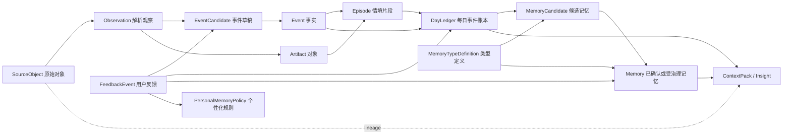

# Ameme 非结构化信息处理与存储框架 v0.4

更新日期：2026-07-13\
状态：第 4 步已由产品负责人确认；等待后续样本与 Prototype 验证

## 1. 核心原则

Ameme 的输入不要求结构化，也不要求每份输入都能变成“事件”。系统要先忠实保存来源和处理状态，再逐步形成可使用的信息。

统一链路：

```text
获取 Acquire
  -> 登记 Register
  -> 分类 Classify
  -> 安全处理 Sanitize
  -> 解析 Parse
  -> 事件草稿 EventCandidate
  -> 情境化 Event / Episode
  -> 每日事件账本 DayLedger
  -> 分层存储 Store
  -> 总结 / 记忆 / 按用途组装 Use
```

任何环节失败都允许降级；失败不能导致系统编造下一层结果。

### 1.1 第 4 步的候选判断

本轮不先确定数据库品牌，而先确认四种逻辑记录必须分开：

| 逻辑层 | 回答的问题 | 典型对象 | 是否允许被上层覆盖 |
|---|---|---|---|
| 来源证据层 | 系统实际获得了什么 | `SourceObject`、原始文件、权限快照 | 否，只能追加状态或按规则删除 |
| 解析观察层 | 从来源中可靠读出了什么 | `Observation`、字段级来源与置信度 | 否，新解析结果形成新版本 |
| 事件记录层 | 当前最可信地认为发生了什么 | `EventCandidate`、`Event`、`Episode`、`DayLedger`、Revision | 否，通过修订、合并和拆分演进 |
| 派生使用层 | 为某次查看或任务怎样表达和使用 | Timeline、Summary、Memory、Insight、ContextPack、索引 | 可以重算，但必须引用生成依据 |

贯穿四层的权限、空间、敏感度、保留期、同步策略和 lineage 属于治理元数据，不作为第五份内容副本。

这意味着：用户看到的一条“晚上和朋友聚餐”，不是把照片、位置和用户补充混成一段不可追溯的 AI 文案；它是一个 Event/Episode 当前版本，事实字段分别引用照片时间、地点候选和用户后补描述。总结只读取这个版本，不能成为新的事实来源。

## 2. 获取：先形成 Source Object

无论输入来自 API、截图、文件、语音还是一个按钮，都先包装成统一的 `SourceObject` 信封：

| 字段组 | 内容 |
|---|---|
| Identity | source_object_id、用户、设备、空间 |
| Origin | 来源 App/Connector、获取方式、原始标识 |
| Time | 获取时间、内容发生时间、时区 |
| Format | MIME、扩展名、编码、大小、语言候选 |
| Permission | 平台 scope/entitlement、用户触发或授权来源、组织策略、用途、有效期、可否云处理 |
| Sensitivity | 初始敏感度和可能包含的敏感类型 |
| Storage | 原始内容位置、hash、加密 key 引用 |
| Processing | 当前状态、解析器版本、失败原因、重试次数 |

`SourceObject` 只说明“系统获得了一个对象”，不宣称已经理解它。

### 2.1 Acquisition Contract

Connector 每次获取前必须形成可审计的 `AcquisitionContract`，至少包含：

- `purpose`：为什么需要这份数据。
- `spaces`：允许写入哪些隔离空间。
- `source_scope`：当前页、选定目录、指定频道、时间段或数据类型。
- `interaction_level`：自动元数据、系统候选、一次 Capture 或显式会话采集。
- `processing_location`：设备、本地网络或云端，以及允许的模型提供方。
- `retention`：原始对象、派生对象和日志分别保留多久。
- `revocation`：导航、撤权、移除 Connector、删除来源或组织管理员变更时如何停止。

例如 Chrome `activeTab` 的授权随用户触发产生，同 origin 内导航可继续，跨 origin 后撤回；这一平台事实必须进入 SourceObject，而不能只保存在扩展内部状态。

## 3. 分类：采用多维标签，不使用单一目录

同一份信息可以同时属于多个维度。例如一张游戏结算截图可以是：Mobile Capture、Image、Personal Space、Game、包含队友昵称、中敏、短期保留原图、长期保留战绩事件。

分类分两次完成：

1. **获取时分类**：不依赖理解正文，先确定来源、格式、空间、权限、敏感度和保留策略，决定能否继续处理。
2. **解析后分类**：根据 Observation 判断它描述的活动、对象、场景、状态或结果，以及能否成为 EventCandidate。

同一对象不强制只有一个“所属类别”。用户界面可以只显示一个主场景和少量标签，底层仍保留多维分类。

### 3.1 来源分类

- Device：Desktop、Mobile、Wearable、Cloud service。
- Acquisition：Passive、One-click、Import、Connector、Prompted。
- Producer：用户本人、他人、应用、传感器、AI、系统。

### 3.2 内容形态分类

- Text、Image、Audio、Video、Document、Web、Structured Record、Mixed。
- 原始、缩略、转写、OCR、摘要等派生关系另行记录。

### 3.3 空间与主体分类

- Work、Personal、Family、Health、Finance、Custom。
- 内容涉及本人、他人、组织、未成年人或未知主体。

### 3.4 敏感度分类

- Public：公开内容。
- Personal：普通个人信息。
- Sensitive：精确位置、私聊、客户资料、未发布工作、家庭内容。
- Restricted：密码、密钥、身份证、银行卡、医疗原始数据等。

Restricted 默认禁止上传云模型，并优先在获取阶段阻断或脱敏。

### 3.5 语义用途分类

- Activity：发生了一个动作。
- Artifact：产生或使用了一个对象，例如文档、照片或网页。
- Event：具有时间和意义的可核验事实。
- State：某段时间的状态，例如位置、运动、项目阶段。
- Communication：人与人或人与 Agent 的沟通。
- Candidate Knowledge：可能形成事实、偏好、目标或方法的内容。
- Unknown：尚不能可靠分类。

Unknown 是正常状态，不要求所有输入立即进入 Event。

### 3.6 事件分类

进入 EventCandidate 后再增加面向“人的一天”的分类，避免把来源类型当作事件类型：

| 维度 | 示例 | 作用 |
|---|---|---|
| 主场景 | 工作、学习、出行、家庭、消费、健康、娱乐、社交、自定义 | 组织“我的一天”和空间默认值 |
| 事件形态 | 活动、沟通、决定、结果、状态变化、里程碑、体验 | 决定描述模板和合并规则 |
| 参与关系 | 独自、与人、与组织、与 Agent、未知 | 判断人物与他人隐私 |
| 重要性 | 日常、高光、承诺、风险、用户标记 | 决定复盘和保留优先级，不决定事实真假 |
| 证据状态 | 已确认、高置信推断、低置信候选、冲突、仅用户陈述 | 决定展示语气和是否需要反馈 |

分类与事实分开：把一件事标为“工作”或“重要”不会改变它是否真实；用户也可以只修改分类而不修改事件事实。

## 4. 处理：本地安全处理优先

### Stage A：低成本预处理

- hash、去重、文件类型检测、编码和语言识别。
- 图片 EXIF、音视频时长、文档页数等元数据。
- 规则和本地模型检测密码、密钥、证件、财务和健康信息。
- 根据空间、来源和用户规则判断能否继续处理。

### Stage B：内容解析

- Image：OCR、版面、视觉分类、可选关键对象识别。
- Audio：语音活动检测、转写、说话人分段。
- Video：关键帧、音轨转写、场景切分。
- Document：原格式解析；失败后渲染/OCR。
- Web：DOM/正文/元数据；失败后用户显式截图 OCR。
- Structured API：验证 Schema、来源签名、分页和重复事件。

解析结果是 `Observation`，必须保留到 SourceObject 的 lineage。

### Stage C：情境化

先把 Observation 转成带置信度的 `EventCandidate`，再把多个候选和已核验事实合并成：

- Artifact：用户处理的对象。
- Event：可核验事实。
- Episode：围绕同一意图的一段经历。
- Entity/Relation：人物、项目、地点、游戏、文档等关联。
- DayLedger：按日期组织的 Event/Episode、来源、修订和已知覆盖缺口。

事件描述采用三层表达：

1. **事实字段**：时间、主体、动作、对象、地点、结果、来源和字段级置信度。
2. **用户陈述**：用户补充的意图、感受、意义、结果说明和重要性；保存原始表述及其所指时间。
3. **展示文本**：标题、摘要和详情，由前两层生成，便于用户查看，可以重算，不能反向覆盖事实和用户原话。

用户改写展示文案时，系统先判断是“只改表达”还是“补充/纠正事实”。前者只产生展示 Revision；后者产生 EventRevision 或 UserAddendum。

### Stage C.1：多源事件归并

多端归并不是把同一时间段的所有信号放进一个事件，而是先做硬边界，再做相似性判断：

**默认禁止自动合并的硬边界：**

- 不同用户或不同隔离空间，除非用户明确允许跨空间关联。
- 时间事实明确冲突，且不能由时区、延迟同步或近似时间解释。
- 用户已明确拆分、标记无关或来源权限不允许共同使用。
- 一个来源属于他人活动，无法可靠证明用户本人参与。

**允许计算同一事件可能性的维度：**

- 时间是否连续或存在合理的开始—进行—结果关系。
- 地点、人物、项目、对象、网页、文档、游戏或日历主题是否相同。
- 不同来源是否互补，例如日历给计划、照片给现场、Agent 给过程、用户补充给意图和结果。
- 是否出现明显场景切换、长时间中断、冲突结论或不同意图。

归并只产生三种结果：

| 结果 | 系统动作 |
|---|---|
| 高可信同一事件 | 自动合并，保留所有候选 ID、字段来源和合并理由 |
| 可能相关但证据不足 | 保持独立并建立 `related_to` 关系，必要时低摩擦询问用户 |
| 明显不同或冲突 | 保持独立，冲突字段进入待核验状态 |

Event 是可独立说明“发生了什么”的最小记录；Episode 是围绕同一意图的一段经历，可以包含多个 Event。多张连拍照片可能只支持一个 Event；“出发—到达—开会—根据结论修改方案”则可以是一个 Episode 下的多个 Event。

字段融合采用“字段权威”而不是“来源全局权威”：用户对自己的意图、感受和意义最权威；支付/游戏/健康平台对其系统结果更权威；Agent 日志对执行过程更权威，但不能单独证明现实任务已经完成。任何自动融合都保存合并决策和可撤销的 Revision。

### Stage D：记忆形成

DayLedger 保存后，再根据重复、重要性、未来用途、用户表达和置信度生成 `MemoryCandidate`。高影响推断必须等待用户确认；确认后形成有版本的 `Memory`。不是每个 Event 都必须升级为长期记忆。

### Stage E：输出与反馈

从 DayLedger 生成 Timeline、Daily Brief、Insight 或 ContextPack。Daily Brief 是展示结果，不是一天的唯一存储。用户的接受、修改、删除和“无用”反馈回写事件修订、分类器与记忆治理，但不覆盖原始证据。

反馈不能只覆盖“对/错”。系统需要同时记录事实纠错、重要性、遗漏补充、记忆类型、合并/拆分、空间/保留策略，以及记忆在真实任务中是否有用。统一形成只追加的 `FeedbackEvent`；重复反馈可以派生可撤销的 `PersonalMemoryPolicy`，但不能静默改写 `SourceObject`、`Observation` 或历史 `MemoryRevision`。

Event/DayLedger 字段与描述规则见 `architecture/Event与DayLedger最小模型.md`；详细反馈机制见 `product/记忆反馈与类型覆盖框架.md`，反馈对象和存储约束见 `architecture/记忆类型与反馈事件模型.md`。

## 5. 数据对象的关系



需要额外增加 `LineageEdge`：记录任意派生对象来自哪些源、使用了哪个解析器/模型和 Prompt、何时生成。它是解释、重算和删除传播的基础。

`FeedbackEvent`、`MemoryRevision` 和 `MemoryTypeDefinition` 同样需要 lineage 和版本。删除某条反馈时，应重算由它派生的个性化规则和覆盖快照，而不是删除原始证据。

## 6. 存储建议

### 6.1 本地逻辑组件

| 组件 | 保存内容 | 首阶段实现建议 |
|---|---|---|
| Secure Config | 身份、设备、空间密钥、Connector token | OS keychain/credential vault |
| Raw Vault | 原始文件、截图、音频、网页快照 | 加密文件目录 + content hash；不放进数据库大字段 |
| Catalog | SourceObject、权限、处理状态、lineage | SQLite |
| Context Store | Observation、EventCandidate、Artifact、Event、Episode、DayLedger、Entity | SQLite 关系表 + JSON 扩展字段 |
| Memory Store | Candidate、Memory、Revision、类型定义、FeedbackEvent、个人规则、覆盖快照和失效状态 | SQLite，独立版本/事件表 |
| Search Index | 全文、向量和可选关系索引 | 可重建的本地派生索引 |
| Output/Audit | Brief、Insight、ContextPack、访问和删除日志 | SQLite + 可导出文件 |

首阶段不需要单独图数据库。关系和 lineage 先用 SQLite 表表达，实际查询证明需要后再引入图存储。

### 6.2 双主入口下的跨端存储

`Personal Event Core` 是逻辑核心，不是远端数据中心。Native Mobile 和 Agent 集成都先在来源端形成 SourceObject，并执行权限检查、敏感识别和最小解析，再按空间策略向已批准 LAN peer 发送允许同步的结构化对象。

```text
Native Mobile 本地暂存 ─┐
                         ├─ 获准的结构化同步/归并 ─> Event / Episode / DayLedger
Agent MCP/Skill/API ─────┘                                      │
                                                               ├─ 各端时间线与补充
各端 Raw Vault 留在原设备或按对象选择加密同步 <─────────────────┘
```

按数据层设置不同默认值：

| 数据 | 默认位置 | 跨端策略 |
|---|---|---|
| 原始照片、音频、文件、网页正文 | 来源设备的加密 Raw Vault 或原对象引用 | 默认不全量同步；用户按来源、对象或空间开启 |
| SourceObject 元数据、Observation | 来源设备；允许选择性结构化同步 | 只同步归并所需最小字段和 lineage |
| Event、Episode、DayLedger、Revision | 当前空间的逻辑核心 | 用户开启该空间同步后跨端共享，是“我的一天”的主要同步对象 |
| Summary、Memory、索引、向量 | 可重算派生存储 | 按用途生成；失效后重算，不作为同步真相源 |
| 权限、删除、访问审计 | 各端；账户服务只持身份/设备元数据 | 撤权和删除必须传播到所有已知 LAN peer 副本及派生物 |

每个空间至少支持三种模式；加密与可见性已由 SDR-001/002 决定为设备本地 + 已认证 LAN peer，身份服务不读取记忆内容：

- `device_local`：只在指定设备使用，不参与跨端完整时间线。
- `structured_sync`：同步获准的结构化事件和修订，原始内容默认留在设备。
- `selected_raw_sync`：在上一模式上，额外同步用户选择的原始对象。

如果某个来源保持 `device_local`，其他端必须把对应时段显示为“该设备可能有未同步记录”，不能假装跨端已经完整覆盖。

### 6.3 MVP 的跨端同步不是用户数据云

MVP 采用同账户已批准设备之间的 LAN Peer Sync：

- Structured sync：同网时同步用户选择的 Event/Episode/Revision/DayLedger。
- Raw sync：只同步用户逐项选择的原始对象；默认留在来源设备。
- SourceLocator：保存不暴露完整路径的本地源索引，帮助重新定位但不保证源仍存在。
- AI processing：只向获准模型上传当前任务需要的最小片段，结果返回本地并记录 lineage；这不构成记忆数据云。
- Sharing：Agent 只获得目的、空间、类型和有效期约束下的 ContextPack。

每个空间有独立 `sync_policy` 和设备密钥。身份服务只处理登录、会话和设备归属，不保存 Event、Raw 或索引。未来 encrypted backup/cloud relay 必须新增 PIA/SDR/ADR，不能沿用本段授权。

## 7. 通用查看如何跨隔离空间工作

统一时间线和搜索采用“查询时联邦聚合”：

1. 用户在当前界面选择可见空间。
2. 查询被拆到各获准空间的索引。
3. 各空间只返回满足权限和敏感度规则的候选。
4. UI 合并显示，不迁移底层数据。
5. 跨空间形成新 Insight 时，用户选择它属于哪个空间，以及是否保留来源引用。

MCP/API 同样必须声明 `purpose + requested_spaces + time_range + data_types`，系统生成最小 ContextPack，而不是给第三方 Agent 数据库直连权限。

## 8. 删除、撤回和重算

删除流程不能只删除原始文件：

1. 标记 SourceObject 删除请求并停止后续使用。
2. 根据 LineageEdge 找出 Observation、Event、Episode、Memory、Insight、ContextPack 和索引。
3. 对完全依赖该来源的对象删除；对多来源对象重新计算置信度和内容。
4. 删除本地 Raw Vault、索引、缓存和允许删除的审计内容。
5. 向所有已知 LAN peer、仍在有效期内的模型处理副本和共享接收方传播撤回。
6. 生成用户可查看的删除结果，不包含已经删除的敏感正文。

首阶段必须至少证明本地删除传播可实现；否则不能声称“用户拥有数据”。

## 9. 如何使用数据

| 使用场景 | 主要数据层 | 是否需要原始内容 | 输出要求 |
|---|---|---|---|
| 今日时间线 | Event、Episode | 通常不需要 | 可展开证据 |
| 每日补漏与确认 | DayLedger、EventCandidate、Event、Episode | 纠错时按需 | 先按时间补事件，再讨论长期记忆 |
| 精确找回 | Event、Artifact、全文索引 | 可能需要 | 返回原对象位置 |
| 项目回顾 | Episode、Memory、Entity | 按需 | 有时间和来源 |
| 长期趋势 | Memory、聚合 Event | 通常不需要 | 明示样本和不确定性 |
| Agent 上下文 | Memory、Episode、Artifact 摘要 | 最小必要片段 | 权限、时效和来源元数据 |
| 导出到 Notion/Obsidian | 用户选择的 Output/Memory | 用户决定 | 可迁移、稳定格式 |

## 10. 下一步验证

框架确认前不启动样本和 Prototype。确认后按以下顺序验证：

1. 用一组移动端来源和一组 Agent 来源验证它们能形成 SourceObject/Observation，且不会被误当成同一事件。
2. 用同一现实事件的照片、日历、Agent 过程和用户补充验证字段级融合、相关但不合并、拆分和撤销。
3. 验证 `device_local` 与 `structured_sync` 并存时，各端能正确显示同步状态和覆盖缺口。
4. 用 Work/Personal 两空间验证禁止默认跨空间合并。
5. 模拟删除一个 SourceObject，确认 Event、DayLedger、Summary、Memory 和索引都能响应。
6. 测量分类、归并、描述生成各阶段的准确率、耗时、成本和人工修正负担。
7. 用“最重要但漏掉的一件事”建立遗漏分母，验证类型覆盖是否会随反馈扩展。
8. 用不含 Git/工作区的通用来源跑通 DayLedger，证明专业工具不是产品成立前提。
