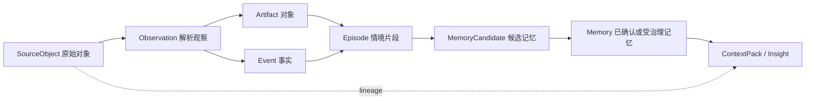

# Ameme 非结构化信息处理与存储框架 v0.1

更新日期：2026-07-13  
状态：方案草案，等待结合来源实测继续细化

## 1. 核心原则

Ameme 的输入不要求结构化，也不要求每份输入都能变成“事件”。系统要先忠实保存来源和处理状态，再逐步形成可使用的信息。

统一链路：

```text
获取 Acquire
  -> 登记 Register
  -> 分类 Classify
  -> 安全处理 Sanitize
  -> 解析 Parse
  -> 情境化 Contextualize
  -> 形成记忆 Remember
  -> 分层存储 Store
  -> 按用途组装 Use
```

任何环节失败都允许降级；失败不能导致系统编造下一层结果。

## 2. 获取：先形成 Source Object

无论输入来自 API、截图、文件、语音还是一个按钮，都先包装成统一的 `SourceObject` 信封：

| 字段组 | 内容 |
|---|---|
| Identity | source_object_id、用户、设备、空间 |
| Origin | 来源 App/Connector、获取方式、原始标识 |
| Time | 获取时间、内容发生时间、时区 |
| Format | MIME、扩展名、编码、大小、语言候选 |
| Permission | 授权来源、用途、有效期、可否云处理 |
| Sensitivity | 初始敏感度和可能包含的敏感类型 |
| Storage | 原始内容位置、hash、加密 key 引用 |
| Processing | 当前状态、解析器版本、失败原因、重试次数 |

`SourceObject` 只说明“系统获得了一个对象”，不宣称已经理解它。

## 3. 分类：采用多维标签，不使用单一目录

同一份信息可以同时属于多个维度。例如一张游戏结算截图可以是：Mobile Capture、Image、Personal Space、Game、包含队友昵称、中敏、短期保留原图、长期保留战绩事件。

### 3.1 来源分类

- Device：Desktop、Mobile、Wearable、Cloud service。
- Acquisition：Passive、One-click、Import、Connector、Prompted。
- Producer：用户本人、他人、应用、传感器、AI、系统。

### 3.2 内容形态分类

- Text、Image、Audio、Video、Document、Web、Structured Record、Mixed。
- 原始、缩略、转写、OCR、摘要等派生关系另行记录。

### 3.3 空间与主体分类

- Work、Personal、Family、Health、Finance、Custom。
- 内容涉及本人、他人、组织、未成年人或未知主体。

### 3.4 敏感度分类

- Public：公开内容。
- Personal：普通个人信息。
- Sensitive：精确位置、私聊、客户资料、未发布工作、家庭内容。
- Restricted：密码、密钥、身份证、银行卡、医疗原始数据等。

Restricted 默认禁止上传云模型，并优先在获取阶段阻断或脱敏。

### 3.5 语义用途分类

- Activity：发生了一个动作。
- Artifact：产生或使用了一个对象，例如文档、照片或网页。
- Event：具有时间和意义的可核验事实。
- State：某段时间的状态，例如位置、运动、项目阶段。
- Communication：人与人或人与 Agent 的沟通。
- Candidate Knowledge：可能形成事实、偏好、目标或方法的内容。
- Unknown：尚不能可靠分类。

Unknown 是正常状态，不要求所有输入立即进入 Event。

## 4. 处理：本地安全处理优先

### Stage A：低成本预处理

- hash、去重、文件类型检测、编码和语言识别。
- 图片 EXIF、音视频时长、文档页数等元数据。
- 规则和本地模型检测密码、密钥、证件、财务和健康信息。
- 根据空间、来源和用户规则判断能否继续处理。

### Stage B：内容解析

- Image：OCR、版面、视觉分类、可选关键对象识别。
- Audio：语音活动检测、转写、说话人分段。
- Video：关键帧、音轨转写、场景切分。
- Document：原格式解析；失败后渲染/OCR。
- Web：DOM/正文/元数据；失败后用户显式截图 OCR。
- Structured API：验证 Schema、来源签名、分页和重复事件。

解析结果是 `Observation`，必须保留到 SourceObject 的 lineage。

### Stage C：情境化

把多个 Observation 合并成：

- Artifact：用户处理的对象。
- Event：可核验事实。
- Episode：围绕同一意图的一段经历。
- Entity/Relation：人物、项目、地点、游戏、文档等关联。

### Stage D：记忆形成

根据重复、重要性、未来用途、用户表达和置信度生成 `MemoryCandidate`。高影响推断必须等待用户确认；确认后形成有版本的 `Memory`。

### Stage E：输出与反馈

生成 Timeline、Daily Brief、Insight 或 ContextPack。用户的接受、修改、删除和“无用”反馈回写分类器与记忆治理，但不覆盖原始证据。

## 5. 数据对象的关系



需要额外增加 `LineageEdge`：记录任意派生对象来自哪些源、使用了哪个解析器/模型和 Prompt、何时生成。它是解释、重算和删除传播的基础。

## 6. 存储建议

### 6.1 本地逻辑组件

| 组件 | 保存内容 | 首阶段实现建议 |
|---|---|---|
| Secure Config | 身份、设备、空间密钥、Connector token | OS keychain/credential vault |
| Raw Vault | 原始文件、截图、音频、网页快照 | 加密文件目录 + content hash；不放进数据库大字段 |
| Catalog | SourceObject、权限、处理状态、lineage | SQLite |
| Context Store | Observation、Artifact、Event、Episode、Entity | SQLite 关系表 + JSON 扩展字段 |
| Memory Store | Candidate、Memory、Revision、失效状态 | SQLite，独立版本表 |
| Search Index | 全文、向量和可选关系索引 | 可重建的本地派生索引 |
| Output/Audit | Brief、Insight、ContextPack、访问和删除日志 | SQLite + 可导出文件 |

首阶段不需要单独图数据库。关系和 lineage 先用 SQLite 表表达，实际查询证明需要后再引入图存储。

### 6.2 云端不是第二个完整真相源

云端能力拆成独立选项：

- Encrypted backup：加密备份，服务端不能读取。
- Structured sync：同步用户选择的 Event/Episode/Memory。
- Raw sync：只同步指定来源或对象的原始内容。
- AI processing：只上传当前任务需要的最小片段，结果返回本地并记录 lineage。
- Sharing：用户明确选择的空间、记忆或 ContextPack。

每个空间有独立 `sync_policy` 和密钥。用户可以让 Personal 同步、Work 单机、Family 共享给成员、Health 完全本地。

## 7. 通用查看如何跨隔离空间工作

统一时间线和搜索采用“查询时联邦聚合”：

1. 用户在当前界面选择可见空间。
2. 查询被拆到各获准空间的索引。
3. 各空间只返回满足权限和敏感度规则的候选。
4. UI 合并显示，不迁移底层数据。
5. 跨空间形成新 Insight 时，用户选择它属于哪个空间，以及是否保留来源引用。

MCP/API 同样必须声明 `purpose + requested_spaces + time_range + data_types`，系统生成最小 ContextPack，而不是给第三方 Agent 数据库直连权限。

## 8. 删除、撤回和重算

删除流程不能只删除原始文件：

1. 标记 SourceObject 删除请求并停止后续使用。
2. 根据 LineageEdge 找出 Observation、Event、Episode、Memory、Insight、ContextPack 和索引。
3. 对完全依赖该来源的对象删除；对多来源对象重新计算置信度和内容。
4. 删除本地 Raw Vault、索引、缓存和允许删除的审计内容。
5. 向同步设备、云端处理副本和共享接收方传播撤回。
6. 生成用户可查看的删除结果，不包含已经删除的敏感正文。

首阶段必须至少证明本地删除传播可实现；否则不能声称“用户拥有数据”。

## 9. 如何使用数据

| 使用场景 | 主要数据层 | 是否需要原始内容 | 输出要求 |
|---|---|---|---|
| 今日时间线 | Event、Episode | 通常不需要 | 可展开证据 |
| 每日确认 | Episode、MemoryCandidate | 纠错时按需 | 区分事实和推断 |
| 精确找回 | Event、Artifact、全文索引 | 可能需要 | 返回原对象位置 |
| 项目回顾 | Episode、Memory、Entity | 按需 | 有时间和来源 |
| 长期趋势 | Memory、聚合 Event | 通常不需要 | 明示样本和不确定性 |
| Agent 上下文 | Memory、Episode、Artifact 摘要 | 最小必要片段 | 权限、时效和来源元数据 |
| 导出到 Notion/Obsidian | 用户选择的 Output/Memory | 用户决定 | 可迁移、稳定格式 |

## 10. 下一步验证

1. 用 Windows 元数据样机产生真实 SourceObject/Event，检验 Schema 是否过重或缺字段。
2. 用截图、PDF、语音、网页和 JSON 各准备一份非敏感样本，跑通多格式分类和 lineage。
3. 验证 Work/Personal 两空间的不同存储与同步策略。
4. 模拟删除一个 SourceObject，确认时间线、记忆和索引都能响应。
5. 测量各处理阶段的耗时、成本、错误和人工修正负担。
