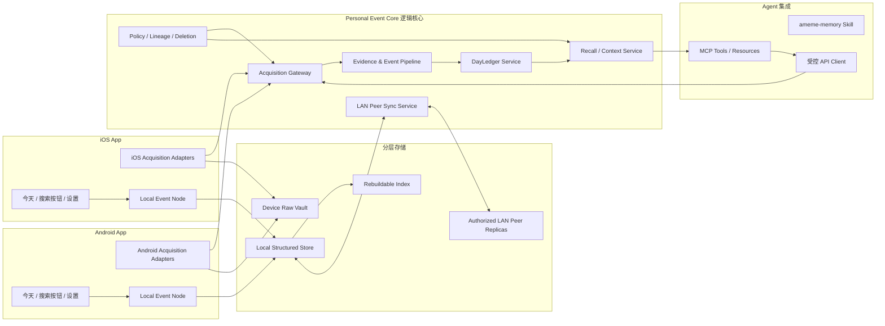
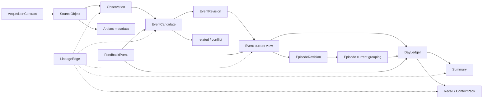

# Ameme MVP 研发架构技术方案 v0.6

> 文档状态：已接受；MVP 研发架构正本，平台与供应商达成情况待 Spike\
> 更新日期：2026-07-14\
> 适合读者：产品、交互、iOS/Android、Agent 集成、后端、数据、安全、测试\
> 人类快速阅读：先看第 2、3、5、13、14 节；技术负责人再审第 8–12 节\
> AI 阅读提示：双端原生、Schema 共享、SQLCipher/Raw Vault/SourceLocator、FTS5、LAN Peer Sync、账户归属无用户密钥 UX、Agent 授权内自动读写和分层 AI 为已接受研发基线；实现达成由 Spike 验证或否决\
> 前置正本：`../product/MVP产品设计规格.md`、`../product/Mobile双端原生页面规格.md`、`MVP领域契约与状态机.md`、`MVP本地存储同步与删除协议.md`、`../../packages/contracts/`\
> 平台基线：iOS 18.0+；Android minSdk 34 / initial targetSdk 36；当前稳定 Xcode 26.x/SDK 26.x 构建并覆盖 iOS 18/26，发布前补 Android 17 兼容证据。
> 非目标：MVP 不建设用户数据云；本版不冻结身份/模型提供方或未经真机/商店验证的系统能力达成结论。

## 1. 目标与架构约束

本方案要支持同一个 MVP 中的三部分产品形态：

1. iOS 与 Android Native App：获取现实生活与手机系统中的获准信息，提供 `今天`、历史搜索、补充、来源控制与删除。
2. Agent MCP / Skill / API：寄生于用户已有 Agent 工作流，在 `autonomous_memory` 授权内自动获取、找回、组装上下文并直接写入带证据状态的长期 Event/Revision。
3. Personal Event Core：统一采集契约、事件主链、修订、检索、选择性同步、权限、lineage、删除传播和访问审计。

架构必须服从以下产品约束：

- 本地先写、本地先看；打开 `今天` 和主动补充不依赖网络成功。
- 原始照片、音频、位置点、文件和网页正文默认留在来源设备，结构化对象按空间策略在获准 LAN peer 间选择性同步。
- Connector 不能直写 Event、DayLedger 或产品数据库，只能提交带采集契约的标准输入信封。
- `Summary`、向量、全文索引和 Agent `ContextPack` 都是可重建派生物，不是真相源。
- 不同空间、设备、来源和第三方 Agent 的权限在进入处理管线前检查，不能只依赖 UI 隐藏。
- 用户原话、来源观察、系统推断和展示文本分别保存；AI 不能反向覆盖证据。
- 删除、撤权、修订、同步缺口和来源失败是 MVP 主链能力，不是上线后补做的后台功能。
- 数据稀疏是默认运行状态，而不是异常。任一获准来源都可独立进入主链；Core 不得以“已连接最小来源组合”作为创建 Event 或 DayLedger 的前置条件。
- 双端 UI 分别使用平台原生框架和控件：iOS 以 SwiftUI 系统组件为主，Android 以 Jetpack Compose Material 3 为主；MVP 不建设 Flutter、React Native 或 WebView 跨平台 UI 壳。
- 网络、同步、OCR、转写、索引和 LLM 不能阻塞 `今天` 本地首帧、用户输入、保存确认或已有日流滚动。
- 当前仍处于 Discovery / Gate 1 hold，但产品负责人已批准 M1–M6 全面研发与并行验证。研发授权不能单独证明价值/平台可行性，也不等于公开发布授权。

## 2. 系统上下文与组件边界



### 2.1 Native Mobile App

每个平台内部至少划分五个逻辑模块：

| 模块 | 职责 | 不负责 |
|---|---|---|
| Experience Shell | `今天`、搜索按钮/历史搜索页、补充、事件详情、平台原生设置入口和状态呈现 | 推断事件、直接读系统数据库、实现跨平台统一控件皮肤 |
| Acquisition Adapters | 包装照片、语音、位置、日历、健康、分享的系统 API | 写 Event、跨空间合并 |
| Local Event Node | 本地命令、查询、任务队列、DayLedger 快照和离线状态 | 绕过 Policy Engine 上传原始内容 |
| Raw Vault & Local Store | 原始对象引用、加密文件、SourceLocator、结构化对象和本地索引 | 把索引当真相源或保证外部原对象永远存在 |
| Peer Sync Node | LAN 发现、同账户设备认证、能力协商、增量同步、重试、撤权与删除传播 | 因同 Wi-Fi 默认互信或同步整个 Raw Vault |

iOS 与 Android 的产品语义和 Schema 一致，UI 控件、导航、系统能力、后台时机、权限状态和获取精度可以不同。共享代码可承载 Schema、命令和候选领域逻辑，但不能拥有平台导航、系统权限弹窗、返回手势或控件渲染。平台适配器必须把能力差异显式写入 `capability_snapshot` 与 `AcquisitionContract`，不能伪造能力一致。

### 2.2 Agent MCP / Skill / API

- MCP 只暴露受控工具：`pair/recall/get_context/capture/feedback/status`，语义与统一 API 共用。
- 单一 `ameme-memory` Skill 负责六种模式、`autonomous_memory` 授权内自动读写、最小范围、结果表达和失败降级，不持有绕过 API 的数据库访问权；产品与运行时正本见 `../product/Agent-Skill产品与交互规格.md`、`../engineering/Ameme-Skill运行时契约.md`。
- API 是统一鉴权、用途限制、速率限制和审计边界；Agent 不能直连 SQLite、同步库或向量索引。
- Agent 对工具调用、选定产物和验证结果具有过程证据权威，但不能单独证明现实任务完成、发布成功或他人承诺。
- 每次调用必须携带 `purpose + spaces + time_range + data_types + caller + expiry`，响应只返回最小 `ContextPack`。

### 2.3 Personal Event Core

Personal Event Core 是一组共享领域规则和服务契约，不预设它必须部署成单个云服务。它包含：

- Acquisition Gateway：校验采集契约、幂等键、权限、空间、敏感度和输入大小。
- Evidence Pipeline：登记 SourceObject、生成 Observation、事件候选、归并关系与字段级证据。
- DayLedger Service：维护 Event/Revision、日期归属、已知缺口和 Summary 失效状态。
- Recall Service：执行 RecallQuery、联邦检索、来源回跳和结果范围声明。
- Context Service：按任务组装最小 ContextPack，不把整库暴露给 Agent。
- Governance Service：策略、lineage、访问审计、撤权、删除计划与传播结果。
- Peer Sync Service：在同网已认证设备间交换获准结构化对象、修订、tombstone、ack/proof 和来源健康状态。

MVP 将这些逻辑组合在设备 Local Event Node 中；账户服务只提供身份/设备归属，不承载用户记忆。跨端由 LAN Peer Sync 实现，不部署 PostgreSQL/对象存储数据平面。未来增加 cloud relay/backup 必须新建 PIA/SDR/ADR。

## 3. 端到端数据主链



### 3.1 AcquisitionContract

每次主动、后台或第三方获取都先产生可审计契约。建议最小 Schema：

```json
{
  "contract_id": "acq_...",
  "owner_id": "owner_...",
  "device_id": "device_...",
  "connector_id": "ios_photo_picker",
  "purpose": "build_today_timeline",
  "spaces": ["personal"],
  "source_scope": {"kind": "selected_objects", "object_ids": ["opaque-id"]},
  "interaction_level": "user_selected",
  "processing": {"allowed_locations": ["device"], "allowed_providers": []},
  "retention": {"raw": "source_reference", "structured": "space_default", "audit": "security_default"},
  "sync_policy": "structured_sync",
  "valid_until": "2026-07-13T23:59:59+08:00",
  "revocation_basis": ["user_revoke", "permission_change", "object_delete"],
  "policy_version": 1
}
```

契约由 Policy Engine 根据系统授权、用户选择、空间策略和调用目的签发；Adapter 只能缩小范围，不能自行扩大。后台采集必须引用仍有效的合同或按已批准策略生成一次性子合同。

### 3.2 SourceObject → Observation

1. Adapter 获取对象或引用后，以 `contract_id + source_native_id + content/version fingerprint` 生成幂等键。
2. Gateway 登记 SourceObject、来源时间、获得时间、权限快照、内容 hash、敏感度初判、Raw Vault 指针；外部 Raw 同时登记设备本地 SourceLocator/fingerprint。
3. 低成本解析器生成 Observation；每条 Observation 只描述来源中实际可观察字段。
4. 解析失败保留 SourceObject 与错误状态，不生成补齐式事实。

### 3.3 Observation → EventCandidate

- 规则先做时间标准化、去重、计划/实际区分、照片聚类、位置停留聚类和健康会话聚合。
- 只有能描述人的活动、状态变化、结果、互动或用户主动表达的 Observation 才进入候选。
- 每个候选保存字段值、字段置信度、证据边、模型/规则版本、空间、敏感度和候选状态。
- 情绪、关系和重要性只影响表达、排序、询问和回顾；不提高任何事实字段置信度，也不触发或绕过空间、来源、处理位置和 Agent 权限。

### 3.4 EventCandidate → EventRevision / Event / Episode

- 先应用用户、空间、冲突时间、已拆分和本人参与等硬边界。
- 再按时间、地点、人物、对象、任务和来源互补计算 `same_event`、`related_to` 或 `conflicts_with`。
- 高可信才自动归并；可能相关保持独立；冲突进入待核验。
- 归并采用字段级权威，不用一个来源覆盖整条事件。
- 每次自动归并产生只追加 Revision，保存参与候选、依据、版本和撤销路径。
- 多阶段过程可组成同 space 的 Episode；成员、顺序和 merge/split 通过 EpisodeRevision 版本化，不能改写成员 Event 事实。

### 3.5 Event / Episode / Revision → DayLedger

- DayLedger 按 `local_date + timezone + space` 维护有序条目、来源状态、已知缺口和 revision。
- 跨午夜、旅行、夜班的归属先保存真实时区和时间区间，再由可版本化规则确定展示日期。
- Event/Revision 变化只把相关 DayLedger 和 Summary 标记为 stale，后台增量重算；不能全库重建阻塞前台。
- `known_gaps` 只表示来源不足、失败或未复盘，不能解释为用户没有活动。

## 4. 获取适配器与标准输入协议

所有平台 Adapter 实现同一逻辑接口：

```text
describe_capability() -> CapabilitySnapshot
request_contract(intent, requested_scope) -> AcquisitionContractRequest
acquire(cursor, contract) -> SourceObjectEnvelope[]
checkpoint(cursor, source_health)
revoke(contract_or_source_scope)
delete_native_reference(source_object_id)
```

`SourceObjectEnvelope` 至少包含：schema_version、object_id、contract_id、source timestamps、device/connector、space、MIME/record type、payload mode（inline/reference/encrypted blob）、hash、sensitivity hint、lineage parent、cursor 和幂等键。

协议要求：

- 未知字段向前兼容；必填字段缺失时拒收，不用默认值伪造权限或时间。
- Payload 和元数据分别限额；大对象先登记引用或分块，不经普通 JSON 请求传整张照片/音频。
- Connector 只提交 SourceObject；是否解析、成为什么事件由 Core 决定。
- Adapter 版本、平台版本、权限状态和失败原因进入来源健康，不记录敏感正文。
- 每个来源有独立游标、重试和熔断，单一来源失败不能阻塞 `今天`。

## 5. Mobile 与 Agent 来源路径

### 5.1 照片

```text
相机 / Picker / Share
 -> 用户选择范围合同
 -> 本地引用 + EXIF/hash/缩略元数据
 -> 连拍和邻近照片聚类
 -> 视觉理解按需执行
 -> Photo Observation
 -> EventCandidate
```

- 原图默认仍在系统照片库或设备 Raw Vault；跨端先同步结构化观察和可选缩略引用。
- 删除系统原图、撤回有限照片权限和用户删除 Ameme 来源是不同事件，都要更新 source health 与 lineage。
- 人脸只可生成待核验人物候选；人物关系不能由视觉模型直接确定。

### 5.2 语音与文字补充

```text
用户按住/点击说话
 -> 立即创建 SourceObject + UserAddendum
 -> 本地队列保存并在今天页显示原话/待转写
 -> 端侧或获准云端转写
 -> 事实 / 意图 / 感受 / 重要性分层
 -> 新候选或 EventRevision
```

- UI 成功条件是本地落盘，不等待转写和云模型。
- 原始音频与转写分开设置保留策略；删除音频后，经用户确认的文字断言可按其独立策略保留。
- 云端转写只能上传当前合同允许的片段，结果记录提供方、模型版本和时间。

### 5.3 位置 A0–A3

| 层级 | 工程路径 | 产物 |
|---|---|---|
| A0 | 复用照片 EXIF、日历地点、系统建议、地图分享、锻炼路线 | LocationObservation |
| A1 | iOS Visit/显著变化/区域事件；Android Geofence/Passive/Fused 低功耗 | PlaceVisitCandidate / TripSegmentCandidate |
| A2 | 用户拍照、语音、分享或补充时单次近似位置 | 当前 SourceObject 的地点证据 |
| A3 | 用户明确路线或消歧时启动短时精确会话 | 有超时的临时 RouteSource |

位置原始点进入设备本地滚动缓冲，事件化后只长期保存地点标签、到访区间和精度等级。具体 TTL、电量预算和前后台频率必须由双端 Spike 确认，不能写死在共享 Schema 中。

### 5.4 日历

- Adapter 按用户选择的日历和时间窗增量读取，使用平台标识、更新时间和 recurrence 实例作为去重依据。
- CalendarObservation 默认是 `planned`，只有其他来源或用户确认后才支持“实际参加”。
- 删除/修改日历计划时保留对应 SourceObject revision；不能静默改写已经由其他证据确认的现实 Event。

### 5.5 健康与活动

- 一个“身体与活动”体验页映射到五类独立权限合同：日常活动、锻炼、睡眠、恢复、正念/主观状态。
- Adapter 只读取用户选择的数据类型，先在设备聚合为日级或会话级 Observation。
- 没有返回值的原因可能是无权限、来源未同步或平台保护，不能生成“用户没有运动/睡眠”事实。
- 恢复类只形成背景或待核验变化，不做诊断；临床、疾病、用药、生殖健康、血压、血糖和默认原始心率流不接入 MVP。
- Health 空间默认不向 Work 或第三方 Agent 开放；跨用途需要新的显式合同。

### 5.6 Agent

```text
宿主任务开始
 -> 用户/宿主授予任务范围
 -> Agent API 签发短期 AcquisitionContract
 -> 写入任务主题、所选对象、工具结果和失败证据
 -> 任务结束提交 EventCandidate / UserAddendum
 -> 用户可在 Agent 或 Mobile 查看、修订和撤回
```

MVP 工具面：

```text
ameme.pair(challenge, caller_identity)
ameme.capture(source_or_addendum, purpose, space, idempotency_key)
ameme.recall(query: RecallQuery)
ameme.context(query, purpose, max_items, expiry)
ameme.feedback(event: FeedbackEvent)
ameme.status(grant_or_job_id)
```

工具默认返回结构化摘要和可打开的来源引用，不返回整个 Raw Vault。`autonomous_memory` 授权内可直接创建长期 Event/Revision，但必须携带 evidence/fact state、lineage、actor、幂等键和撤销；推断不能直接创建 confirmed Event。

## 6. RecallQuery、日历与未来 Agent 搜索

`今天` 中的日期定位、Mobile 历史搜索页和 Agent 复用同一查询内核：

```json
{
  "query_id": "rq_...",
  "query_text": "方案评审",
  "anchor_date": "2026-07-13",
  "date_range": ["2026-07-01", "2026-07-13"],
  "page_direction": "older",
  "day_page_size": 7,
  "continuation_token": null,
  "visible_spaces": ["work", "personal"],
  "entity_filters": [],
  "event_types": [],
  "device_scope": "available",
  "mode": "keyword",
  "purpose": "user_recall",
  "caller": "mobile",
  "result_limit": 50,
  "group_by": "day"
}
```

执行顺序：

1. Policy Engine 收窄空间、时间、数据类型和设备范围。
2. 日历索引先返回 `DayLedger` 日期存在性和当前设备/同步覆盖状态；`anchor_date` 只负责跳转锚点。
3. 向上滑动以 `page_direction=older + continuation_token` 读取更早的 DayLedger 日分页；日分页之间保持稳定顺序和去重。
4. 关键词模式查结构化字段和全文索引；日期 + 关键词取交集。它只过滤同一日流，不产生另一套搜索结果对象。
5. 结果按日分组后返回 Event/Artifact/Summary manifest，附命中字段、时间、来源入口、空间和“哪些设备未参与”。
6. 后续 semantic/agent 模式先把自然语言解析为同一 RecallQuery，再执行同一权限与检索流程。

向量召回只作为候选生成。最终结果必须经过结构化过滤、空间权限和来源存在性校验；已删除、过期或无权来源不能因旧 embedding 再次出现。

## 7. 本地优先与选择性同步

### 7.1 三种空间同步模式

| 模式 | 本地 | LAN peer | UI 必须说明 |
|---|---|---|---|
| `device_local` | Raw + structured + index | 不同步内容 | 其他端可能有未同步记录 |
| `structured_sync` | 完整本地对象 | 获准 SourceObject 元数据、Observation、Event、Revision、DayLedger、tombstone | 需要同网/权限；原始照片/音频仍在来源设备 |
| `selected_raw_sync` | 完整本地对象 | 在 structured 基础上发送用户选定加密 blob | 哪些 peer 有副本及如何删除 |

### 7.2 同步单位

优先同步不可变事件/修订记录，而不是互相覆盖整张“当前快照”：

- device registration 与 capability snapshot；
- policy/contract 摘要及 revocation；
- SourceObject 最小元数据和 lineage；
- EventCandidate、EventRevision、FeedbackEvent；
- DayLedger entry operation 与 revision；
- deletion tombstone、sync acknowledgement 和来源健康；
- 用户选择的加密 raw manifest/chunk。

当前 Event、DayLedger 和索引快照由这些记录重放或增量更新。Schema 必须携带 `schema_version`、`device_id`、本地 sequence、created_at、parent/base revision 和幂等键。

### 7.3 离线与冲突

- 所有用户写操作先进入本地 durable queue；网络恢复后按设备 sequence 推送。
- 简单追加对象按 ID 幂等合并；同一字段的并发修改保留两个 revision，不做 last-write-wins 静默覆盖。
- 用户显式删除优先于未上传的旧派生更新，但删除对象本身也必须可撤销或按产品策略确认。
- Event 合并/拆分冲突进入待核验；系统可以保留临时显示快照，但必须标注冲突。
- 时钟只用于展示与排序提示，因设备时钟不可靠，因果顺序使用 device sequence + parent revision；是否需要 Hybrid Logical Clock 或向量时钟待同步 Spike 决定。
- 长时间离线后先同步权限撤销与 tombstone，再同步普通内容，防止已撤权数据重新出现。

## 8. 存储模型

### 8.1 逻辑存储

| 存储 | 真相内容 | MVP 候选实现 | 备注 |
|---|---|---|---|
| Secure Config | 设备私钥、空间 key 引用、Connector token、授权状态 | iOS Keychain / Android Keystore | 不把 token 放普通 SQLite |
| Raw Vault | 受控原始 blob、manifest、hash、系统对象引用 | 应用私有加密文件目录 | 大字段不进关系表 |
| Catalog | SourceObject、SourceLocator、Contract、权限快照、处理状态、lineage | SQLCipher 关系表 | Locator 设备本地，与 Raw Vault 指针分离 |
| Context Store | Observation、Candidate、EventRevision/Event、Artifact、DayLedger | SQLite + JSON 扩展字段 | 关键查询字段关系化 |
| Search Index | 日期、全文、可选向量 | SQLite FTS/平台索引/嵌入索引候选 | 全部可重建 |
| Output/Audit | Summary、ContextPack manifest、访问与删除作业 | SQLite + 加密导出 | 日志不含敏感正文 |
| Peer State | peer identity/cursor、ack、tombstone、raw chunk 进度 | SQLCipher + peer 文件暂存 | 无中心数据服务；离线 peer 形成范围缺口 |

首阶段延续 SQLCipher + 加密 Raw Vault + SourceLocator，不引入独立图数据库。Lineage 和关系先用邻接表；只有真实查询和容量测试证明需要时再评估图存储。

### 8.2 Schema 与迁移

- 公共领域对象放在 `packages/` 的单一版本源，生成 Swift/Kotlin/服务端绑定或运行时校验器，禁止两端手工维护不同 Schema。
- 每个持久化对象有 schema version；只允许可测试的向前迁移，并为失败保留备份与回滚路径。
- 数据库迁移与索引重建分开：索引失败不能破坏主库，旧索引可继续只读或降级到结构化查询。
- Raw Vault manifest 记录 key id、hash、size、MIME、source object、retention 和 chunk 状态，不记录可逆明文路径到日志。
- SourceLocator 保存平台授权的 opaque photo asset id/security-scoped bookmark/content URI/app object id、fingerprint、last verified 和 availability；它是回跳索引，不是原文件副本或可用性保证。

### 8.3 原始与中间数据保留原则

产品已确认“Raw 按 A 短期恢复、SourceLocator 长期索引、结构化独立保留、选定原始才向 LAN peer 同步、删除可传播”的语义；初始 TTL 由 ADR-005 集中配置，Spike 可收紧：

| 对象 | 默认保留原则 | 长期保留的代替对象 | 必须验证 |
|---|---|---|---|
| 原始位置点 | 设备本地短期滚动缓冲，事件化后按策略清理 | 地点标签、到访区间、精度级别和 lineage | 平台延迟、重算窗口、电量和删除证明 |
| 原始音频 | 转写/重试所需的短期恢复窗口；用户可显式选择长期保留 | 转写、用户确认文字、意图/感受字段和 lineage | 端侧/云端转写失败恢复、存储成本和删除传播 |
| 照片缩略/预览 | 来源端本地优先；只有用户选中原始同步时才建立加密跨端副本 | 照片观察、代表照引用、事件文本和 lineage | 系统照片失效、离线预览、存储与删除 |
| 模型输入/中间缓存 | 只在幂等重试、可重现处理和质量安全检查所需窗口内保留，到期清理 | 输出对象、模型/提示模板版本、lineage 和不含敏感正文的状态码 | 最大重试时间、供应商留存边界、删除 SLA 和复现需求 |

上述对象都必须有 `retention_class + expires_at + deletion_state + source_object_id`，而不能只靠定时脚本按路径清理。

## 9. 安全、密钥、权限与 lineage

### 9.1 密钥候选层级

```text
设备硬件/系统保护的 Device Key
 -> 包装各 Space Data Key
 -> 分别加密 structured store、Raw Vault object 或同步 payload
```

- 每个空间独立数据密钥，便于设备撤销、空间删除和差异化同步。
- Connector token 使用系统安全存储，不随业务数据库备份明文同步。
- MVP 无用户数据云；账户登录只定义 owner/device 归属。本地密钥由 OS 透明管理，全部旧设备不可用时无法恢复历史数据。
- 密钥轮换、丢失设备、账户接管和设备加入仍必须测试，但用户不接触 recovery key/助记词。

### 9.2 权限执行点

权限至少在四处执行：Adapter 获取前、Gateway 接收时、模型调用前、Recall/ContextPack 输出前。任何上游通过都不能代替下游复核。

授权策略最小维度：owner、space、source/data type、purpose、caller、device、processing location/provider、time range、retention、sync、expiry。用户点击“这件事很重要”只更新 Salience，不进入扩权流程；任何扩权必须从独立的具体使用动作发起并生成新策略，不能修改历史合同。

### 9.3 LineageEdge

每个派生对象保存：

- parent object/revision IDs；
- 参与字段与输出字段映射；
- parser/rule/model/prompt template version；
- contract/policy version；
- processing location、时间和结果状态；
- 是否可由其他来源重建。

Lineage 用于事件详情解释、模型重算、冲突审计和删除传播。它不能只存在模型日志里。

## 10. 删除传播与撤权

删除以持久化 `DeletionJob` 执行，避免只删 UI 行：

```text
请求删除 / 来源撤权
 -> 冻结新的处理和同步
 -> 写入 tombstone
 -> 遍历 LineageEdge
 -> 删除纯依赖派生物 / 重算多来源对象
 -> 清理 Raw Vault、索引、缓存和可删日志
 -> 向设备、云副本和已知共享方传播
 -> 设备 ack / 超时 / 失败重试
 -> 生成不含敏感正文的结果回执
```

硬规则：

- 删除 SourceObject 不等同于删除用户后来独立确认的事实；产品必须在删除前说明“同时删除事件”或“仅移除来源并重算”。
- 撤回 Agent ContextPack 不能保证第三方已经使用的内容从其模型上下文消失，因此必须有短有效期、最小内容、接收方审计和产品提示。
- 离线设备未 ack 前显示“删除传播中”，不能宣称全部删除完成。
- 用户删除 FeedbackEvent 后，重算由其派生的 PersonalMemoryPolicy 和 CoverageSnapshot。
- 验收必须覆盖源对象仅有一个证据、多证据、已经生成 Summary、进入搜索索引和同步到离线设备五种情况。

## 11. AI 模型调用分层与成本控制

### 11.1 路由层级

| 层级 | 任务 | 首选 | 升级条件 |
|---|---|---|---|
| R0 确定性规则 | hash、EXIF、Schema 校验、时间标准化、日历 recurrence、权限过滤 | 本地规则 | 不升级即可完成 |
| R1 平台/传统解析 | OCR、语音活动检测、文档解析、照片聚类、位置停留 | 系统能力或本地库 | 解析失败且合同允许 |
| R2 轻量语义 | 分类、实体候选、短文本字段抽取、候选相关性 | 本地小模型或低成本模型候选 | 低置信/冲突/高影响 |
| R3 强推理 | 多源事件归并、复杂描述、歧义消解、自然语言 RecallQuery | 云端大模型或高能力本地模型候选 | 必须有最小上下文与用户授权 |
| R4 派生检索 | embedding、rerank、摘要 | 批处理与缓存 | 仅在关键词/结构化召回不足时 |

模型输出永远先进入 Observation/Candidate/Derived Output，不直接写 confirmed Event。模型路由记录输入对象引用、token/耗时、版本、置信度和失败，不记录正文到普通日志。

### 11.2 成本控制

- 先聚类再理解：连拍、位置点、同一 Agent 工具流先在本地压缩为批次。
- 增量处理：只处理新增 SourceObject 和受影响 DayLedger，不按天重复全量调用。
- 内容指纹缓存：相同内容 + parser/model/prompt version 复用结果；撤权后缓存同样受删除传播控制。
- 预算按用户/日、来源和任务分层，优先保证主动补充与 `今天`，低优先级趋势分析可延迟。
- 只在高价值且不确定时用强模型；低重要噪声不通过“多问模型”升级成事实。
- 云模型失败降级为“待处理/仅保存来源”，不阻塞本地记录。
- 成本模型至少统计每活跃用户：原始字节、结构化对象数、OCR/转写分钟、模型 token、embedding 数、同步字节和支持失败数。

## 12. 可观测性与运行诊断

### 12.1 端到端追踪

每个 SourceObject 产生不含内容的 `trace_id`，贯穿 acquire、parse、candidate、merge、ledger、sync、recall 和 delete。可观测数据默认只记录对象 ID、来源类型、状态码、耗时、大小桶、模型版本和重试次数。

### 12.2 核心指标

| 域 | 指标 |
|---|---|
| Acquisition | 合同签发/拒绝、读取成功、权限变化、来源新鲜度、重复率、后台延迟 |
| Pipeline | 解析成功、候选生成、自动归并/拆分/冲突、字段缺失、队列积压 |
| Product data | DayLedger 生成时延、stale 时长、来源缺口、用户修订和重要遗漏 |
| Recall | 本地/同步范围、零结果、索引新鲜度、来源回跳成功、Agent 有用/缺失反馈 |
| Sync | 待发送对象、冲突、ack 延迟、字节、离线设备、tombstone 传播 |
| Privacy | 越权拒绝、模型上传阻断、删除作业完成/失败、ContextPack 接收方和过期 |
| Cost/resource | 电量影响、后台运行、存储、网络、模型/转写/OCR 成本 |

### 12.3 错误模型

错误至少区分：平台不支持、未授权、合同过期、系统限频、来源无数据、读取失败、解析失败、策略阻断、同步等待、Schema 不兼容、冲突待核验、删除传播中。UI 只映射成用户可理解状态，诊断页保留稳定错误码和建议动作。

日志、崩溃报告和指标严禁包含用户原话、照片/音频、精确坐标、完整 URL 查询参数、联系人名称、健康值或密钥。需要内容诊断时使用合成夹具或用户明确选择的加密支持包。

### 12.4 Native UI 流畅性观测

双端 Prototype 必须分别测量而不是用桌面模拟器替代：

| 域 | 观测项 | 约束 |
|---|---|---|
| 启动 | 冷/热启动到 `今天` 可用、首个可滚动帧 | 读取本地 DayLedger；网络和 AI 不在关键路径 |
| 渲染 | 慢帧/卡顿、主线程长任务、长日流内存、图片缩略抖动 | 使用惰性列表、稳定 ID、局部更新和后台处理 |
| 输入 | 搜索输入、键盘、补充入口、保存确认延迟 | 原生输入/焦点系统；先保存再整理 |
| 查询 | 本地首屏、分页、日历锚定、索引更新期间可用性 | 已有结果不能因后台更新或部分失败被清空 |
| 稳定 | Crash-free、iOS hang、Android ANR、进程回收恢复 | 查询、草稿和滚动状态有明确恢复策略 |
| 资源 | 前后台 CPU、内存、网络、存储和电量 | 后台位置、同步、索引和模型按机会式调度 |

具体性能阈值需在选定最低系统版本和真机基准后写入 Gate 3；Discovery 只冻结指标和不阻塞原则，不编造毫秒目标。

## 13. 研发基线、决策与 Spike

| 领域 | 研发前默认基线 | 状态/证据 |
|---|---|---|
| iOS | Swift + SwiftUI 系统组件，必要时桥接 UIKit；平台 Adapter 独立 | accepted；最低版本/后台需真机 |
| Android | Kotlin + Compose Material 3，必要时桥接 View；平台 Adapter 独立 | accepted；最低版本/厂商后台需真机 |
| 共享边界 | 共享 JSON Schema/OpenAPI/fixtures，不共享 UI 或 P0–P2 运行时 Core | `ADR-001` accepted；机器契约已校验 |
| 本地 Core | SQLite 逻辑库 + durable queue + private Raw Vault + 系统密钥 | `ADR-002` accepted；加密/性能待 Spike |
| 搜索 | 日期/结构化 + SQLite FTS；向量默认关闭 | `ADR-002` accepted；中文基准待 Spike |
| LAN Peer Sync | Bonjour/Network.framework、Android NSD、加密 peer session、durable cursor/outbox | `ADR-006` accepted；权限/后台/恶意 LAN 待 Spike |
| 同步 | immutable SyncEnvelope、peer/device sequence/base revision、tombstone 优先 | 契约已冻结；发现/收敛/HLC 待 Spike |
| Agent | MCP/Skill 映射统一 Policy/Grant/Audit；`autonomous_memory` 内自动读写 | 接口正本已形成；宿主兼容待 Spike |
| AI | R0 规则、R1 系统/端侧、R2 小模型、R3 高价值难例；provider adapter | `ADR-004` accepted；提供方/Eval 待 Spike |
| 观测/成本 | 无内容 trace/metric/log，L/M/H/X 可重算负载与暂定性能预算 | 正本/脚本已形成；真实价格/设备待回填 |

正式决策见 `../decisions/`。产品负责人已确认：LAN Peer Sync/无用户数据云、账户归属无用户密钥 UX、健康进入首个公开 MVP、结构化导出 P1、M1–M6 全面研发、iOS 18+/Android 14+、Agent 授权内自动读写、Raw A 保留+源索引、单悬浮记录入口和 10–15 人/真机投入。

其余未验证项不空置，全部落为可执行 Spike：DB/加密/迁移、同步冲突/时钟/tombstone、Raw TTL/清理、双端来源/后台、中文 FTS/可选向量、模型提供方和真实成本。

## 14. Prototype → MVP 工程切片

### P0：契约与合成证据底座

准备状态：`packages/contracts/` 已形成 19 类 JSON Schema、OpenAPI、正/负合成夹具和离线校验；这只是研发前契约，不是 P0 运行时完成。

产物：公共 Schema、AcquisitionContract、SourceObjectEnvelope、LineageEdge、Event/Revision/DayLedger、RecallQuery、错误码；补齐照片/日历/位置/健康/Agent 合成夹具；实现 Schema 兼容与删除图测试。

通过条件：两个模拟 Adapter 不能直写 Event；同一输入幂等；任意 Event 字段可回到 Observation/SourceObject；删除源能计算影响集合。此切片不证明真实平台可用。

### P1：本地 DayLedger Core Prototype

产物：SQLite + Raw Vault、本地任务队列、规则解析、候选/归并/Revision、DayLedger 查询、最小调试界面。

通过条件：用通用合成一天跑通 `SourceObject → DayLedger → 补漏/修订 → Summary stale/rebuild → 删除传播`，失败和冲突被保留。此阶段先不接 LAN Peer Sync 和完整视觉 UI。

### P2：双端显式获取垂直切片

两端分别完成：语音/文字、照片 Picker/分享、日历选择、`今天` 本地显示和来源状态；同时建立能力/权限快照。

通过条件：iOS 与 Android 使用相同领域契约；拒绝权限、离线和解析失败不阻断主动补充；原始内容默认不离开设备。

### P3：机会式位置与健康 Spike

分平台验证 A0–A3、电量/后台行为、位置事件化、五类健康权限包和无数据语义。先生成正式 Spike 证据，再确定 TTL、频率和最低系统版本。

通过条件：能形成可信 PlaceVisit/Workout/Sleep 候选；没有连续 GPS 默认路径；无权限/无数据/系统限频可区分；资源数据可测。

### P4：LAN Peer Sync 与多设备

实现 Bonjour/NSD 发现、同账户设备认证、加密会话、structured_sync、幂等增量、离线队列、字段冲突、tombstone/ack 和“其他设备可能有未同步记录”。selected_raw_sync 可先只验证一个用户选择对象。

通过条件：同网权限/发现成立，恶意 LAN 不越权；断网写入后恢复；双端并发修订不丢失；撤权/删除优先传播；未同步设备不被描述为完整覆盖。

### P5：Agent 集成闭环

实现 MCP 工具、Skill 流程、短期合同、RecallQuery、ContextPack、任务结果写回和使用反馈。

通过条件：Agent 在 `autonomous_memory` 内自动读取并直接写入带证据状态的长期记忆；无权/Restricted 范围被拒绝或确认；所有写入可见、幂等、可撤销、有审计。

### P6：MVP 体验与可信控制

分别用 iOS 与 Android 原生组件实现效率风格的 `今天 + 右上搜索按钮 + 历史搜索页 + 设置二级入口`、事件详情、来源解释、Revision、删除结果、Summary 重算和关键词/日期搜索。

通过条件：覆盖当前正本列出的所有空/等待/失败/冲突/仅本机状态；交互首帧读取本地数据；用户补充成功不等待 AI；每个控制动作落到正式命令而非仅改 UI；双端分别取得启动、滚动、输入、搜索、返回和恢复的真机证据。

### P7：封闭 MVP 稳定化

补齐迁移/回滚、性能、电量、成本、隐私安全测试、崩溃恢复、可观测性、支持包和发布 Gate 证据。是否进入封闭测试由产品、研发、安全和质量共同 Gate，不由代码合并数量决定。

## 15. 与产品线、交互线的契约

### 15.1 产品必须提供给研发

- MVP 事件来源范围、空间默认值、跨空间扩权文案和数据保留产品规则。
- 每种来源对“计划、实际、结果、感受”的字段权威矩阵。
- `今天`、Mobile 历史搜索、Agent 召回的验收任务和不成立示例。
- 哪些事件需要询问、哪些可自动展示、哪些只能保存为来源的风险等级。
- 日总结、长期记忆和跨周洞察的明确版本边界。

### 15.2 交互必须使用的系统状态契约

UI 不自行推断后台状态，只消费稳定状态：

```text
ContractState = not_requested | limited | foreground | background_limited | granted | denied | unsupported | paused | revoked | expired
SourceState   = acquired | queued | processing | processed | failed | quarantined | deleted
FactState     = confirmed | high_confidence_inference | low_confidence_candidate | conflict | user_asserted | planned
DayState      = empty | sparse | ready_local | processing | partial | syncing | permission_limited | offline
DeleteState   = queued | local_deleting | sync_propagating | recomputing | partial_failed | completed
```

页面只把上述领域状态映射到 `Mobile双端原生页面规格.md` 的共同页面状态，不能创造第二套真相。例如 `queued/processing` 不能显示为“今天没有照片”，`ready_local/partial` 不能显示为“所有设备已同步”。

交互动作必须映射为领域命令：

| 用户动作 | 领域命令 |
|---|---|
| 语音/照片/文字补充 | `acquire_and_register` + `add_user_addendum` |
| 修改事实 | `append_event_revision` |
| 只改展示文案 | `append_description_revision` |
| 不记录/删除 | `create_deletion_job` 或 `reject_candidate` |
| 标记重要 | `set_importance`；只更新 Salience，禁止联动授权 |
| 日期 + 关键词 | `execute_recall_query` |
| 暂停来源 | `pause_contract/connector` |
| 移动空间 | `append_space_revision` + policy re-evaluation |

### 15.3 研发必须反馈给产品/交互

- 各平台 capability snapshot、后台延迟分布、电量和权限降级，不用单一“支持/不支持”结论。
- 数据从获取到事件可见的 P50/P95 延迟与可能长时间 waiting 的来源。
- 每个页面状态能否本地立即得出，哪些依赖同步或模型。
- 原始对象不可用、仅其他设备可用和已被删除时，来源回跳能够做到什么。
- 模型/同步/存储成本对来源包和默认设置的影响。

## 16. 验收风险与验证重点

| 风险 | 可能造成的产品偏离 | 最早验证方式 |
|---|---|---|
| 双端平台能力差异 | 交互承诺同样数量/速度的数据 | P2/P3 capability matrix + 真机 Spike |
| Core 过度云化 | 离线不可用、原始数据默认上传 | P1 本地闭环 + 网络阻断测试 |
| Core 过度单机化 | `找回` 和 Agent 看不到跨端事件 | P4 structured sync Prototype |
| Adapter 直写事件 | 来源权威混乱、无法重算 | P0 接口约束与架构测试 |
| 日历计划当事实 | 时间线高误报 | planned/occurred 状态夹具 |
| 健康无数据误判 | 错误描述用户生活 | 无权限/无数据/未同步三态测试 |
| 位置耗电和后台不稳定 | 用户关闭关键来源 | A0–A3 电量、延迟、系统杀后台实测 |
| 模型过早参与 | 成本高、延迟高、事实不可解释 | 规则基线与升级率统计 |
| Summary 成为真相 | 修订/删除后旧结论残留 | stale/rebuild 与删除回归测试 |
| 向量索引残留 | 已删除内容被再次找回 | tombstone + index rebuild 测试 |
| last-write-wins | 用户修订被其他设备覆盖 | 双端并发 Revision 测试 |
| 删除只在当前设备完成 | 违反用户控制承诺 | 离线设备传播与 ack 测试 |
| Agent 授权过宽 | 跨空间或敏感内容泄露 | purpose/space/time/data type 负向测试 |
| UI 把等待说成没有 | 用户误以为记录完整 | 状态契约快照测试 |
| 技术共享层过重 | 双端进度被 FFI/框架阻塞 | P0/P2 比较生成 Schema 与共享 Core 成本 |

## 17. 本版结论与下一决策门

本版已从方向候选推进为可估算的研发前架构基线，但仍不等于技术 Spike/Gate 通过：

1. 双移动端和 Agent 都通过 `AcquisitionContract + SourceObjectEnvelope` 进入同一 Personal Event Core，任何 Connector 都不直写 Event。
2. 每台设备拥有 Local Event Node；用户写入先本地持久化，结构化对象按空间在 LAN peer 间选择性同步，Raw 默认留在来源端并保留 SourceLocator。
3. 事件主链固定为 `SourceObject → Observation → EventCandidate → EventRevision/Event → EpisodeRevision/Episode → DayLedger`，Summary、Recall/index 都是带 lineage 的派生使用；长期 Memory 不进入 MVP 主链。
4. `RecallQuery` 同时服务历史日流分页、日历锚定、关键词/日期筛选和未来 Agent 搜索，结果统一按日分组，Agent 不获得额外空间权限。
5. 权限、lineage、Revision、删除 tombstone、离线冲突和来源健康必须在 Prototype 期间进入主链，不能在 UI 完成后补接。
6. 双端原生、Schema 共享、SQLCipher + Raw Vault/SourceLocator、可重建索引、LAN Peer Sync、Agent 授权内自动读写和分层 AI 已成为默认基线；实现达成仍需证据。
7. 机器契约、AI 路由、成本公式、暂定性能预算和无内容可观测性已经有正本与校验入口；不能把 planning fixture 当真实成本或基准。

当前负责人决策已回填。研发/安全按 Spike 回填 LAN、账户设备、加密、健康、真机、TTL、模型、性能和真实成本。M1–M6 可全面研发；公开发布仍需完整 Gate 证据。
