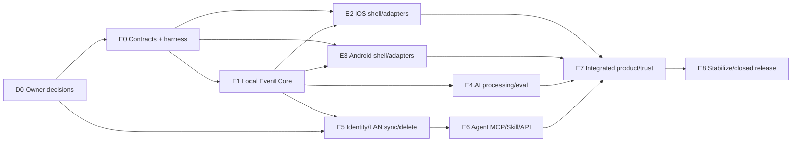

# Ameme MVP 研发任务书与里程碑 v0.3

> 文档状态：已接受；M1–M6 全面研发与并行验证获批，公开发布仍受证据 Gate 约束\
> 更新日期：2026-07-14\
> 重要：M1–M6 已获研发授权，但 Gate 1 当前 `hold`、Gate 2 未执行；这不是任何里程碑已完成或公开发布已批准。

## 1. 启动与发布边界

M1–M6 的设计、实现、测试和用户/真机验证均已获批，可按依赖并行推进。Gate 1/2/3 未通过不再阻止工程开工，但仍阻止相应真实数据放量、商店发布和对外能力承诺。

### 已决策但仍需实现证据

| 事项 | 已接受基线与阻断 |
|---|---|
| Gate 1 用户/任务证据 | 从技术 Prototype 升级为完整 MVP 投入 |
| LAN Peer Sync / 账户归属 | 已接受 SDR-001/002、ADR-006；LAN-SYNC/SEC/SYNC 未通过前不进入真实用户同步 |
| Health | 五类进入首个公开 MVP；政策/真机/商店证据未通过则阻断发布，不静默缩范围 |
| 最低系统版本/设备 | iOS 18+、Android min 34/target 36；正式性能验收仍需设备矩阵 |
| 结构化导出 | P1/M5 纳入；不阻断 M1–M3 |

## 2. 团队角色

| Role | 责任 |
|---|---|
| Product owner | 范围/决策/Gate/价值与商业批准 |
| Product/UX | PRD、双端状态、研究、可用性、指标 |
| Architecture/Core | Contract、领域/存储/同步、ADR、迁移 |
| iOS | SwiftUI、Apple adapters、local node、真机证据 |
| Android | Compose、Android adapters、local node、厂商证据 |
| Backend/Agent | identity/policy/sync/jobs、MCP/API/Skill、运行观测 |
| AI | route/prompt/eval/provider adapter |
| Security/Privacy | PIA/threat/key/SDK/store/security tests |
| QA/SRE | harness/E2E/performance/release/incident/rollback |

小团队可兼任，但安全 Gate 与实现者至少要有独立 reviewer。

## 3. 依赖图

## 4. Epic 与可估算任务

Complexity 是相对值（S≈1–3 engineer-days、M≈3–7、L≈1–2 engineer-weeks），不是承诺日期；Spike 发现会重估。

### E0 Contract 与测试底座

| Task | Deliverable/DoD | Dep | Size |
|---|---|---|---:|
| C-001 | JSON Schema/OpenAPI breaking diff + CI；正负 fixture 全对象 | 已有 v0.1 | M |
| C-002 | Swift DTO/validator round-trip synthetic bundle | C-001 | M |
| C-003 | Kotlin DTO/validator round-trip | C-001 | M |
| C-004 | Swift/Kotlin/Agent DTO 与 local API/identity/peer adapter stub | C-001 | M |
| C-005 | fake Adapter + deterministic clock/ID/fault harness | C-001 | L |
| C-006 | security canary/logger allow-list test | C-001 | M |

### E1 Local Event Core

| Task | Deliverable/DoD | Dep | Size |
|---|---|---|---:|
| CORE-001 | SQLite logical schema、migration runner、encrypted backup/rollback hook | C-002/003 | L |
| CORE-002 | Raw Vault manifest、atomic write/hash/quota/cleanup | CORE-001 | L |
| CORE-003 | Contract/SourceObject/Observation durable commands | CORE-001/002 | L |
| CORE-004 | Candidate、Event/Episode Revision、field evidence、conflict | CORE-003 | L |
| CORE-005 | DayLedger query/coverage/Summary stale projection | CORE-004 | L |
| CORE-006 | RecallQuery date/FTS/cursor/range_state | CORE-005 | L |
| CORE-007 | durable processing/sync/delete/export queues and priority | CORE-001 | L |
| CORE-008 | lineage impact graph、DeletionJob、proof/restore regression | CORE-004/007 | L |
| CORE-009 | 1k–1M synthetic benchmark and H/X degradation | CORE-005/006 | M |

### E2 iOS Native

| Task | Deliverable/DoD | Dep | Size |
|---|---|---|---:|
| IOS-001 | SwiftUI app shell、NavigationStack、M-ONB/TOD/SEA/CAP/EVT/SET/DEL synthetic states | C-002 | L |
| IOS-002 | Local Event Node binding/offline save/restore | CORE-003/005 | L |
| IOS-003 | Photos Picker、Share、text/audio permission-on-use | IOS-002 | L |
| IOS-004 | Calendar selected scope + planned semantics | IOS-002 | M |
| IOS-005 | Location A0–A3 Spike adapter/feature flags | Spike | L |
| IOS-006 | HealthKit 五类 read-only public-MVP adapter、权限/删除/商店申报 | PDR-002 + HEALTH-01 | L |
| IOS-007 | Dynamic Type/VoiceOver/Reduce Motion/OS reclaim E2E | IOS-001–006 | M |
| IOS-008 | minimum-device performance/resource evidence | version decision | M |

### E3 Android Native

| Task | Deliverable/DoD | Dep | Size |
|---|---|---|---:|
| AND-001 | Compose/Material 3 shell、全部 Page ID synthetic states | C-003 | L |
| AND-002 | Local Event Node binding/offline save/restore | CORE-003/005 | L |
| AND-003 | Photo Picker、Share、text/audio permission-on-use | AND-002 | L |
| AND-004 | Calendar scoped adapter + planned semantics | AND-002 | M |
| AND-005 | Fused Location A0–A3/厂商后台 feature flags | Spike | L |
| AND-006 | Health Connect 五类 read-only public-MVP adapter、权限/删除/申报 | PDR-002 + HEALTH-01 | L |
| AND-007 | font scale/TalkBack/back/process death E2E | AND-001–006 | M |
| AND-008 | minimum-device/厂商 performance/resource evidence | version decision | M |

### E4 AI processing and Eval

| Task | Deliverable/DoD | Dep | Size |
|---|---|---|---:|
| AI-001 | Task registry/PromptEnvelope/provider adapter/policy gate | C-004/CORE-003 | L |
| AI-002 | R0 time/dedup/planned/merge rules | CORE-004 | L |
| AI-003 | OCR/STT platform adapter and fallback | IOS/AND explicit sources | L |
| AI-004 | Event draft/description/Summary structured validators | AI-001/002 | L |
| AI-005 | fixed eval + attack/delete set + differential report | AI-001–004 | L |
| AI-006 | budget/cache/batch/route observability | AI-001/CORE-007 | M |

### E5 Identity, LAN sync and deletion

| Task | Deliverable/DoD | Dep | Size |
|---|---|---|---:|
| SYNC-001 | account/device session、owner namespace、透明设备 key | SDR-001/002, C-004 | L |
| SYNC-002 | Bonjour/NSD discovery、local-network permission、peer capability | SYNC-001 + LAN-SYNC-01 | L |
| SYNC-003 | 加密 peer session、immutable push/pull/cursor/sequence/idempotency | CORE-007/SYNC-002 | L |
| SYNC-004 | conflict/tombstone/revoke/ack/convergence harness | SYNC-003 | L |
| SYNC-005 | selected Raw 向 LAN peer 加密传输 + SourceLocator 行为 | SYNC-003/CORE-002 | L |
| SYNC-006 | distributed DeletionJob/proof + backup restore | CORE-008/SYNC-004 | L |
| SYNC-007 | peer capability/migration/old client behavior | SYNC-003 | M |

### E6 Agent

| Task | Deliverable/DoD | Dep | Size |
|---|---|---|---:|
| AG-001 | one-time pairing + caller key/Grant Mobile approval | SYNC-001/IOS/AND settings | L |
| AG-002 | MCP pair/capture/recall/context/feedback/status | AG-001/CORE-006 | L |
| AG-003 | 集成 `autonomous_memory` 自动读写、Codex/Claude Code/Cursor adapters、可见活动/撤销、无长效 secret | AG-002 + SKILL-01 | M |
| AG-004 | ContextPack expiry/revoke/cache/audit | AG-002/SYNC-002 | M |
| AG-005 | injection/cross-space/replay/end-to-end utility tests | AG-001–004 | L |

### E7 Integrated product and trust

| Task | Deliverable/DoD | Dep | Size |
|---|---|---|---:|
| UX-001 | Today/Search/Capture/Event 状态与 local/sync Core 集成 | E1–E5 | L/端 |
| UX-002 | Source/permission/processing/sync explainability | adapters/policy | M/端 |
| UX-003 | Agent/访问记录/撤销 | E6 | M/端 |
| UX-004 | 删除影响/进度/proof + export（若批准） | E5 | L/端 |
| UX-005 | KPI events/privacy scan/day review flow | metrics + all | M |
| UX-006 | a11y/localization/timezone/recovery regression | UX-001–005 | L |

### E8 Stabilization and closed release

| Task | Deliverable/DoD | Dep | Size |
|---|---|---|---:|
| REL-001 | build/sign/config/SBOM/provenance/staging | all | L |
| REL-002 | full test/eval/performance/security/privacy/store pack | all | L |
| REL-003 | monitoring/alerts/runbooks/data requests/incident drill | observability | L |
| REL-004 | migration/backup/restore/rollback rehearsal | E1/E5 | M |
| REL-005 | ring0/ring1 closed rollout + stop/rollback evidence | Gate approve | L |

## 5. 里程碑与退出条件

| Milestone | Outcome | Exit evidence |
|---|---|---|
| M0 Decisions/DoR | 技术/产品默认决策已收口；团队/设备投入获批 | D1–D10 决策、M1–M6 开工边界 |
| M1 Contract Runtime | 三端 DTO/harness、规则不变量 | CI/fixtures/negative/security canary |
| M2 Local Core | 合成一天本地闭环 | save→Event/Episode→Today→Recall→delete 可复跑 |
| M3 Mobile Explicit Prototype | 双端文字/语音/Picker/Share/Calendar | 真机拒权/离线/性能/恢复；Gate 2 输入 |
| M4 LAN Sync + Agent Alpha | 两设备同网 convergence、Agent 自动读写 | local-network/revoke/tombstone/cross-space/injection 通过 |
| M5 Feature Complete | J1–J6、控制、a11y、observability | Gate 4 evidence pack |
| M6 Closed MVP | 预登记 ring/user study、安全/成本/支持 | Gate 5 decision |

## 6. 规划周期场景

仅用于资源 Review，非承诺：

| Scenario | 假设 | Critical path |
|---|---|---|
| Lean | 1 iOS、1 Android、1 Core/Backend、产品/QA/安全兼职 | 20–26 周 |
| Core（推荐估算基线） | 1 iOS、1 Android、2 Core/Backend/Agent、1 QA、产品/设计/AI/安全共享 | 14–18 周 |
| Accelerated | 双端各 2、Core/Backend 3、专职 QA/AI/安全 | 12–16 周；平台/证据存在下限 |

Gate 1/2、商店/设备、提供方和决策等待会延长日历时间。完成 Spike 后用任务级 estimate 重算，不以本表锁定日期。

## 7. 每项 DoD

- 代码/配置/迁移存在并 review；契约/文档同步。
- 正常+负向+故障测试通过；真实命令/设备证据有路径。
- 无真实数据/secret/log 泄漏；telemetry allow-list。
- 性能/成本/资源与预算对比，超出有降级或范围决策。
- feature flag、向前兼容、回滚/删除影响明确。
- 对应 Page/Journey/Invariant/Metric/Test 可追踪。

## 8. 已批准的研发启动边界

M1–M6 已获产品负责人完整研发授权，用户研究、双端真机、LAN/Health/Skill/安全验证同步推进。真实用户数据接入、公开测试和生产发布仍需对应 Gate；完整开工不能替代证据，也不能削弱 Health、删除、自动 Agent 写入和 LAN 安全硬门。
