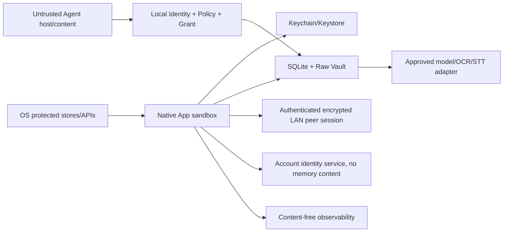

# Ameme MVP 安全需求与威胁模型 v0.2

> 文档状态：已接受；资产、边界、威胁和控制为研发基线，SEC/SYNC/SKILL 实现证据待执行\
> 更新日期：2026-07-29\
> 方法：STRIDE + 隐私威胁；移动测试覆盖 OWASP MASVS Storage/Crypto/Auth/Network/Platform/Code/Privacy 类别\
> 参考：[OWASP MASVS](https://mas.owasp.org/MASVS/)

## 1. 资产与安全目标

| Asset | 目标 |
|---|---|
| Raw/SourceObject/Event/健康/位置/Agent 内容 | confidentiality、space isolation、purpose limitation |
| Revision/lineage/DayLedger | integrity、可解释、不可静默覆盖 |
| Grant/Contract/设备身份 | caller authenticity、least privilege、revocation |
| Sync/tombstone/deletion proof | ordering、anti-replay、eventual convergence、no resurrection |
| 密钥/token/recovery | non-exportability where possible、rotation、revocation |
| App/API/worker/index | availability、safe degradation、bounded resource use |
| Audit/telemetry | evidence without content leakage |

安全硬门：越权内容、错空间、保存后数据丢失、tombstone 复活、假删除完成和 secret 泄漏均为 SEV0/P0，不接受“平均指标良好”抵消。

## 2. 信任边界

默认不信任：来源正文/Prompt、第三方 Agent、客户端时钟、同一 LAN、旧客户端、离线设备、SDK、模型响应和任何跨 space ID。身份服务/运营人员也不因内部身份自动获得记忆内容权限。

## 3. 威胁与控制

| ID | 威胁/攻击 | 控制 | 验证 | 残余 |
|---|---|---|---|---|
| T01 | 恶意 App/被盗设备读本地库/Raw | sandbox、系统 key store、space key、备份排除、重认证 | 静态/动态存储检查、锁屏/备份测试 | 取决于设备完整性 |
| T02 | Root/jailbreak/调试导出 | 风险检测只作提示/收窄、secret 不落盘、短 token | Hook/backup/log 测试 | 无法完全防已控设备 |
| T03 | Agent 冒充/配对码窃取 | 一次性 bootstrap、签发时 caller P-256 key possession、二维码 secret 与会话 credential 分离、Mobile 审批、短 Grant | 篡改/重放/MITM/并发扫描/换 key/同 key 响应重取负向测试 | 冻结应用通道 bearer 可复制；宿主身份质量差异 |
| T04 | Confused deputy 跨 purpose/space | 每次交集校验、Repository space bound、资源存在性隐藏 | IDOR/跨 space/fuzz | 低，需持续回归 |
| T05 | Grant 撤销后缓存继续用 | 在线/本地 revocation check、ContextPack expiry/caller binding | 撤销竞态、离线缓存测试 | 短离线窗口需策略 |
| T06 | Sync replay/乱序/sequence gap | immutable envelope、device sequence、idempotency、签名/会话 | 重复/乱序/丢包测试 | HLC 待 Spike |
| T07 | Tombstone 被旧更新复活 | tombstone priority、quarantine、ack/proof | 多设备离线删除测试 | 丢失设备 proof gap |
| T08 | 并发 Revision 静默覆盖 | If-Match/base revision、append-only、field conflict | 双设备同/异字段 | 用户需处理冲突 |
| T09 | Prompt injection 诱导越权/伪事实 | 内容视为数据、固定 task/schema、证据校验、输出 policy 再检 | 注入语料、tool call/JSON fuzz | 模型未知攻击 |
| T10 | 恶意文件/parser exploit | MIME/magic/size、sandbox parser、超时/资源限额、quarantine | 模糊测试/zip bomb/畸形媒体 | 平台 parser CVE |
| T11 | 模型/SDK 留存或训练 | provider/SDK allow-list、Contract location、DPA/retention、禁用通用训练 | 配置/网络流量/供应商审计 | 第三方证明依赖 |
| T12 | 日志/崩溃/Trace 泄漏 | allow-list logger、redaction、query/content 禁采、支持包预览 | canary secret 扫描 | SDK 原始异常风险 |
| T13 | Export 泄漏/共享错误 | re-auth、scope snapshot、本机加密/到期、系统分享显式 | 跨 space/过期/外部分享测试 | 用户导出后控制转移 |
| T14 | 删除假完成 | durable job、影响图、replica ack、proof hash、partial_failed | 单/多来源/index/离线设备 | 无法确认遗失设备 |
| T15 | peer 恢复时复活已删除数据 | tombstone 优先于对象、恢复前应用删除水位、定期 peer restore test | peer restore 删除回归 | 丢失 peer 无法确认 |
| T16 | 设备密钥丢失或新设备冒领账户数据 | OS key store、每设备身份 key、在线旧设备批准、rotation；账户登录本身不解密历史数据 | 设备添加/移除/全设备丢失/rotation | 全设备丢失时历史不可恢复 |
| T17 | 供应链/恶意依赖 | 最小依赖、lock/SBOM、签名、secret scan、更新策略 | SCA/SBOM/build provenance | 零日风险 |
| T18 | 资源耗尽阻塞保存/删除 | quotas、size/page limits、priority queue、delete preemption | H/X profile、磁盘/队列故障注入 | 极端离线积压 |
| T19 | UI 截图/App switcher 泄漏 | Restricted 页面隐私遮罩候选、通知无正文、secure view 按平台 | 多任务/锁屏/通知测试 | 用户截屏不可完全防 |
| T20 | 内部人员/客服滥用 | 无默认内容后台、just-in-time role、审计、双人高风险操作 | 权限审计/演练 | 取决于组织制度 |

## 4. 安全需求

### 身份与授权

- `SEC-AUTH-001` 每个设备有不可导出优先的身份 key；账户 token 短期、可撤销、绑定设备；Agent caller 使用独立设备绑定身份。
- `SEC-AUTH-002` 所有读写都校验 owner、space、purpose、data type、time、processing location 和 expiry；UI 隐藏不算控制。
- `SEC-AUTH-003` 高风险删除、导出、添加设备、恢复和扩权需要重新认证；安全失败不泄漏对象存在性。

### 存储与密钥

- `SEC-STO-001` secret 仅在 Keychain/Keystore 或身份服务密钥系统；业务库只保存 key reference/version；用户无需接触恢复密钥或助记词。
- `SEC-STO-002` 每 space 独立 key/material scope；Raw 每对象 envelope key，便于选定同步与删除。
- `SEC-STO-003` 敏感数据库/Raw/导出/迁移快照加密，普通 OS 备份默认排除；密钥轮换可恢复失败。

Android 官方建议敏感、仅 App 使用的数据存储在 app-specific internal storage；系统可阻止其他 App 访问并在较新系统上加密。[Android app-specific storage](https://developer.android.com/training/data-storage/app-specific)

### 网络、API 与处理

- `SEC-NET-001` LAN 发现信息不得包含账户、space 或内容；配对后使用相互认证的加密会话，禁止明文 fallback；身份/模型服务仍使用现代 TLS 和域名校验，敏感 payload 不进 URL。
- `SEC-API-001` idempotency、If-Match、page/size/rate limit、统一 error redaction；输入按 Schema/业务不变量双校验。
- `SEC-AI-001` Restricted 外部模型阻断，Prompt injection 不改变 Grant/工具；输出先 Schema/evidence/policy 校验。

### 删除、审计和响应

- `SEC-DEL-001` tombstone/revoke 高优先级、Job durable、proof 可查询、备份/索引/缓存同策略。
- `SEC-LOG-001` audit/metric/log 内容 allow-list；安全 canary 扫描阻断构建/发布。
- `SEC-IR-001` SEV0 自动停相关路由/放量，保留非内容证据并启动事故/用户通知评估。

## 5. 已选账户与 LAN 密钥模型

- 账户服务只证明账户归属、管理会话和设备目录，不保存 Event、Raw、索引或可解密的内容密钥。
- 设备身份 key 在 Keychain/Keystore 生成并优先不可导出；space key 只通过已批准设备间的加密配对转移。
- 结构化对象和 selected Raw 均通过已认证 LAN peer session 传输；同网广播只用于无敏感信息的发现，不构成信任。
- 新设备必须先登录同一账户，再由一台在线已批准设备确认并传输数据；登录账户不等于身份服务可以恢复历史内容。
- MVP 不向用户暴露恢复密钥、助记词或手工密钥管理。所有已批准设备都丢失、卸载或损坏时，账户仍可登录，但旧记忆不可恢复。
- 产品文案只承诺“设备本地加密、已批准设备间加密同步”，不得宣传尚未证明的零知识或灾备恢复能力。

## 6. 安全测试门

| Gate | 必测 |
|---|---|
| P0 Contract | Schema/unknown field、space/purpose、idempotency、Revision、tombstone、错误脱敏 |
| P1 Local Core | at-rest、backup、process kill、disk full、migration/rollback、Raw deletion |
| P2 Mobile | permission downgrade、share/picker URI、deep link、screen/notification、root/jailbreak behavior |
| P4 Sync | LAN 发现隐私、配对 MITM/replay/order/gap/conflict/device revoke/key rotate/旧 peer 隔离 |
| P5 Agent | pairing MITM/replay、并发扫码、key possession、同 key 响应重取、issued bearer 复制边界、host impersonation、prompt injection、cross-space、expiry/revoke |
| Gate 5/6 | SAST/SCA/SBOM、secret scan、DAST/API auth、restore/deletion drill、incident tabletop |

当前 QR Bootstrap v2 已在仓库内实现短时 HMAC envelope、P-256 持有证明、Android 原子一次性消费/同 key 重取和独立随机 credential；Release artifact 不含开发者 bearer，iOS pending/active 状态进入 device-only Keychain。Android Release 已接系统 QR-only scanner 与不读剪贴板的显式粘贴替代，两条入口都复用严格 parser、event-only 确认和设备凭据/TLS 应用认证。该控制只把 credential 签发与首次 client key 绑定；冻结 v1 应用通道后续仍以 bearer 认证，没有每次重连 P-256 proof。共享账户 Grant registry、物理扫码/无 Play 真机、物理网络/设备、真实用户配对和 bearer 复制攻击验证仍为未关闭 Gate。

## 7. 未决但已收敛

1. SDR-001 LAN Peer Sync 与 SDR-002 账户归属/无用户密钥 UX 已批准；实现有效性由 SEC/SYNC Spike 证明。
2. 加密库/SQLCipher/字段加密、pinning、attestation 是否启用由威胁/兼容 Spike 决定，不写成象征性功能。
3. 目标市场、未成年人策略、漏洞接收/事故通知流程需要组织与法律输入。
4. 身份、模型、OCR/STT、崩溃和分析供应商未选；未完成清单/网络验证不得进入 release build。
