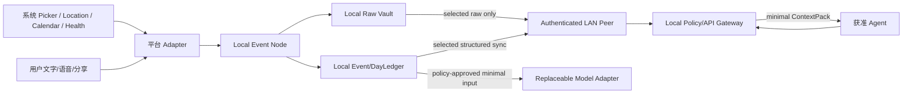

# Ameme MVP 隐私影响评估（PIA）v0.2

> 文档状态：已接受；数据用途、必要性、处理位置、风险和发布前置已审计，法律辖区/供应商实现待外部证据\
> 更新日期：2026-07-14\
> 适用范围：iOS/Android Native Mobile、Agent MCP/Skill/API、Personal Event Core、账户身份与 LAN 点对点同步\
> 限制：本文是产品/工程隐私设计，不构成任何辖区的法律意见或“已合规”证明。

## 1. 处理目的与禁止用途

唯一一级目的：在用户主动或分项授权下，把一天中的来源信息整理为可追溯 Event/DayLedger，使用户能够查看、补充、纠错、搜索、删除，并向明确授权的 Agent 提供最小上下文。

禁止用途：

- 广告定向、跨产品跟踪、数据经纪或出售；
- 工作绩效评分、保险/信贷/就业判断；
- 未经用户确认的医疗、心理或关系诊断；
- 用健康、位置、照片、音频或 Agent 内容训练通用模型；
- 将“重要”“情绪”或关系作为静默扩权理由；
- 从无权限/无数据推断用户现实中没有活动。

Apple 要求权限按需要申请并透明说明；App Store 还要求准确申报 App 和第三方 SDK 的数据实践。[Apple Privacy HIG](https://developer.apple.com/design/human-interface-guidelines/privacy)、[Apple privacy manifest](https://developer.apple.com/documentation/bundleresources/describing-data-use-in-privacy-manifests)。Google Play 同样要求对个人/敏感数据的访问、收集、使用和分享透明、限于用户合理预期的功能，并对第三方 SDK 行为负责。[Google Play User Data](https://support.google.com/googleplay/android-developer/answer/10144311)、[Data safety](https://support.google.com/googleplay/android-developer/answer/10787469)

## 2. 数据清单与最小化

| 数据 | 产品目的 | 默认位置/同步 | 敏感度 | 最小化/禁用 |
|---|---|---|---|---|
| 账户/设备随机 ID | 账户归属、设备配对、撤销 | 设备+身份服务 | confidential | 不收 IMEI/MAC/广告 ID；身份服务不保存记忆内容；遥测 ID 分离可重置 |
| 用户文字/后补描述 | 补漏、事实/感受表达 | 本地；按 space 同步到获准 LAN peer | personal–restricted | 不做遥测；不训练通用模型 |
| 语音/转写 | 低负担主动记录 | 音频本地短恢复；转写结构化 | confidential–restricted | 实际使用时申请；失败保留；TTL 配置化 |
| 照片/元数据 | 现场、时间/地点证据 | Picker 引用/本地；选定 Raw 才同步 | confidential–restricted | 不默认扫全库；不做人脸身份/关系推断 |
| 机会式位置 | 到访/出行候选 | 原始点本地短缓冲；事件化地点可同步 | restricted | A0–A3 最低成本；不连续 GPS；不用于分析/广告 |
| 日历 | 时间锚点/计划 | 选定日历、时间窗；结构化最小字段 | confidential | 计划不等于现实；不默认读全部日历 |
| 健康/活动 | 身体活动背景 | 平台 store 读取；默认本地/Restricted | restricted | 分类型授权；不写回；不做医疗推断；发布受 PDR-002 门禁 |
| Agent 任务/Artifact | 工作事件与任务继续 | Agent/设备；获准结构化 sync | confidential–restricted | purpose/space/type/expiry；不全工作区扫描 |
| Event/Revision/DayLedger | 产品核心记录 | 本地；选择性结构化 sync | 继承最高依赖敏感度 | 字段级 evidence、space 隔离、可删除 |
| Summary/Recall/ContextPack | 展示/任务使用 | 可重算；ContextPack 短期 | 继承输入 | 固定 revision/expiry；不能成为真相源 |
| 访问/安全审计 | 授权、删除、安全调查 | 本地；必要元数据同步至已知 peer/身份服务 | confidential | 无正文、query、精确位置/健康值；保留限时 |
| 产品遥测 | 价值/性能/可靠性 | 可选云聚合 | non-content metadata | 独立匿名 ID；字段 allow-list；可关闭 |
| 密钥/Token | 加密、设备/Agent 身份 | Keychain/Keystore/服务密钥系统 | secret | 不进 SQLite、日志、导出或模型 |

## 3. 数据流与处理位置

每条数据必须能回答：用户如何触发、哪个 Contract/Grant、在哪处理、是否同步、保存多久、由谁访问、如何撤回/删除。缺任一项不得扩量。

## 4. 透明度与同意旅程

1. 首次页面解释“整理获准信息为今天”，不连续弹权限墙。
2. 来源包只是产品选择；系统权限在实际使用/明确开启时分项请求。
3. 来源页显示系统授权、Ameme Contract、处理位置、同步、最近成功和关闭方式。
4. Agent 配对显示 caller、purpose、space、data types、expiry；允许收窄、拒绝和撤销。
5. 云模型或 selected Raw peer sync 使用二次、具体授权，不复用模糊总同意；重要性标记不得成为扩权入口或理由。
6. 撤权后停止新处理；历史保留/删除后果单独说明。

健康需要特别门禁。Apple 指出 HealthKit 读取权限按数据类型细分，拒绝读取时 App 可能只看到“没有数据”，且 HealthKit 数据的使用必须与明确的健康/健身用途相符；不能用于广告或任意第三方分享。[HealthKit privacy](https://developer.apple.com/documentation/healthkit/protecting-user-privacy)、[HealthKit](https://developer.apple.com/documentation/healthkit)。Android Health Connect 也要求在 App 内提供同步暂停与进入系统权限管理的路径。[Health Connect permissions](https://developer.android.com/health-and-fitness/health-connect/ui/permissions)

因此 Ameme 不得把健康无返回解释为“没有运动/睡眠”。健康五类进入首个公开 MVP，必须在商店发布前证明用途、申报资格、真机语义和删除行为；证据不足时阻断公开发布，并回到负责人决定延期或正式缩范围，不能静默 flag off。

## 5. 用户权利与控制

| 用户动作 | MVP 实现要求 |
|---|---|
| 查看 | Event 详情看来源、事实状态、同步范围和 Revision |
| 纠正 | 追加 Revision；用户原话/历史保留 |
| 撤权/暂停 | 停止新获取/处理；Agent 新调用立即拒绝 |
| 删除 | DeletionJob 覆盖 Raw/结构化/派生/索引/副本并显示证明缺口 |
| 导出 | 按 space+日期固定快照，JSON/Markdown；密钥/未选 Raw 排除 |
| 关闭遥测 | 不影响核心功能；本地诊断与云遥测分离 |
| 注销 | 先撤 Grant/Contract，冻结写入，执行账户全图删除；例外清楚说明 |

## 6. 风险评估

| Risk | 初始 | 控制 | 残余/门禁 |
|---|---|---|---|
| 过度采集形成生活监控感 | High | Picker、机会式、分项 Contract、默认 Raw 本地 | Medium；真实信任测试 |
| 位置/健康/关系推断造成伤害 | High | Restricted、本地优先、无诊断、字段 evidence、禁止无数据推断 | Medium；健康发布门禁 |
| LAN peer/模型/SDK 读取内容 | High | 同网不可信、设备认证与加密会话、allow-list、processing location、无广告 SDK、provider DPA/retention Review | Medium；SYNC/供应商证据待验证 |
| Agent confused deputy/跨 space | High | Grant intersection、短期 ContextPack、二次策略检查、审计 | Low/Medium；负向安全测试 |
| 删除假完成/离线副本 | High | tombstone 优先、ack、proof incomplete 显示 | Medium；DEL-01 Spike |
| 被盗设备/备份泄漏 | High | OS key store、space keys、private storage、备份排除、设备撤销 | Medium；SEC-01 真机验证 |
| 遥测/日志侧漏 | High | 内容禁采、allow-list logger、匿名 ID 分离、支持包预览 | Low；持续扫描 |
| 误事实影响用户判断 | High | Source/Observation/Event 分层、Revision、计划/现实分离 | Medium；真实 Eval |
| 未成年人/家庭他人数据 | High | MVP 不面向儿童/家庭共享；第三人内容最小化 | Medium；年龄/市场策略待法务 |

## 7. 第三方与 SDK 门

任何 SDK/服务进入前登记：公司/服务、代码位置、数据类别、目的、处理区域、传输、保留、训练、子处理者、删除、事故通知、退出/迁移和商店申报。默认禁止广告、归因、会话重放、键盘/屏幕录制和可读取正文的通用分析 SDK。

第三方 SDK 的数据实践必须纳入 Apple/Google 商店披露；Google 明确要求开发者将 SDK 数据收集视为自己的责任。[Google Play SDK safety](https://support.google.com/googleplay/android-developer/answer/13326895)

## 8. 发布前隐私清单

- [x] 产品负责人批准 SDR-001 LAN Peer Sync 和 SDR-002 账户归属/无用户密钥 UX。
- [ ] 地区/年龄/主体/隐私联系渠道确定，并完成适用法律审查。
- [ ] 隐私政策与 App 内简明说明可用，内容/版本/第三方一致。
- [ ] iOS PrivacyInfo.xcprivacy、App Privacy 和第三方 SDK privacy report 校验。
- [ ] Android Data safety、User Data、Health/Location 申报与 prominent disclosure 校验。
- [ ] 所有 source/grant/model/sync/delete 负向测试通过。
- [ ] 供应商和 SDK 清单非空即逐项批准；未批准依赖不得进包。
- [ ] 导出、删除、撤权、遥测关闭和账户注销真机可复跑。

## 9. 当前结论

核心事件化路径可以在隐私最小化下全面研发，但公开发布尚不能判定“隐私就绪”。硬阻断是：LAN 同步/账户设备安全未证、Health 发布资格未证、第三方提供方未选、保留/删除 SLA 未经真机验证、法律辖区未确定。这些均已转换为可执行 Spike/Gate。
