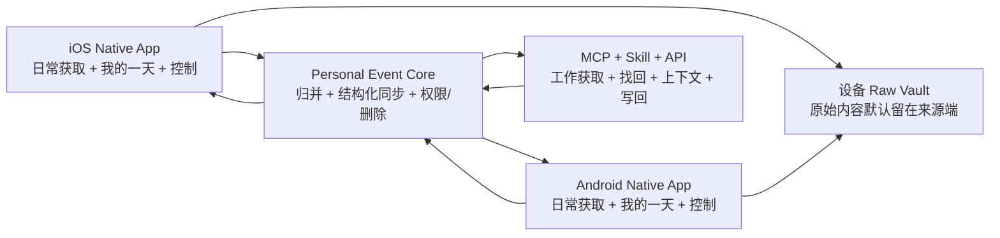

# Ameme MVP 范围与体验设计原则 v0.5

> 文档状态：首批用户、双移动端、`今天` 工作名、机会式位置、健康授权包与 MVP 效率风格已确认；详细信息架构待设计\
> 更新日期：2026-07-13\
> 当前决策：R0/R1 调研有意后置，先用已确认的产品框架定义 MVP 和体验原则。\
> 非目标：现在选择技术栈、具体色值/字体/图标、收费价格或正式上线范围。

## 1. MVP 的单一命题

> 在用户几乎不写日记的情况下，用 Mobile 与现有 Agent 中获准的信息形成一份清楚、可补充、可追溯的“我的一天”，并让用户或 Agent 在之后真正找回并使用这些经历。

MVP 不是证明“我们能采集很多数据”，也不是证明“AI 能写一篇漂亮日报”。它要同时证明四件事：

1. **覆盖**：双主入口能还原一天中一部分有意义的工作和生活事件。
2. **低负担**：普通一天允许零输入；需要补充时一次分享、一句话或一次 Agent 指令完成。
3. **可信**：事件有来源、置信状态、修订和删除传播，用户能看懂系统为什么这样记录。
4. **可使用**：至少有一种找回或 Agent 使用场景，让历史记录在后续任务中产生价值。

体验质量可以用一个约束表达：

```text
有效体验 = 事件覆盖 × 可信程度 × 低交互负担 × 后续使用价值
```

任何一项接近零，产品都不成立。

## 2. 首批目标用户与覆盖策略

### 首批获客用户：已确认

已经高频使用 Coding Agent 或通用 Agent 的信息密集型知识工作者，例如产品经理、研发、研究者、创作者和小团队创业者。

产品负责人已确认首批用户面向 AI 使用者。以下理由仍属于产品判断，不是已经完成的市场验证：

- 工作过程已经发生在 Codex、Claude Code、Cursor 等 Agent 中，容易形成高密度事件。
- 同时存在手机里的通勤、会议、照片、生活安排等覆盖缺口，能检验双主入口价值。
- 能理解 MCP/Skill 的安装和权限边界，适合封闭 MVP。
- 对“让 AI 记得最近做过什么”有直接复用场景，也更可能接受早期付费。

### Mobile 覆盖日常用户：已确认

MVP 的招募用户可以是 AI Native，但 Mobile 端不能变成 Agent 的遥控器：

- 不安装 MCP/Skill 时，用户仍能通过 Mobile 的照片/文件选择、分享、日历、文字和语音形成“我的一天”。
- Event、Episode、DayLedger 和反馈模型不包含 Git、代码或工作区专属字段。
- Agent 是覆盖和使用增强，不是账户成立、事件保存和 Mobile 查看前提。

因此同一个 MVP 提供两种入口，但不是两个产品：

| 入口 | 面向用户 | 独立闭环 |
|---|---|---|
| Mobile 日常模式 | 不使用 Agent 的普通日常用户 | Mobile 获取 -> 我的一天 -> 补充/纠错 -> 总结/找回 |
| AI 增强模式 | 已使用 Codex、Claude Code、Cursor 等产品的用户 | Mobile 日常模式 + Agent 工作获取/找回/写回 |

首批传播和深度测试可以从 AI 用户开始；Mobile 的注册、首页、术语和核心操作不出现 MCP、工作区或代码前置条件。

## 3. MVP 产品形态



MVP 只建设三个用户可感知组成部分：

1. **iOS 与 Android 两个原生客户端**：共同构成完整 C 端主入口，两端都进入 MVP。
2. **一套 Agent 集成层**：MCP、Skill 和受控 API 共同提供获取、找回、ContextPack、反馈和结果写回，不把 Skill 等同于采集脚本。
3. **一个 Personal Event Core**：统一事件、修订、结构化同步、检索、权限、删除和访问记录。

MVP 不同时建设完整 Web App、小程序、Browser Extension 和 Native Desktop。Web 只保留项目介绍、邀请/登录回调或必要账户页，不形成第二套完整产品。

### 双移动端的一致与差异

iOS 和 Android 的 MVP 要求“产品能力一致”，不要求系统权限逐项相同：

- 两端共有：照片、语音、轻量位置、文字/分享、日历、获准的基础健康活动摘要、“我的一天”、补充/纠错、搜索、来源解释、同步与删除。
- 平台差异：位置事件、系统建议和健康数据按照各平台正式能力分别实现，界面明确显示当前平台可用来源和精度。
- 同一事件 Schema、权重、空间、同步和反馈规则由共享核心定义，不能在两端形成不同含义。
- 某平台拿不到的来源显示为覆盖能力差异，不用模拟、越权或非官方抓取制造表面一致。

## 4. MVP 必须包含的来源

### Mobile 必选来源

| 来源 | 为什么进入 MVP | 获取方式 |
|---|---|---|
| 照片 | Mobile 最丰富的日常事件证据，覆盖现场、人物、旅行、餐饮、截图和生活时刻 | 相机、照片选择器、系统建议或用户授权范围 |
| 语音记录 | 最低表达成本地补充没有数字证据的事件、意图、感受和意义 | 一句话或短语音，转写后形成 UserAddendum |
| 轻量位置 | 补足通勤、到访、旅行和线下活动，是日常事件的时间/地点骨架 | 分级授权，优先到访/显著变化/地理围栏，不持续高精度 GPS |
| 健康活动摘要 | 补足步数、锻炼、睡眠等身体活动事件 | HealthKit / Health Connect 按数据类型分项授权 |
| 日历 | 提供计划、会议和时间锚点 | 分项授权 |
| 文字与分享入口 | 接收网页、图片、文件和其他 App 对象，覆盖用户主动表达 | 文本、系统 Share Sheet |

位置是两个 Mobile 端的 MVP 必选产品能力，但用户可以拒绝授权，拒绝后 Mobile 其他闭环仍可使用。位置记录采用“当前事件位置 + 到访/出行片段”，不把连续轨迹作为默认产品。健康能力进入 MVP，但只覆盖用户明确选择的活动/健身摘要；临床记录、疾病、用药和生殖健康等医疗数据不进入 MVP。账单、游戏、邮件和 IM Connector 仍后置。

详细的照片、语音、健康和轻量位置边界见 `移动端来源与轻量位置记录.md`。

### Agent 集成必选能力

| 来源 | 为什么进入 MVP | 获取方式 |
|---|---|---|
| 用户明确要求记录 | 保留决定、重要发现和后补描述 | “记一下这个” |
| 当前 Agent 任务 | 形成工作 Episode 的主题、时间和过程 | 宿主授权范围内 |
| 选定文件/产物和工具结果 | 证明修改、生成、验证或失败 | 只读取任务必要对象 |
| 任务结束写回 | 保留结果、未完成事项和下一步 | 生成 EventCandidate/Revision |

不默认扫描整个工作区，不把文件名中的 `done`、`prod` 或 `final` 当成完成事实。

MCP、Skill 和 API 的职责不同：

- MCP：向兼容 Agent 暴露标准工具和资源。
- Skill：定义何时获取、怎样形成事件、何时找回和怎样写回的工作流。
- API：提供受控的 `ingest / recall / context / feedback` 能力，供自有端和首批指定集成使用；MVP 不开放任意第三方整库访问。

## 5. MVP 必须完成的用户闭环

### 5.1 开启

`安装 Mobile -> 选择“记录工作和生活” -> 连接一项 Mobile 来源 -> 配对 MCP/Skill（可跳过） -> 看到第一条真实或预览事件`

要求：用户先看到来源带来的具体价值，再申请下一项权限。

### 5.2 日常记录

`Mobile 获准信号 + Agent 任务写回 -> 自动形成 Event/Episode -> 进入“我的一天”`

要求：没有用户输入时也能工作；来源状态可见，但不为每条采集弹通知。

### 5.3 补充和纠错

`打开我的一天 -> 查看少量待核验项/覆盖缺口 -> 一句话补充或修改 -> 系统保留 Revision`

要求：不强制每日复盘；高置信事件无需逐条确认。

### 5.4 产生价值

MVP 同时保留两个输出，但只设一个主输出：

- **主输出：我的一天**——按时间显示清晰事件、来源、状态和缺口。
- **验证输出：Agent 找回**——用户在 Agent 中找回最近事件、决定或产物，并报告是否有帮助。

日总结可以从“我的一天”生成，但不作为独立真相源；跨周模式、人格洞察和主动建议不进入 MVP 核心承诺。

### 5.5 控制和删除

`查看事件来源 -> 暂停来源/移动空间/删除事件或来源 -> 传播到 DayLedger、Summary、Memory、索引和同步副本`

要求：删除传播、权限状态和访问记录是 MVP 核心功能，不后置到 Usable v1。

## 6. MVP 范围清单

### 必须有

- 单账户、少量设备配对和空间基础能力，至少支持 Work / Personal。
- SourceObject、Observation、EventCandidate、Event、Episode、DayLedger 和 Revision 主链。
- Native Mobile 的“我的一天”、一键补充、修改、删除、来源与同步状态。
- MCP/Skill 的 `capture`、`recall`、`context`、`feedback` 四类能力。
- 获准结构化事件跨端同步；原始内容默认留在来源设备。
- 基于事件的日总结，以及底层事件修改后的失效和重算。
- 基础时间/关键词/语义找回，并能回到来源。
- 最小权限、敏感度、访问日志和删除传播。
- 事件、找回和 Agent 使用后的低负担反馈。

### 明确不做

- 完整 Web App、小程序、Browser Extension、Native Desktop。
- 全量屏幕、持续录音、全量聊天或隐藏后台抓取。
- 医疗原始数据，以及账单、游戏、出行、邮件、IM 的完整 Connector 矩阵。
- 家庭共享、多人协作、组织管理和企业权限。
- 长期人格画像、复杂习惯判断、主动人生建议和自动决策。
- 独立图数据库、公开 Connector SDK 和开放 API 商业平台。
- 完整订阅计费系统；封闭 MVP 可使用邀请和人工付费验证。
- Notion/Obsidian 等大量导出目标。

## 7. 信息权重不是一个总分

信息权重决定系统怎样处理信息，但不能把可信、重要、敏感和有用压成一个数字。MVP 使用四层、多维权重：

| 层级 | 维度 | 回答的问题 |
|---|---|---|
| 来源级 | 来源稳定性、独特覆盖增益、同步新鲜度、默认敏感度 | 这个来源一般能证明什么，增加了哪些其他端没有的信息？ |
| 字段级 | 对时间、地点、参与人、动作、结果、意图和感受的权威度 | 这项来源对当前字段有多可信？ |
| 事件级 | 事实置信度、事件重要性、新颖性、未来用途、重复度、风险 | 这件事是否值得展示、询问、总结或长期保存？ |
| 用户级 | 用户明确标记、历史纠正、空间规则、个人关注类型 | 对这个用户而言，同类信息以后应自动、询问还是忽略？ |

事件至少保留以下权重向量，而不是单一 `score`：

```json
{
  "evidence_confidence": 0.86,
  "event_importance": 0.62,
  "coverage_uniqueness": 0.78,
  "future_utility": 0.55,
  "freshness": 0.95,
  "emotional_salience": 0.30,
  "relationship_salience": 0.72,
  "sensitivity": "sensitive",
  "user_priority": "normal"
}
```

### 权重怎样影响产品

| 产品决定 | 主要使用的权重 | 规则 |
|---|---|---|
| 是否形成 EventCandidate | 证据置信度 + 是否描述人的活动/状态变化 | 数据量大不等于事件多 |
| 是否自动进入“我的一天” | 事实置信度 + 事件可读性 + 空间规则 | 高可信日常事件自动进入，保留推断状态 |
| 是否询问用户 | 重要性 × 不确定性 × 错误影响 | 很重要且不确定才优先问 |
| 是否进入日总结 | 当日相关性 + 重要性 + 事实置信度 | 重要但不确定时明确写出不确定性 |
| 是否形成长期记忆 | 重复/新颖性 + 未来用途 + 用户优先级 | 不是所有 Event 都升级为 Memory |
| 保留多久 | 未来用途 + 用户规则 + 法律/敏感度约束 | 敏感信息不能仅因重要而无限保存 |
| 是否同步/交给 Agent | 明确权限 + 任务相关性 + 新鲜度 + 敏感度 | 由独立具体动作发起授权；重要性不得触发或扩大范围 |

### 典型来源的权重差异

- 用户补充：对自己的意图、感受和意义权威度最高，对支付结果或他人承诺不是绝对权威。
- 照片：对拍摄时间、现场和视觉对象较强，对人物关系和事件意义较弱。
- 日历：对计划时间和主题较强，对事件是否实际发生较弱。
- 位置轨迹：对移动和到访较强，单个定位点语义价值低，应压缩成出行/到访候选。
- Agent 过程：对执行步骤、使用工具和产物较强，对现实任务是否完成、是否发布较弱。
- 平台 API：对游戏战绩、支付状态、运动结果等系统字段较强，对用户感受和重要性较弱。

信息权重也必须可学习和可撤销：用户连续把游戏对局标为高光，系统可提高这类事件的个人重要性；用户删除该规则后，后续恢复基础策略，历史证据不被改写。

### 情绪与关系分别建模

情绪权重和关系权重都影响“这件事对用户有多重要”，但两者不是同一概念，也不由普通重要性字段替代：

| 权重 | 建议字段 | 主要来源 | 条件使用 |
|---|---|---|---|
| 情绪显著度 `emotional_salience` | 情绪方向、强度、用户表达时间、来源、置信度 | 用户文字/语音/主动情绪标记；获准健康信息只能作为背景 | 只用于表达、排序和回顾；不证明事件事实 |
| 关系显著度 `relationship_salience` | 关联人物、关系类型、当前事件中的作用、用户优先级、敏感度 | 用户补充、联系人选择、共同事件和获准沟通来源 | 共同事件或用户关系说明可支持参与人字段；联系频率只能形成弱候选 |

情绪、关系和重要性与事件事实置信度完全解耦。参与人、时间、地点、结果和事件是否发生必须由独立来源证据或用户明确事实陈述支持；显著度只用于表达、排序和回顾。

用户标记“这件事很重要”时，可以触发一次明确的跨空间或第三方 Agent 授权。用户确认具体对象、用途、接收方和有效期后，系统可以扩大本次或后续同类使用范围；重要性本身不能静默改写既有授权。

## 8. Mobile 主输出命名

“我的一天”作为信息结构已经确认，但用户看到的入口名称可以更简洁：

| 名称 | 优点 | 风险 |
|---|---|---|
| `今天`（建议） | 无学习成本，适合主导航；历史页面直接显示具体日期 | 品牌独特性较弱 |
| `日迹` | 可品牌化，表达一天留下的痕迹 | 容易被理解为位置足迹 |
| `今日回放` | 有画面感，强调回看 | 容易让人联想到录屏或持续监控 |
| `我的一天` | 语义最完整、温和 | 稍长，像页面标题而非主导航 |

本阶段确认采用双层命名：主导航工作名为 `今天`，页面标题按日期显示“7 月 13 日”，产品说明中使用“自动整理你的一天”；内部仍使用 DayLedger。等进入交互和用户体验细化时，再验证是否需要品牌化名称。

## 9. MVP 风格方向

MVP 采用效率风格，面向首批 AI 使用者优先解决“快速看清、低负担补充、可信核验和后续使用”。产品性格是安静、清楚、可信、紧凑和快速，但不把生活事件变成生产力考核。

情绪风格作为后续体验方向保留，未来可强化照片、人物、用户原话、情绪、关系和叙事节奏。两种风格共用 Event Core、权限、Revision 和删除规则，不建立两套数据真相，也不把风格与 Work/Personal 等空间绑定。

详细边界见 `产品体验风格与演进策略.md`。

## 10. 体验设计原则

### P1：无感，但不隐身

减少操作和通知，不隐藏权限、采集状态、同步范围和删除入口。用户随时能回答“现在记录了什么”。

### P2：先把一天说明白，再让 AI 发挥

时间线和事件事实先于总结、洞察和长期记忆。漂亮文案不能掩盖遗漏、冲突和未知。

### P3：默认自动，表达只需一句话

能从获准来源推断的字段不让用户重复填写；主动补充只要求一句话、一次分享或一次 Agent 指令，不设计长表单。

### P4：权限要换来可见价值

不在首次启动索取所有权限。每新增一项权限，都展示它能补上哪类事件、数据保存在哪里、能否只在本地处理。

### P5：不确定性由系统管理

高置信自动记录，低价值噪声不打扰，只有高价值冲突才询问。用户不需要理解置信度算法，但能看出“确认、推断、待核验”。

### P6：一套事件核心，各端顺势而为

Mobile 适合现场获取、我的一天和控制；Agent 适合任务上下文、找回和写回；Web 未来负责低门槛触达。各端不复制同一界面。

### P7：简洁展示，证据渐进展开

首屏只显示人的事件和少量状态；来源、字段置信度、Revision、访问记录和保留期按需展开。

### P8：任何智能都可解释、可纠正、可撤销

合并、总结、个人规则和 Agent 使用必须保留来源；修改产生 Revision；删除向所有派生物和副本传播。

### P9：被使用的记忆才产生价值

评价产品不能只看采集量和日报打开率，还要看用户是否找回了需要的经历，以及 Agent 是否因此更好地完成任务。

## 11. MVP 体验评审清单

每项新功能进入 MVP 前回答：

1. 它具体补上哪类有意义事件，还是只增加原始数据量？
2. 哪个端最自然，是否正在复制另一个端？
3. 用户需要多做几步，能否降成零输入、一句话或一次点击？
4. 新权限换来的价值是否立即可见？
5. 推断错误时用户如何发现、纠正和撤销？
6. 原始内容、结构化事件和派生输出分别存在哪里？
7. 删除后哪些对象需要重算或撤回？
8. 这份记忆最后在哪个真实任务中被使用？

任一问题没有明确答案，功能不进入 MVP 主路径。

## 12. MVP 先观察的指标

本阶段先确认指标定义，不把未经验证的数字包装成门槛：

| 维度 | 观察指标 |
|---|---|
| 覆盖 | 已复盘时段的重要遗漏数、每种来源的独特事件增量 |
| 准确 | 误报、错误合并、时间错序和描述修改次数 |
| 负担 | 每日手动输入次数、可选复盘耗时、重复提问次数 |
| 信任 | 来源可解释率、越权事件、删除传播结果、暂停/撤权成功率 |
| 使用 | 找回成功、Agent ContextPack 有用/缺失、日总结事实一致性 |
| 留存 | 产生“我的一天”的活跃天数、次周和四周持续使用 |
| 成本 | 每活跃用户的模型、存储、同步和支持成本 |

数值阈值在 MVP 实现计划和封闭测试方案中单独确认。

## 13. 当前确认进度

已确认：

1. 首批用户面向 AI 使用者，但 Mobile 的基础体验面向普通日常用户并可独立成立。
2. iOS 与 Android 两个原生客户端都进入 MVP。
3. Agent 侧是 MCP + Skill + API 的完整集成层，不只是 Skill 采集。
4. “我的一天”作为 Mobile 主输出结构。
5. Mobile 来源以照片为第一优先、语音为第二优先；位置为必选产品能力，并接入用户分项授权的日历和健康活动摘要。
6. Mobile 主导航现阶段使用 `今天`，正式命名在交互设计阶段再验证。
7. 情绪显著度与关系显著度作为独立维度，但不提高任何事实字段置信度；推断型来源只形成候选。
8. “这件事很重要”只影响 Salience，禁止触发或绕过空间、来源、同步、处理位置和 Agent 权限。
9. 位置采用 A0-A3 机会式低功耗级联；健康在同一交互路径展示五类授权包，默认推荐日常活动、锻炼和睡眠。
10. MVP 采用效率风格；情绪风格作为后续表达层保留，不复制事件、权限和存储底座。

已收口或转为证据任务：

1. 原始位置点采用本地短期滚动恢复缓冲；精确 TTL 由 LOC/RAW Spike 回填，不再是无边界产品待定。
2. 选择性结构化同步、来源解释、修订和删除传播已经冻结为信任底座；云可见性由 SDR-001 决定。
3. 今日小结作为 P1 进入 MVP，数据不足不生成；跨周洞察、人格画像和主动人生建议后置。
4. Mobile 信息架构、关键状态和双端原生页面规格已经形成；MVP 不再先做三种自定义视觉方向，随原生 shell 做平台视觉与流畅性验证。
5. Agent MCP/Skill/API、OpenAPI/Schema 和 E0–E8 工程切片已经形成；剩余为实现/Spike 证据。
