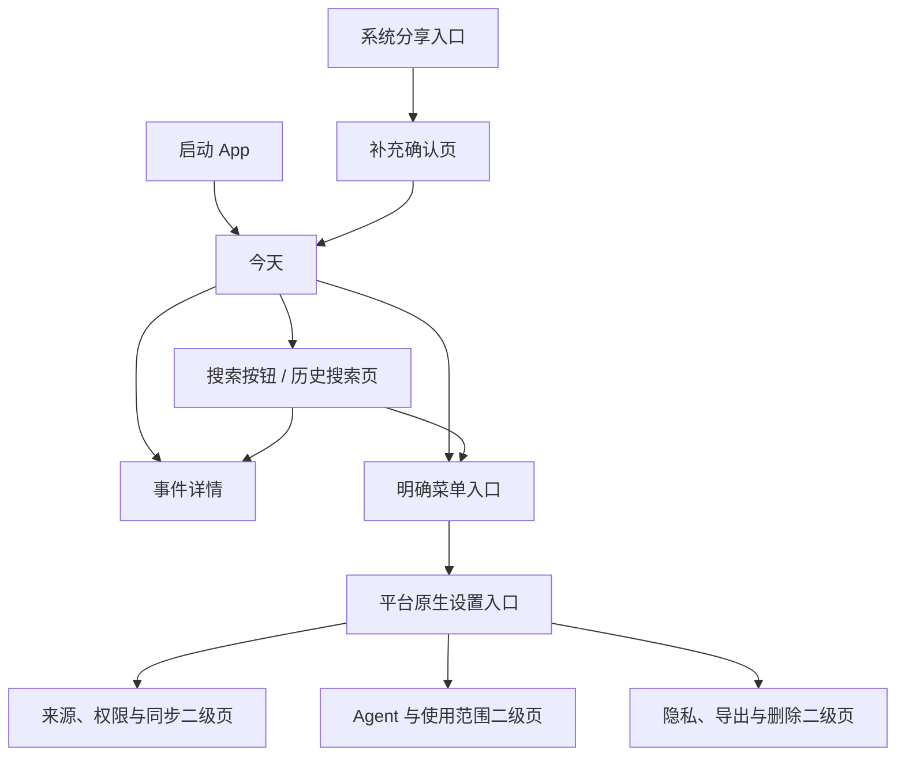
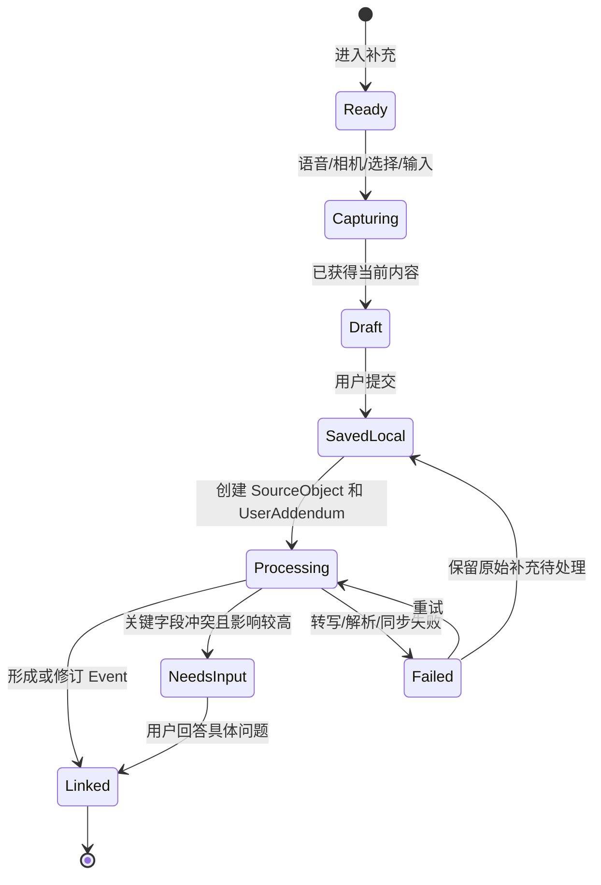
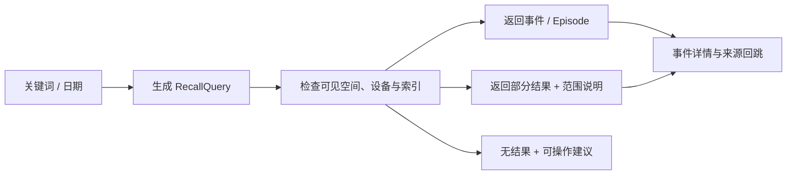
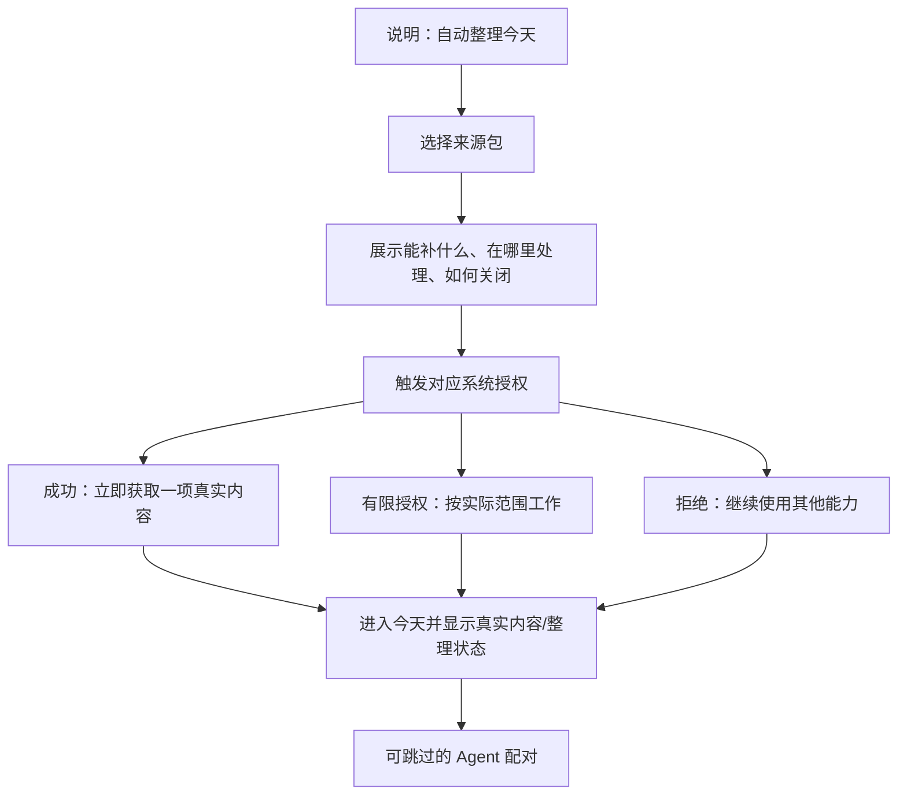

# Ameme Mobile 交互设计规格 v0.7

> 文档状态：已接受；MVP 研发前交互正本\
> 更新日期：2026-07-15\
> 适用范围：iOS 与 Android Native Mobile MVP\
> 适合读者：产品负责人、交互设计、客户端、服务端、数据与隐私评审人员\
> 人类快速阅读：先读第 2、3、5、8、9、13 节，确认导航、核心任务、授权和已选低保真骨架。\
> AI 阅读提示：把 `Mobile低保真设计基线.md` 视为语义骨架，把 `Mobile双端原生页面规格.md` 视为逐页实现契约，把 `Mobile原生UI与流畅性基线.md` 视为平台渲染硬约束；禁止从通用低保真直接推导跨平台像素稿。\
> 上游边界：`今天默认首页 + 右上搜索按钮 + 搜索页历史日流 + 设置二级入口`、效率风格、Mobile 与数据获取并行设计\
> 目标：定义核心页面、动作、状态、反馈和数据对象之间的交互契约。\
> 品牌方向：简洁、高效、安静、可信、流畅；借鉴 ChatGPT Mobile 的单任务聚焦、渐进展开和低等待感，不复制其品牌视觉、图标或 trade dress。
> 非目标：本阶段不产出跨平台像素一致稿、定制字体/图标体系或重动效；平台原生 UI 和有限品牌强调已经确定。

## 1. 交互目标与约束

MVP 的移动端需要让用户完成四件事：

1. 打开后快速看懂今天已经记录的事件，以及哪些内容仍在整理或需要处理。
2. 用语音、照片、文字或导入补上一件事，不填写长表单。
3. 通过右上搜索按钮进入历史日流，再按日期或搜索词筛选历史事件，并清楚知道检索范围是否完整。
4. 随时看到来源、权限、同步、Agent 使用和删除控制，不把首页做成管理后台。

所有交互遵守以下约束：

- **先保存，再整理**：用户主动提交的内容先形成正式本地记录，再异步转写、解析、归并和同步。
- **事实与状态分开**：整理中、待同步或来源失效不能改变事件事实；没有数据也不能被解释为没有活动。
- **主路径低负担**：新增一件事不要求标题、类型、人物、地点和标签全部填写。
- **控制可发现**：侧滑手势、长按和滑动操作只能是增强，关键能力必须有可点击入口。
- **局部更新**：后台新增或修订事件时保持用户当前滚动位置，不让整页跳动或闪烁。
- **原话不消失**：自动摘要、归并和重算不能覆盖用户原话或使刚提交的内容从界面中消失。
- **权限不偷渡**：重要性、情绪和关系可以触发具体授权说明，但不能静默扩大空间、设备或 Agent 范围。

## 2. 导航壳

### 2.1 内容与控制分层



- `今天` 是默认首页和当日记忆主视图。
- `今天` 右上使用放大镜图标按钮进入历史搜索页；用户界面不再使用“找回”作为入口名称。
- 搜索页同时承载历史日流、日历跳转和关键词筛选，不另设互相分离的“历史”和“搜索结果”页。
- 设置是控制层，不占第三个主内容位置；从明确菜单按钮进入。iOS 使用系统菜单后 push/sheet，Android 可使用 Drawer，但边缘侧滑都不是唯一入口。
- 事件详情从 `今天` 和搜索页共用，同一事件不因入口不同出现两套编辑结果。
- 外部 App 的系统分享入口可以直接进入补充确认页，提交后回到原 App；下次打开 Ameme 时在对应日期可见。

### 2.2 导航状态保留

| 场景 | 返回行为 | 状态保留 |
|---|---|---|
| `今天` → 事件详情 | 返回原时间线位置 | 保留日期、滚动位置和展开状态 |
| 搜索页 → 事件详情 | 返回原结果位置 | 保留搜索词、日期范围、筛选和滚动位置 |
| 主页面 → 设置入口 | 按平台关闭 menu/sheet/drawer 或系统返回 | 不重置查询和滚动位置 |
| 设置二级页 → 主页面 | 使用平台原生返回路径 | 权限变化后局部刷新相关模块 |
| 外部分享 → 补充确认 | 提交或取消后回原 App | Ameme 在后台保存提交结果和处理状态 |

从搜索页返回 `今天` 不应销毁搜索页的短期查询上下文；App 被系统回收后可恢复最近一次合理状态，但重新启动默认仍进入 `今天`。

### 2.3 页面 ID 与实现路由

| Page ID | 交互章节 | 实现边界 |
|---|---|---|
| `M-ONB-01` | 第 8 节 | 价值解释、来源选择和按需系统授权 |
| `M-TOD-01` | 第 3 节 | 本地首帧、当日事件和补充入口 |
| `M-SEA-01` / `M-CAL-01` | 第 5 节 | 统一历史日流、日期锚点和关键词/范围筛选 |
| `M-CAP-01` | 第 4 节 | 语音、照片、文字、导入的先保存路径 |
| `M-EVT-01` | 第 7 节 | 来源、Revision、反馈和高影响操作 |
| `M-SET-01` / `M-SRC-01` / `M-AGT-01` | 第 6、8 节 | 控制层、来源合同、配对与访问记录 |
| `M-DEL-01` | 第 7 节 | 删除影响、传播、部分失败和重试 |

每个 Page ID 的 iOS/Android 组件、查询/命令、状态、恢复和性能验收以 `Mobile双端原生页面规格.md` 为正本；本文件不另建第二套页面命名。

## 3. `今天` 页

### 3.1 页面结构

```text
页面头部
  日期 | 搜索图标按钮 | 菜单/设置入口
  今日记录状态（最多一个需注意状态）

时间线主体
  已确认 / 推测 / 待核验事件
  最多一个高价值追问
  用户刚补充但仍在整理的内容

时间线之后
  今日小结（派生内容）

单一悬浮“记录”按钮
  点击后展开：文字 | 语音 | 照片 | 导入
```

首页不展示覆盖率、效率分数、解析器名称或完整权限日志。用户首先看见人的活动，不看见采集流水。

### 3.2 页面头部

- 日期以自然语言和完整日期表达；点击日期进入搜索页并定位该日。
- 放大镜图标按钮的等效点击区不小于 44×44，无障碍名称为“搜索历史记录”；不用只有内部人理解的图标变体。
- 页面只显示一个最高优先级状态，例如“正在整理 3 项”“1 项需要处理”“仅显示本机记录”。
- 状态可点击，展开简短说明和直接动作；复杂修复进入对应来源或同步二级页。
- 多个状态同时存在时，优先级为：用户操作失败 > 权限/来源需要处理 > 离线或仅本机 > 整理/同步中 > 正常。
- 正常状态可以弱化为“已整理 N 件事”及最近更新时间，不声称“一天已经完整”。

### 3.3 时间线与事件卡

事件按发生时间排列；时间不确定时显示范围或“时间待确认”，不能为了排序伪造精确时间。

| 区域 | 默认显示 | 交互 |
|---|---|---|
| 时间 | 时间点、时间段或近似提示 | 点击事件进入详情，不单独编辑 |
| 标题 | 一句话说明发生了什么 | 点击进入详情 |
| 摘要 | 按已有字段显示结果、地点、人物或用户原话 | 超长内容折叠，不在卡片内堆叠 |
| 状态 | 已记录、推测、待核验、冲突、整理中、仅本机 | 点击状态查看含义和下一动作 |
| 来源 | 最多展示少量来源类别 | 点击进入详情的来源区 |
| 媒体 | 一张代表照片或一段用户原话 | 点击预览；媒体不可用时保留事件文本 |

卡片快捷动作只保留高频且低风险操作；修改、标记重要、不记录、删除、查看来源、拆分/合并建议进入事件详情或明确的更多菜单。滑动删除和长按菜单不能成为唯一入口。

### 3.4 待补充与待核验

- 首页同时最多突出一个高价值、可快速回答的问题。
- 问题必须指向具体候选及缺失字段，例如“14:00 的会议实际参加了吗？”。
- 选项优先是直接答案，如“参加了 / 没参加 / 稍后补充”；回答后立即形成 `EventRevision`。
- 其余问题折叠为数量提示，不把首页变成审核队列。
- 来源覆盖不足时只说明“这一时段缺少获准来源”，不主动制造问题，也不声称用户没有活动。

### 3.5 今日小结

- 小结位于当日事件流末尾，不抢占首屏。
- 默认显示 2–3 行简版，包含一天的主要事件和必要的范围说明；点击后展开完整版。
- 小结标注生成时间；包含待核验内容时使用不确定语气。
- 事件发生修改、删除、空间变更或撤权后，小结进入“需要更新”，后台重算时仍可查看旧版但明确标记已过期。
- 只有已有足够可靠事件能生成有信息量的摘要时才显示。数据不足时不生成空泛文案，也不用小结卡反复推动用户授权。
- 用户可主动请求生成；此时结果仍须说明已知事件和未参与范围，不声称已总结完整的一天。

## 4. 上传与快速补充

### 4.1 统一入口

`今天` 页只保留一个悬浮“记录”主按钮作为所有主动记录的统一入口。点击后用平台原生 Sheet 展开文字、语音、照片和导入；外部 Share Sheet 复用同一套确认与保存逻辑。首页不常驻输入框、不叠加第二个 FAB，也不设底部 Tab Bar。

单一入口遵循三条规则：

1. 点击后立即显示四种方式和最近一次常用方式，不在按钮周围平铺动作。
2. 选择文字后在 Sheet 内输入一句话；提交后关闭 Sheet，并在当前日流出现本地临时卡片。
3. 语音进入明确录音状态，始终显示结束、取消和时长；照片/导入只在点选后申请对应权限。



用户提交后的第一反馈必须是“已保存”，不能让“AI 整理失败”看起来像内容丢失。

### 4.2 通用提交规则

1. 默认带入当前时间、当前可见空间及已存在的机会式位置，不为补充动作强制等待定位。
2. 用户可以用自然语言或日期控件把所指时间改为“昨晚”“刚才会议后”或具体日期。
3. 提交时先保存 `SourceObject + UserAddendum`；转写、理解、关联、归并和同步异步进行。
4. 提交成功后回到对应日期并显示临时卡片；历史日期补充不强制把用户永久切离当前任务。
5. 只有歧义会导致错误日期、错误对象或敏感空间时，才追加一个具体追问。
6. 处理失败时保留原始内容、失败原因和重试入口；用户可以不等待 AI，直接编辑成一条文字记录。

### 4.3 各方式交互

| 方式 | 进入与权限 | 提交前 | 提交后与失败降级 |
|---|---|---|---|
| 语音 | 点击开始、点击结束；第一次实际使用时申请麦克风 | 显示录音状态、时长、取消和结束；禁止后台持续录音 | 先保存音频引用，再显示转写；转写失败可重试、重录或手动补文字 |
| 拍照 | 打开系统相机；第一次实际使用时申请相机 | 可重拍、补一句说明、调整所指时间 | 保存当前照片引用；视觉理解失败不阻止照片和说明进入时间线 |
| 选照片 | 使用系统照片选择器，优先一次选择当前对象 | 展示已选数量、范围和是否同步原图 | 先读取时间/EXIF 等获准信息；媒体不可用时保留结构化事件和用户说明 |
| 文字 | 直接输入一句话，无前置权限 | 可修改所指时间、空间或附加对象 | 立即显示原文；解析失败仍是一条有效 `UserAddendum` |
| 导入/分享 | 文件选择器或系统 Share Sheet，只访问当前对象 | 显示对象类型、目标日期/空间和可选说明 | 保存对象引用与 lineage；无法解析时允许仅以附件 + 说明保存 |

语音默认采用点击开始、点击结束的可访问模式；按住说可以后续作为快捷动作，但不能是唯一方式。相机、照片、麦克风权限不在首次启动时预取。

### 4.4 补充后的可见状态

| 状态 | 用户看到什么 | 可做什么 |
|---|---|---|
| 已保存，等待整理 | 用户原话、媒体缩略和提交时间 | 编辑、删除、继续补充 |
| 转写/解析中 | 局部“整理中”，事件卡不反复改位 | 继续浏览或离开页面 |
| 已关联事件 | 事件标题与摘要局部更新，原话仍可展开 | 查看来源、撤销关联、修改 |
| 建议合并 | 显示将关联到哪一事件及依据 | 合并、保持独立、稍后处理 |
| 处理失败 | 明确是哪一步失败，不使用笼统“出错了” | 重试、改成文字、保留原始内容 |
| 待同步 | 显示“仅本机”，不阻止本机使用 | 联网后自动重试、手动重试 |

## 5. `搜索`：统一历史日流

### 5.1 页面结构与默认状态

```text
搜索框
精简日期条 / 月份入口
展开式完整月历
当前条件：锚点日期、日期范围、搜索词、可见空间与设备范围
统一历史日流：按日分组的事件卡
```

- 默认锚定今天或最近可见日期。用户向上滑动时，日流以“一天一组”的方式持续加载更早日期。
- 不使用强制满屏吸附的一天一页翻页：单天内容长度不定，日内垂直滚动与跨日翻页会争夺同一手势。
- 点击月份展开完整月历；翻月不触发原始照片、位置或健康读取，只查询本地/已同步日期索引。
- 日期只显示当前可见空间中“有可用事件”的轻量标记，不显示被隔离空间的数量。
- 点击单日只将日流跳到该日锚点；范围选择使用明确的开始/结束模式，并筛选同一日流。
- 从 `今天` 点击日期进入时，自动选中该日；返回后恢复 `今天` 原滚动位置。

### 5.2 查询组合规则

| 日期条件 | 搜索词 | 结果 |
|---|---|---|
| 无 | 无 | 显示统一历史日流，向上增量加载更早日期 |
| 单日 | 无 | 将同一日流定位到该日，不替换页面结构 |
| 日期范围 | 无 | 日流只显示范围内的日组 |
| 无 | 有 | 在当前可见、可用时间范围内筛选，命中事件仍按日分组 |
| 单日/范围 | 有 | 只在日期条件内筛选，结果仍复用日流卡片 |

- 清除日期只移除日期限制，保留搜索词；清除搜索词保留日期。
- 所有结果复用日标题、事件卡和事件详情；搜索模式额外显示命中上下文，不创建第二套搜索结果样式。
- 页面持续显示参与检索的空间、设备和同步范围；“仅本机”“某设备离线”“索引更新中”必须可见。
- MVP 支持关键词匹配；未来 Agent 自然语言搜索仍转换为同一个 `RecallQuery`，不获得额外权限。

### 5.3 搜索状态与结果行为



| 情况 | 展示 | 不允许的表达 |
|---|---|---|
| 当前范围无结果 | “在 7 月 1–13 日未找到‘方案评审’”并可清除日期 | “你没有做过这件事” |
| 索引更新中 | 保留已有结果并显示更新状态 | 把旧结果描述为完整结果 |
| 某设备未同步 | 显示当前结果和未参与设备 | 自动扩大到未授权设备 |
| 日期有记录但当前空间无权 | 仅说明当前范围无可见事件 | 暴露隔离空间的数量、标题或人物 |
| 离线 | 搜索本地索引并显示“仅本机结果” | 因云不可用清空本地结果 |

## 6. 设置二级入口

### 6.1 入口职责

设置入口提供系统概览和二级页面，不承载复杂配置表单：

| 区块 | 入口概览中显示 | 二级页处理 |
|---|---|---|
| 账户 | 当前账户和设备身份 | 账户、退出与设备管理 |
| 信息源 | 正常/需要处理/已暂停数量、最近更新时间 | 照片、位置、日历、健康等来源详情与授权 |
| 空间与同步 | 当前空间、仅本机或同步状态 | 空间规则、设备与结构化同步范围 |
| Agent | 已连接数量和最近使用 | 配对、用途、空间、有效期、访问记录和撤销 |
| 隐私控制 | 简短入口 | 导出、保留、删除、访问记录 |

### 6.2 打开、关闭与异常提示

- 顶部菜单按钮是所有平台的稳定入口；iOS 不实现与系统返回冲突的边缘抽屉，Android 边缘侧滑只作增强。
- iOS 使用 Menu 后 push 或 sheet；Android 使用 Top App Bar 菜单并可选择 `ModalNavigationDrawer`。关闭和返回遵循系统行为，未提交设置先提示保留或放弃。
- 设置界面打开不暂停本地整理；状态改变时只更新对应条目。
- 首页只呈现一条轻量异常；点击后可直接打开对应来源设置，避免用户自行寻找。
- 权限被系统撤销时，二级页解释影响和修复路径；拒绝修复后回到原页面，不循环弹权限框。

## 7. 事件详情

### 7.1 信息顺序

1. **发生了什么**：时间、动作、对象、人物、地点和结果。
2. **我的补充**：用户原话、感受、意义、关系和重要性。
3. **为什么这样记录**：来源摘要及其分别支持的字段。
4. **当前状态**：已记录、推测、待核验、冲突、整理中、仅本机或待同步。
5. **使用范围**：所属空间、同步状态和已授权 Agent 范围。
6. **修改历史**：关键 Revision，默认折叠。
7. **控制**：修改、补充、标记重要、拆分/合并建议、不记录和删除。

详情不是工程调试页。数值置信度、解析器版本和完整审计字段默认不展示；用“由照片支持时间、由你补充参与人”等可读表达解释字段来源。

### 7.2 核心动作

| 动作 | 交互规则 | 数据影响 |
|---|---|---|
| 补充 | 复用统一补充入口，并自动关联当前事件 | 新增 `UserAddendum`，可能形成 `EventRevision` |
| 修改 | 先改用户可读字段；新增事实要标明来自用户 | 追加 `EventRevision`，不覆盖历史 |
| 确认/否认 | 只回答当前具体事实 | 更新字段状态和证据关系 |
| 标记重要 | 只更新事件重要性；不改变事实、空间、同步或 Agent 权限 | 更新 Salience；禁止联动授权 |
| 不记录 | 说明是隐藏候选、忽略同类建议还是删除已有事件 | 形成可撤销反馈规则或删除请求 |
| 拆分/合并 | 展示受影响事件和时间线结果 | 追加可撤销 Revision，保留原候选 lineage |
| 删除 | 显示将影响的媒体引用、Summary、Memory、索引和同步副本 | 进入删除传播，不只从页面隐藏 |

删除、跨空间和 Agent 扩权属于高影响动作，必须在确认界面明确对象、范围和后果。普通文字修改不使用同等级警告，避免所有操作都变得沉重。

## 8. 首次使用与授权

### 8.1 编排原则

首次启动不连续弹出系统权限框。用户先看到产品价值，再选择来源包，系统只申请用户刚选择的分项权限。



### 8.2 来源包

| 来源包 | 用户价值说明 | 系统授权时机 |
|---|---|---|
| 生活现场 | 用照片和低功耗地点补充到访、聚会、旅行和日常现场 | 用户选择后先申请照片；位置按 L0–L2 解释与分层申请 |
| 时间安排 | 用选定日历提供计划和时间锚点 | 用户选择日历范围后申请 |
| 身体与活动 | 用日常活动、锻炼、睡眠等形成身体活动片段 | 同页选数据包，再按平台逐类型申请 |
| 工作增强 | 让既有 Agent 写回任务、决定和产物，并支持找回 | 用户主动配对时申请用途、空间、对象和有效期 |

相机和麦克风在第一次实际使用对应动作时申请。拒绝、有限照片、近似位置或没有后台权限都属于可继续使用的状态；界面说明能力差异，不用高频弹窗施压。

### 8.3 权限状态机

| 状态 | 用户可见说明 | 下一动作 |
|---|---|---|
| 未选择 | 说明可补充的事件类型 | 用户主动连接 |
| 解释中 | 说明对象、用途、处理位置、保留与关闭方式 | 继续或取消 |
| 系统授权中 | 进入平台系统界面 | 等待系统结果，不叠加自定义弹窗 |
| 已授权 | 显示实际范围和最近成功时间 | 调整、暂停或撤销 |
| 有限授权 | 显示当前可用对象/精度 | 继续有限使用或主动扩大 |
| 已拒绝 | 产品其余能力可用 | 仅在用户再次触发相关价值时提供设置入口 |
| 系统不支持 | 说明设备能力限制 | 提供手动补充，不诱导重复尝试 |

### 8.4 Agent 配对与访问反馈

普通用户从设置中的“设备连接”进入，不接触密钥、JSON、IP、端口或 MCP 配置。首个候选提供三种发现入口：同一局域网自动发现、扫描电脑端二维码、同账户设备。三种入口只负责找到候选设备，不等于已经授权，并统一进入同一确认页：显示设备、Agent 身份、用途/能力、空间、数据类型和有效期，用户明确允许后才建立连接。

1. Agent 生成或提交的配对挑战只能是短时、一次性对象，不能携带长期密钥。
2. Mobile 必须展示可验证的调用方标识、用途、空间、数据类型和有效期，并允许用户收窄或拒绝；不能因为是同网、扫码或同账户就跳过确认。
3. 批准后，Mobile 显示活跃授权、连接方式、最近使用时间和撤销入口；访问记录只含元数据，不展示或上传用户正文。
4. 过期、撤销、跨空间、超时间和超数据类型请求必须返回不同拒绝原因；界面不能建议用户“一键全部授权”来修复。
5. Agent 在 exact `autonomous_memory` Grant 内写回的任务、决定和产物直接形成带来源、证据状态和撤销入口的 Event/Revision；推断保持 `inferred`，不得无提示覆盖 Mobile 中的既有事件。
6. 测试构建允许三种入口收敛到明确标注“体验模式，不建立真实网络连接”的成功态，用于验证流程；它不得写入事件、伪造访问记录或进入 Release。手工 TLS 密钥/JSON 入口仅放在 Debug 开发者选项，作为真实 Host 通路验证工具，不作为普通用户旅程。

## 9. 来源状态与全局页面状态

### 9.1 来源状态词汇

| 底层情况 | 用户状态 | 页面反馈 |
|---|---|---|
| 可用但未授权 | 未连接 | 说明价值并允许主动开启 |
| 已授权且最近成功 | 正常 | 弱化显示最近更新时间 |
| 系统限频或等待后台窗口 | 等待更新 | 不报错；允许前台刷新 |
| 已收到，等待解析或归并 | 整理中 | 用户补充可立即显示，推断事件不提前生成 |
| 授权撤销、令牌过期或读取失败 | 需要处理 | 说明具体来源和修复动作 |
| 用户主动暂停 | 已暂停 | 保留历史，不继续获取 |
| 已保存但未同步 | 仅本机 | 本机可用，其他端显示覆盖缺口 |
| 平台不支持或无数据源 | 不可用 | 说明限制并给出手动降级路径 |

### 9.2 `今天` 的必须状态

| 页面状态 | 首屏表达 | 主动作 |
|---|---|---|
| 首次空状态 | “从一件真实的事开始”，说明可连接来源或直接补充 | 选择照片 / 说一句 / 输入文字 |
| 已连接但无事件 | 显示来源已连接、等待真实数据；不展示虚构示例为真实记录 | 手动补充、查看来源状态 |
| 首次导入 | 显示已有内容逐项进入“整理中”，保持可操作 | 继续使用；不要求停留等待 |
| 正常一天 | 时间线和少量状态；证据足够时在末尾显示小结 | 查看事件、快速补充 |
| 数据不足 | 如实显示已有事件和已知范围，不生成小结 | 继续浏览、主动补充或查看来源状态 |
| 待核验 | 只突出一个具体问题 | 直接回答或稍后处理 |
| 权限/来源失效 | 保留已有事件，显示一条影响说明 | 修复、暂停或忽略 |
| 离线 | 继续显示本地 DayLedger，标注仅本机范围 | 本地补充；联网后自动同步 |
| 同步中 | 保留当前内容，局部显示进度 | 继续浏览，不阻塞 |
| 整理中 | 显示用户主动内容；候选结果稳定后再插入 | 查看原内容、取消或离开 |
| 小结重算 | 旧小结标记过期，事件事实保持可用 | 等待或手动刷新 |
| 操作失败 | 在发生动作处给出具体失败原因 | 重试、保留本地或改用手动路径 |

### 9.3 状态表达规则

- Loading 不替代已有内容；刷新时保留旧内容并局部表示更新。
- Error 不清空本地记录；失败发生在哪里，就在哪里给出修复动作。
- Empty 必须区分“确实没有记录、未连接、未同步、无权限、平台不可用”。
- Offline 必须说明当前结果范围，而不是把未参与 LAN peer 说成数据丢失。
- Sync 和 Processing 分开：同步回答“数据是否到达”，整理回答“内容是否已形成事件”。
- 状态不能只用颜色；必须有文字、图形语义和屏幕阅读器标签。

## 10. 可访问性

- 所有关键动作提供可见按钮和无障碍名称；侧滑、长按、滑动卡片都不是唯一入口。
- 点击目标至少遵循平台建议的可触达范围；时间线密集时仍保证相邻动作不会误触。
- 支持系统字体缩放；放大后卡片改为纵向布局，不截断关键状态和主动作。
- 已记录、推测、待核验、冲突、失败不能只用颜色区分，需同时使用文字和一致图形。
- 语音记录提供明显的开始、进行、结束、取消状态；转写结果可编辑，音频不是理解事件的唯一形式。
- 照片需要可选的用户说明；系统不得自动生成冒充用户确认的图片描述。
- 日历支持屏幕阅读器按日期导航，日期标记读出“有可见事件”，不只展示小圆点。
- 搜索筛选条件以可朗读、可逐项清除的形式存在；焦点返回搜索结果时保持在合理位置。
- 动画遵循系统“减少动态效果”；数据局部更新不强制滚动或抢占焦点。
- 错误提示说明发生了什么、现有内容是否安全、下一步是什么，不只显示错误码。

## 11. iOS 与 Android 差异原则

| 主题 | iOS | Android | 共同产品语义 |
|---|---|---|---|
| UI 框架 | SwiftUI 系统组件优先，必要时桥接 UIKit | Jetpack Compose Material 3 优先，必要时桥接 Android View | 不使用跨平台自定义 UI 壳，不要求像素一致 |
| 页面壳 | `NavigationStack`、系统 Toolbar、系统安全区 | Compose `Scaffold`、Top App Bar、Navigation Compose | 页面目的、入口和返回后的状态一致 |
| 导航返回 | 遵循系统返回手势和导航栈 | 遵循系统 Back/预测性返回 | 返回不丢失查询、草稿和滚动位置 |
| 搜索 | `.searchable` 与系统搜索放置规则 | Material 3 Search 组件与系统 IME | 搜索同一 RecallQuery 并显示范围 |
| 日流 | `List` 或具备原生语义的惰性列表 | `LazyColumn` 与 Material 列表语义 | 按日分组、分页和状态含义一致 |
| 补充入口 | Toolbar/安全区内 Button，打开 Menu/Sheet；不照搬 FAB | FAB/Extended FAB 或 Button，打开 `ModalBottomSheet` | 都只保留一个主入口，再选择记录方式 |
| 设置入口 | Toolbar Menu 后 push/sheet；不使用边缘抽屉 | Top App Bar 菜单，可使用 `ModalNavigationDrawer` | 设置不占主导航，按钮必有 |
| 日期范围 | 系统 sheet/popover 与日期/日历能力 | Material 3 Date Picker / Date Range Picker | 只改变同一日流锚点或范围 |
| 照片 | 系统 Photos Picker / 有限照片范围 | 系统 Photo Picker / 文件提供器 | 默认只访问用户选择对象，可说明扩大范围 |
| 分享/导入 | Share Sheet、文件选择器 | Sharesheet、系统文件选择器 | 当前对象进入同一补充确认流程 |
| 位置 | Journaling Suggestions、Visit、显著变化、区域事件 | Geofencing、Passive/Fused Location、活动转换 | 按 A0–A3 使用最低成本足够信号，不追求点位数量一致 |
| 健康 | HealthKit 分类型授权 | Health Connect 分类型授权及可用性检查 | 同一“身体与活动”路径，按实际获准范围工作 |
| 权限设置 | 在必要时跳转系统设置 | 后台位置等可能需分步进入系统设置 | 先解释价值，拒绝后其他闭环继续可用 |
| 后台与同步 | 遵循系统调度，不能承诺固定时间 | 遵循系统限频、后台和厂商策略 | 显示最近成功和当前范围，不承诺实时完整 |

MVP 验收产品能力、信息层级和信任语义一致，不要求两个平台的控件外观、权限名称、系统弹窗、后台频率或事件数量完全相同。双端必须分别验证启动、滚动、输入、搜索、返回、字体缩放和辅助功能，不以同一张通用视觉稿替代真机验收。

## 12. 交互动作与数据对象映射

| 用户动作 | 立即写入/读取 | 异步派生 | 成功反馈 | 失败与回滚 |
|---|---|---|---|---|
| 打开 `今天` | 读取本地 `DayLedger`、Event/Episode 当前版本 | 增量同步、来源健康检查、小结状态检查 | 立即显示本地内容 | 保留本地视图，标注部分范围 |
| 向上滑动历史日流 | 读取当前锚点之前的 DayLedger 日分页 | 必要时增量同步结构化对象 | 保持位置并接续更早日组 | 加载失败不清空已有日流 |
| 点击日期 | 更新 `RecallQuery.anchor_date/date_range` | 刷新锚点附近日分页 | 在同一日流跳到指定日期 | 索引不可用时显示本地日期和范围 |
| 输入搜索词 | 更新 `RecallQuery.query_text` 和当前 scope | 筛选 Event/Episode/Artifact 索引并按日分组 | 在同一日流显示命中上下文和来源回跳 | 无结果与部分范围分开表达 |
| 提交语音/文字 | 新增 `SourceObject + UserAddendum` | 转写、Observation、EventCandidate、EventRevision | 先显示已保存原话 | 处理失败仍保留原内容 |
| 拍摄/选择照片 | 新增 `SourceObject`，可附 `UserAddendum` | EXIF/聚合/视觉 Observation 和候选关联 | 先显示媒体或引用 | 媒体解析失败不删除补充 |
| 导入/外部分享 | 新增当前对象 `SourceObject` 和 lineage | 类型解析、事件候选和同步 | 返回原 App，Ameme 异步处理 | 保留对象引用，可重新解析 |
| 回答待核验问题 | 追加用户断言和 `EventRevision` | 重算 Event/Episode/DayLedger/Summary | 问题消失，事件局部更新 | 写入失败时保留答案草稿并提示重试 |
| 修改事件 | 追加 `EventRevision` | 重算描述、归并关系和 Summary | 立即显示新版本 | 不覆盖旧 Revision，可撤销 |
| 标记重要 | 更新 Salience 与用户优先级 | 不生成扩权候选 | 事件显示已标记 | 权限范围保持不变 |
| 调整来源 | 更新 `AcquisitionContract`/权限状态 | 启停增量获取并重算覆盖状态 | 显示实际生效范围 | 系统拒绝时回到有限/未连接状态 |
| 删除事件/来源 | 创建 `DeletionJob` 与审计记录 | 传播至 DayLedger、Summary、Memory、索引和同步副本 | 显示范围与完成状态 | 部分失败保持任务可重试，不假装完成 |
| 配对/撤销 Agent | 新建或撤销最小 `AccessGrant` | 刷新 Agent 会话和访问记录 | 显示调用方、范围、有效期 | 过期/跨空间/撤销使用稳定拒绝码，不返回内容 |
| 导出结构化数据 | 创建只读 `ExportJob`，固定空间和日期快照 | 本机生成 JSON/Markdown 清单与校验文件 | 可查看范围、状态和本机文件 | 部分失败可重试，不改变源数据、不静默缩小范围 |

埋点、日志和错误报告只记录动作类型、状态、耗时和对象匿名 ID，不记录用户文字、音频、照片、精确位置、搜索词或可识别人物信息；稳定事件名与字段以 `MVP指标与埋点字典.md` 为准。

## 13. 低保真骨架决策

以下是已选低保真与仍待状态验证的交互决策：

| 编号 | 需要确认的决策 | v0.2 结论/建议 | 影响 |
|---|---|---|---|
| I1 | 历史搜索的首页入口 | **已确认**：首页右上使用放大镜图标按钮，不设底部双入口或顶部分段器，不显示“找回”文字 | 首页纯净度、搜索可发现性、无障碍名称 |
| I2 | `今天` 是否允许左右滑动查看历史日期 | **已确认**：首页只以当天为主；点击日期进入搜索页并锚定该日 | 日期导航、返回路径、时间线状态 |
| I3 | 常驻补充区的形态 | **已确认骨架**：保留一个“补充记录”主动作，点击后再选语音、照片、文字或导入 | 展开层形态、一次操作成本、可访问性 |
| I4 | 语音默认手势 | 点击开始/点击结束；按住说只作快捷方式 | 录音状态、误触、无障碍和权限说明 |
| I5 | 新增内容提交后的落点 | 留在当前上下文并显示“已保存”；用户可一键查看对应日期 | 历史补充、外部分享和滚动行为 |
| I6 | 今日小结默认态 | **已确认**：放在当日事件流末尾，证据足够时显示 2–3 行简版并可展开，不足时不生成 | 页面长度、主输出权重、重算状态 |
| I7 | 待核验问题放在顶部还是插入对应时间 | 顶部只提示数量，具体问题放在相关事件附近；全页最多突出一个 | 时间语境、首页干扰和回答效率 |
| I8 | 搜索页的默认结构 | **已确认**：统一历史日流；向上加载更早日期，顶部日历负责跳转，搜索词负责筛选同一日流 | 首屏结果空间、日历可发现性、长列表性能 |
| I9 | 关键词何时执行搜索 | 用户停顿或提交后执行；短词不阻塞日期浏览 | 性能、误查询、键盘交互 |
| I10 | 首页补充入口 | **已确认**：单一悬浮“记录”按钮；点击后 Sheet 展开文字/语音/照片/导入，不设常驻输入框或底部 Tab | 单手可达、Sheet/键盘、最近方式和安全区 |
| I11 | 品牌与视觉 | **已确认**：简洁高效、安静可信；系统字体/图标/控件为主，仅用 Ameme 强调色和轻量层级 | 双端原生一致语义、品牌克制、可访问性 |
| I10 | 日期范围的进入方式 | 明确“选择范围”动作，再选择开始和结束日期 | 可发现性、无障碍和误触 |
| I11 | 首次来源包是否默认勾选 | 卡片可推荐前三类健康包，但不替用户静默同意；用户明确继续后再调用系统授权 | 授权转化、信任和商店合规 |
| I12 | 事件删除采用立即撤销还是确认后传播 | 先展示影响范围并确认；传播中显示状态，是否提供短时撤销由架构确认 | 删除一致性、同步竞态和用户安全感 |
| I13 | 事件字段修改使用结构化字段还是一句话 | 默认一句话补充；时间、空间等高影响字段提供明确控件 | 修改效率、事实边界和 Revision |
| I14 | 首页来源异常入口 | 头部只显示最高优先级一条，点击直达对应设置条目 | 首页干净度、多异常处理 |

低保真语义骨架、关键状态、单一悬浮记录入口和双端原生逐页映射已接受为研发基线。下一阶段用 iOS/Android 可点击 Prototype 和真机任务复核组件行为、系统回收、性能与授权差异；品牌视觉只在系统组件之上做有限校准。

## 14. 低保真验收用任务

低保真阶段至少用以下任务验证，不以“页面都画了”为完成：

1. 新用户不连接 Agent，只选择两张照片并说一句话，形成第一条当天事件。
2. 用户离线说一句话，立即看到已保存；联网后完成转写、关联和同步。
3. 用户把“昨晚和朋友吃饭，很重要”补到昨天，并看见时间、人物、感受和重要性没有被混成无依据事实。
4. 用户点击右上搜索按钮，向上滑过三天，再用日历跳到某日，输入“方案评审”后仍在同一日流找到事件并回看来源。
5. 搜索时一台设备未同步，用户能看懂结果只是部分范围。
6. 用户拒绝后台位置，照片、语音、日历和手动地点仍能正常形成事件。
7. 健康授权只给锻炼和睡眠，页面不把无步数数据写成“今天没有活动”。
8. 用户修正一个推测事件后，小结进入过期并完成重算。
9. 用户从事件详情删除记录，能看到受影响范围和删除传播状态。
10. 屏幕阅读器和大字体用户不依赖侧滑、长按、颜色或图片即可完成查看、补充和历史搜索。
11. 用户只授权 Personal 空间 24 小时，Agent 的 Work 读取被拒绝且 Mobile 有不含正文的访问记录；撤销后新调用立即失败。
12. 用户发起结构化导出并核对空间、日期和对象数量；导出失败可重试，源数据和同步状态不改变。
