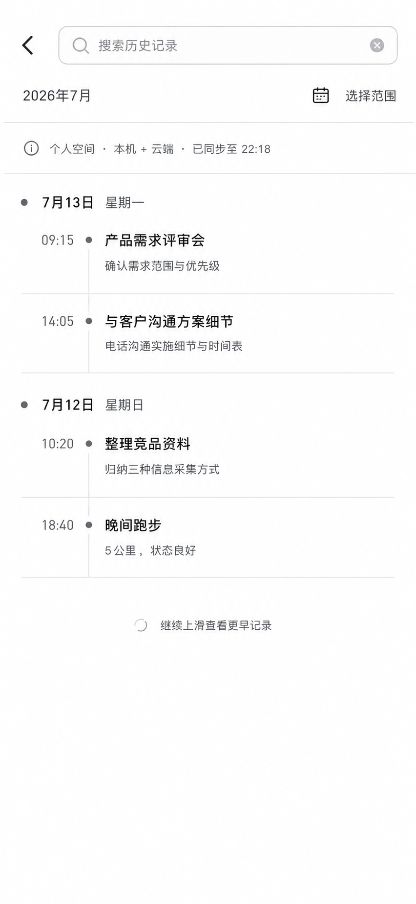
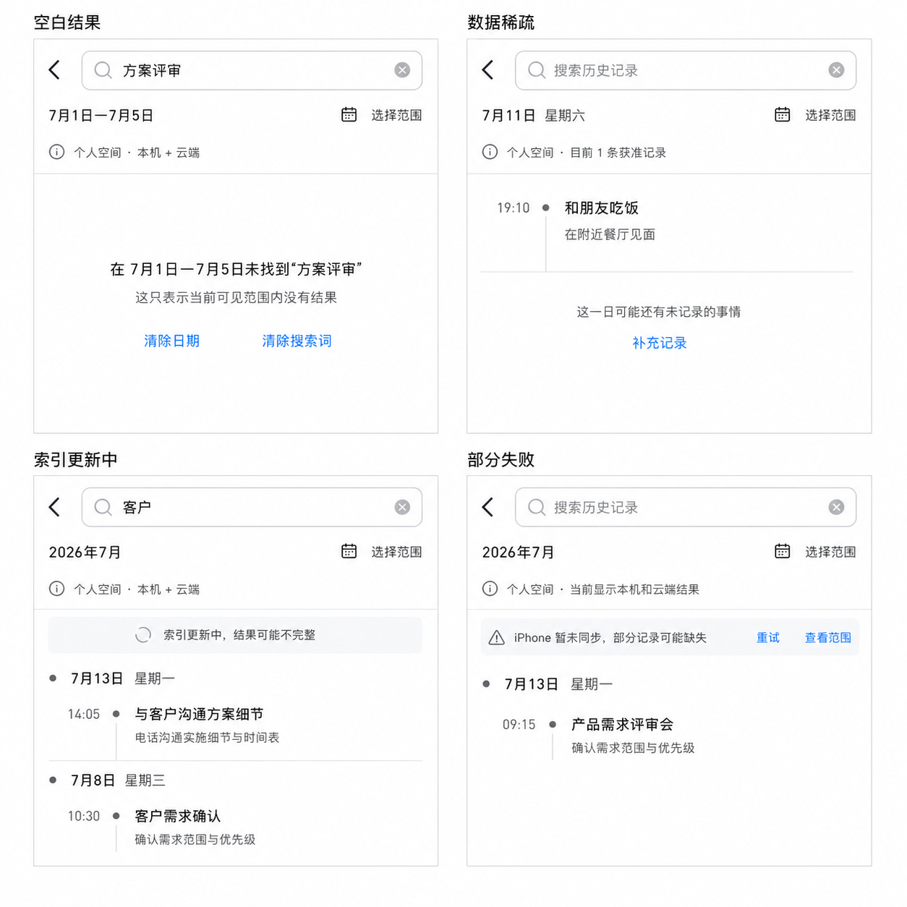

# Ameme Mobile 低保真设计基线 v0.3

> 文档状态：页面语义和关键状态已确认；双端将按系统原生组件分别实现\
> 更新日期：2026-07-13\
> 适用范围：iOS 与 Android Mobile MVP\
> 设计边界：本文是共同语义图，不是跨平台像素稿；iOS 与 Android 必须使用各自原生导航、搜索、列表、日期、弹层、字体和手势。

## 1. 已确认的低保真方向


该图是交互骨架参考，不是最终视觉稿。图中蓝色、字号、线条、圆角、间距、图标和圆形补充按钮都不能当作两端像素规范；下列信息层级与任务语义才是共同约束。

## 2. `今天` 页骨架

1. 页面标题和日期在左上，用户首先理解正在查看的日期。
2. 右上只放两个明确控制：搜索图标按钮和设置/菜单入口。
3. 不在用户界面使用“找回”作为功能名称；搜索按钮的无障碍名称是“搜索历史记录”。
4. 首页不设 `今天 / 搜索` 底部双入口或顶部分段器，保持当日浏览语义纯净。
5. 来源/同步范围只用一条克制状态说明，不显示覆盖分数。
6. 事件按时间排列，默认显示时间、标题、一句摘要和文字状态，不把每件事做成独立浮卡。
7. 全页最多突出一个与具体事件相关的待核验问题。
8. 今日小结位于事件流末尾，默认 2–3 行并可展开；数据不足时不生成。
9. 右下保留一个“补充记录”主动作，点击后再选择语音、照片、文字或导入，不同时铺开所有入口。

## 3. 搜索页骨架契约

### 3.1 默认搜索页低保真候选



该画面延续已确认的 `今天` 页信息密度和时间线语法，用于确认入口、日期控制、范围说明和统一历史日流。iOS 应转换为系统导航与搜索体验，Android 应转换为 Material 3 搜索与列表体验。

### 3.2 交互契约

点击右上搜索按钮进入独立搜索页：

```text
搜索框 + 返回
 -> 精简日期入口 / 可展开月历
 -> 当前范围（日期、空间、设备、同步）
 -> 统一历史日流
```

- 无搜索词时，向上按日加载更早记录。
- 日历只跳转到指定日锚点，不切换另一套页面。
- 搜索词和日期范围只筛选同一历史日流，结果仍按日分组。
- 搜索页保留查询、锚点和滚动位置；返回 `今天` 后恢复原滚动位置。

## 4. 搜索页四类关键状态候选



四种状态共用同一个页面结构和结果容器，不因为空白、稀疏、加载或失败切换另一套搜索体验：

| 状态 | 数据含义 | 页面必须表达 | 恢复动作 |
|---|---|---|---|
| 空白结果 | `RecallQuery` 已在当前时间、空间、设备与权限范围内完成，但没有命中 | “当前可见范围内没有结果”，不能推断用户没有做过 | 清除日期、清除搜索词或修改范围 |
| 数据稀疏 | 日期可用，但只有少量获准 Event/DayLedger | 明确当前只有少量记录，不显示覆盖分数，也不虚构缺失事件 | 补充记录或继续浏览 |
| 索引更新中 | 本地或同步索引正在更新，已有结果仍可读取 | 保留已有结果并标记“可能不完整”，不能清空页面 | 等待后台完成，必要时允许重试 |
| 部分失败 | 某设备、LAN peer 或索引分片暂不可用，其他可用范围仍能返回结果 | 显示未参与范围，同时保留本机/已同步结果 | 重试或查看当前检索范围 |

状态实现继续遵守三条边界：不暴露隔离空间的数量或内容；失败不抹掉已可用结果；无结果不等于没有发生。

## 5. 已确认与待设计边界

| 层级 | 当前状态 | 后续阶段 |
|---|---|---|
| `今天` 页面骨架和入口 | 已确认 | 作为后续页面和可交互原型的基线 |
| 默认搜索页与四类关键状态语义 | 已确认 | 分别映射 iOS/Android 原生组件并真机验证 |
| 事件层级、待核验、小结和补充 | 已确认 | 细化空、稀疏、离线、失败、仅本机等状态 |
| 颜色、字体、间距、圆角、图标风格 | MVP 原则已确认 | 使用 iOS/Android 平台原生控件与系统 token；在 native shell 做可读性/一致性 QA，不先建自定义视觉系统 |
| 动效和手势细节 | 实现验证项 | 优先系统转场/手势；可交互原型中以掉帧、响应和 Reduce Motion 等真机证据验收 |

## 6. 与数据和技术的约束

- 搜索按钮只是用户入口；底层继续使用 `RecallQuery` 执行日分页、日历锚定、关键词筛选和 Agent 召回。
- 图标按钮必须有可见焦点、至少 44×44 等效点击区和无障碍名称。
- 日流、小结和来源状态从本地结构化对象立即读取，不因视觉加载而阻塞主页。
- 低保真中的文案和事件是合成示例，不是真实用户数据或已验证数据源。
- 四类状态名称是交互候选；架构线需要在 P0/P1 中落为稳定的 `RecallResultState`、`IndexState` 和 `DeviceSyncState` 枚举及转换规则。
- 具体原生组件、平台差异和流畅性指标以 `Mobile原生UI与流畅性基线.md` 为准；本文件中的通用控件外观不得覆盖该原则。
