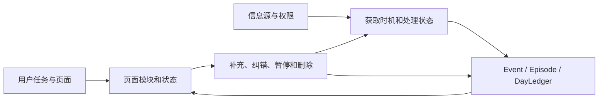

# Ameme Mobile 信息架构与数据获取联动 v0.5

> 文档状态：`今天默认首页 + 右上搜索按钮 + 搜索页统一历史日流 + 平台原生设置入口` 已确认\
> 更新日期：2026-07-13\
> 适用范围：iOS 与 Android MVP\
> 目标：同时定义用户看见什么、数据从哪里来、何时获取、失败时怎样降级，避免信息架构脱离真实数据能力。\
> 非目标：本阶段不确定视觉配色、具体组件样式、系统技术栈和后台频率参数。

## 1. 核心判断

Mobile 设计采用两条并行、逐项对齐的轨道：



任何用户可见模块进入 MVP 前，都必须回答：

1. 它读取哪个正式数据对象，而不是哪段临时 AI 文案？
2. 数据来自哪些来源，用户授权到什么范围？
3. 数据尚未到达、处理失败或来源失效时显示什么？
4. 用户如何补充、纠错、暂停、撤权或删除？
5. 该动作是否改变事件事实、展示文本、权限还是同步状态？

## 2. MVP 一级信息架构候选

```text
Mobile App
├─ 今天（默认首页）
│  ├─ 日期与当前记录状态
│  ├─ 当日事件时间线
│  ├─ 少量待补充 / 待核验
│  ├─ 今日小结（事件之后的派生视图）
│  └─ 常驻上传 / 补充入口
├─ 搜索（由今天页右上放大镜按钮进入）
│  ├─ 搜索词输入
│  ├─ 可展开月历与日期 / 日期范围筛选
│  ├─ 指定日期的“我的一天”
│  ├─ 关键词 + 日期 + 空间等组合筛选
│  └─ 事件 / Episode 结果与来源回跳
└─ 设置二级入口（平台原生呈现）
   ├─ 信息源与覆盖状态
   ├─ 权限和处理位置
   ├─ 空间、设备与同步
   ├─ 已连接 Agent
   └─ 隐私、导出与删除
```

Mobile 不再使用双内容导航。`今天` 是唯一默认首页，右上放大镜按钮进入搜索页；设置从明确菜单入口打开，不依赖隐藏手势。iOS 使用系统 menu 后 push/sheet，Android 可使用 drawer；上传/补充是 `今天` 页单一主动作，点击后再选语音、照片、文字或导入；系统 Share Sheet 仍可从其他 App 直接写入。

## 3. `今天` 页的信息层级

### 3.1 日期与当前状态

首屏顶部只显示：

- 当前日期；首页不通过左右滑改变“今天”语义，历史日期从搜索页日历进入。
- `已整理 N 件事`，以及最多一个需要用户注意的状态，例如“2 件待补充”或“照片尚未同步”。
- 轻量同步/来源状态入口。

不显示“覆盖率 82%”“效率 8/10”或“今天已完整记录”。系统无法证明一天已经完整，只能说明当前已获得和已整理的内容。

### 3.2 上传与快速补充

`今天` 页只保留一个悬浮“记录”按钮。用户点击后在平台原生 Sheet/BottomSheet 中选择文字、语音、照片或导入；系统可记住上次方式但不在首页常驻输入框，语音在未操作时绝不持续录音。

提交后：

1. 立即保存一个带时间和空间的 `SourceObject + UserAddendum`。
2. 页面先显示用户原话或明确内容，不等待所有 AI 处理完成。
3. 后台再关联照片、位置、日历或 Agent 来源，形成或修订 Event。
4. 自动丰富不能覆盖用户原话，用户可查看关联依据。

### 3.3 当日事件时间线

时间线是首页主体，每张事件卡只默认展示：

| 层级 | 内容 |
|---|---|
| 第一层 | 时间或时间段、事件标题 |
| 第二层 | 一句结果/对象/地点/人物摘要，按事件实际拥有字段显示 |
| 第三层 | `已记录 / 推测 / 待核验` 状态和少量来源提示 |
| 可选媒体 | 一张代表照片或用户语音原话，不做装饰瀑布流 |
| 展开动作 | 补充、修改、标记重要、不记录、查看来源、删除 |

首页不展示数值置信度、解析器名称或完整权限日志；这些信息在事件详情中渐进展开。

### 3.4 少量待补充和待核验

- 只询问高价值且用户能快速回答的问题。
- 默认同时最多突出 1 个问题，其余进入折叠列表。
- 问题必须具体，例如“14:00 的会议实际参加了吗？”，不能问“今天还有什么？”作为高频任务。
- 来源不足只能显示“这一时段缺少获准来源”，不能断言用户没有活动。

### 3.5 今日小结

今日小结是事件的派生结果，不是首屏主内容：

- 位于当日事件流末尾，默认只显示 2–3 行简版，可主动展开。
- 只读取当前版本 Event/Episode。
- 明确包含待核验事件时的语气。
- 任一底层事件修改、删除或撤权后，小结失效并重算。
- 只在已有足够可靠事件能形成有信息量的摘要时生成；数据不足时直接不显示，不用通用鸡汤文案填空。
- 用户主动要求时可重新生成，但仍必须说明已知范围和缺口。

## 4. `搜索` 页：统一历史日流

搜索页只有一种结果容器：按日分组的历史日流。上滑、日历和关键词不创建三套页面，而是分别改变同一日流的加载、定位和筛选。

### 4.1 页面结构

```text
搜索框
 -> 精简日期条 / 可展开月历
 -> 当前条件（锚点日期、日期范围、关键词、可见空间/设备）
 -> 统一历史日流（一天一组）
```

- 默认锚定今天或最近可见日期；用户持续向上滑时，按天增量加载更早日期。
- 日流是连续分组列表，不使用“每天占满一屏”的强制翻页，避免与单日内部的垂直滚动冲突。
- 日期只显示当前可见空间中是否存在事件的轻量标记，不暴露被隔离空间的数量或内容。
- 点击日历中某一天只把日流跳到该日锚点；它不打开另一种“单日结果页”。
- 日期范围会缩小同一日流的可见范围；范围选择采用明确的开始/结束动作，不依赖长按。
- 输入搜索词后，只保留命中的事件，结果仍然按日分组出现在同一日流中；清除搜索词恢复日流。
- 点击 `今天` 页右上搜索按钮进入未筛选的历史日流；点击今天页日期时进入搜索页并锚定该日。

### 4.2 日历与搜索词的组合规则

| 用户输入 | 系统行为 |
|---|---|
| 只选日期 | 打开该日期的 DayLedger / 事件时间线 |
| 只输入搜索词 | 在当前可见时间和空间中搜索 |
| 日期 + 搜索词 | 只在所选日期或范围中搜索 |
| 无日期、无搜索词 | 显示最近日期和可用日历，不生成空搜索结果 |
| 清除日期 | 保留搜索词，恢复全部可用时间范围 |

搜索结果沿用事件卡语义，并显示命中的时间、上下文和来源入口。页面必须显示当前参与检索的空间、设备和同步状态，不能把本机结果描述成完整个人历史。

### 4.3 为 Agent 搜索预留统一契约

Mobile 关键词搜索和后续 Agent 自然语言搜索共用 `RecallQuery`，而不是建设两套检索：

```json
{
  "query_text": "方案评审",
  "date_range": ["2026-07-01", "2026-07-13"],
  "visible_spaces": ["work", "personal"],
  "entity_filters": [],
  "event_types": [],
  "device_scope": "available",
  "mode": "keyword"
}
```

MVP 先实现 `calendar + keyword`；后续 Agent 把自然语言意图解析成同一查询对象，并把 `mode` 扩展为 `semantic` 或 `agent`。权限、空间、设备范围和结果 lineage 不因 Agent 搜索而改变。

## 5. 设置二级入口

设置是控制层，不是第三个内容空间：

- 入口概览只展示账户、来源状态、空间/同步、Agent、隐私和设置入口。
- 来源异常可以在 `今天` 轻量提示，修复动作进入设置概览或对应二级页。
- 修改授权、空间或同步后，返回原页面并局部刷新，不把用户带到独立管理首页。
- 顶部必须有明确按钮入口；iOS 不实现边缘抽屉，Android 侧滑手势只是增强，不能成为唯一进入方式。

## 6. 事件详情页

事件详情同时承担“看懂”和“控制”，但不做工程调试页：

1. **发生了什么**：时间、动作、对象、人物、地点和结果。
2. **我的补充**：用户原话、感受、意义和重要性。
3. **为什么这样记录**：照片、日历、位置、健康、Agent 等来源摘要及字段对应关系。
4. **当前状态**：已记录、推测、待核验、冲突、仅本机或待同步。
5. **修改历史**：关键 Revision，默认折叠。
6. **使用范围**：空间、同步和 Agent 可用范围。
7. **控制**：修改、拆分/合并建议、不记录、删除和撤回。

## 7. `今天` 上传与快速补充路径

```text
点击 `今天` 页补充区
 -> 语音（默认）/ 照片 / 文字 / 导入
 -> 自动带入当前时间、当前空间和可用的机会式位置
 -> 用户可一句话改为“昨晚”“刚才会议后”等所指时间
 -> 立即保存
 -> 后台解析与事件关联
 -> 今天页出现或修订事件
```

MVP 不要求用户填写标题、类型、人物、地点和标签表单。只有系统无法确定且错误影响较高时，再出现一个具体追问。

## 8. 数据获取总状态

底层保留细状态，用户侧压缩成少量可理解状态：

| 底层状态 | 用户可见状态 | 页面行为 |
|---|---|---|
| 平台不支持 / 无数据源 | 不可用 | 说明当前设备限制，不诱导授权 |
| 可用但未授权 | 未连接 | 说明能补充哪类事件，用户主动开启 |
| 已授权且最近成功 | 正常 | 低打扰显示最近更新时间 |
| 系统限频 / 等待后台窗口 | 等待更新 | 不报错，允许前台刷新 |
| 授权撤销 / Token 过期 / 读取失败 | 需要处理 | 指向具体修复动作 |
| 用户主动暂停 | 已暂停 | 保留历史，不继续获取 |
| 仅本地且未同步 | 仅本机 | 其他端显示覆盖缺口，不显示内容 |
| 已收到，尚在解析/归并 | 整理中 | 不生成虚假事件，可显示明确的用户主动补充 |

“没有数据显示”必须区分：确实没有记录、尚未授权、来源还未同步、平台拿不到和处理失败。

## 9. MVP 信息源获取矩阵

| 来源 | 触发方式 | 授权范围 | 后台策略 | 本地先处理 | 主要贡献 | 降级路径 |
|---|---|---|---|---|---|---|
| 用户语音 | 用户点击/按住说 | 当前片段麦克风 | 无持续录音 | 音频缓存、转写和敏感检测 | 事实补充、意图、感受、意义 | 允许重录或仅保存音频待处理 |
| 拍摄/选择照片 | 相机、Picker、分享 | 当前照片、有限照片或用户选择范围 | 获准时做增量候选，不全量上传 | EXIF、hash、连拍聚合和敏感检测 | 时间、现场、对象、地点和生活时刻 | 仅保存照片引用和用户说明 |
| 轻量位置 | A0 已有数据、A1 被动事件、A2 单次位置、A3 短时精确 | 近似/精确、前台/后台分层 | Visit、显著变化、Geofence、被动或低功耗 | 去噪、停留聚类和敏感地点处理 | 到访、通勤、旅行和事件地点 | 无位置也允许保存事件，按需手动补地点 |
| 日历 | 首次选择和增量同步 | 选定日历、时间窗 | 平台允许时增量，前台兜底 | 去重、计划/实际区分 | 时间锚点、主题、地点和参与候选 | 显示“计划”，不当成已发生 |
| 健康与活动 | 用户选择授权包 | 日常活动、锻炼、睡眠、恢复、正念分项 | 系统允许时批量读取，前台兜底 | 日级/会话聚合，不上传原始流 | 运动、睡眠、身体活动和背景 | 没有读取结果不解释为没有活动 |
| 文字/分享 | 输入、Share Sheet、文件导入 | 当前对象 | 无 | 类型识别、敏感检测 | 用户表达、网页、文件和其他 App 对象 | 保存原对象引用和用户补充 |
| Agent | 配对后由任务写回或用户明确记录 | 任务目的、空间、时间、对象和有效期 | 宿主任务内，不扫描无关工作区 | 结构验证、敏感与空间检查 | 工作过程、决定、产物和结果说明 | 保留本地待同步状态或由用户重试 |

## 10. 页面模块与数据能力映射

| 页面模块 | 读取对象 | 依赖来源 | 不可用时必须显示 |
|---|---|---|---|
| `已整理 N 件事` | 当前日期 Event/Episode | 任意已连接来源 | 只显示已有事件数量，不推算全天覆盖百分比 |
| 时间线 | Event/Episode 当前版本 | Mobile + Agent 获准结构化事件 | 空状态区分未连接、等待同步和确实无记录 |
| 事件状态 | 字段置信度、证据状态、用户反馈 | SourceObject/Observation/UserAddendum | 不知道就显示推测/待核验，不升级为事实 |
| 代表照片 | 设备引用或用户选择同步的媒体 | 照片 | 媒体不可用时保留事件，不显示破图占位 |
| 地点 | PlaceVisit/TripSegment/Event.location | 照片、日历、位置、用户补充 | 显示无地点或允许补充，不主动高频定位 |
| 待补充 | 冲突、重要缺口、来源健康 | 多源归并和来源状态 | 无可靠缺口证据时不生成问题 |
| 今日小结 | 当前 DayLedger 派生输出 | 已形成 Event/Episode | 事件不足时不生成泛化总结 |
| 搜索历史日流 | RecallQuery + DayLedger 日期索引 + Event/Episode | 已同步或本地可用空间 | 无记录、未授权、未同步、索引中和处理失败必须分开 |
| 日历与搜索条件 | RecallQuery 的锚点日期、日期范围和搜索词 | 同一历史日流 | 明确哪些设备/空间未参与，不生成第二套结果布局 |
| 设置二级入口 | AcquisitionContract、权限和最近成功记录 | 各来源 | 显示具体中断原因与修复动作 |

## 11. 获取与页面联动的关键时机

### 打开 `今天`

1. 立即读取本地 Event/DayLedger，不等待网络。
2. 并行检查照片、日历、健康和 Agent 的增量状态。
3. 位置仅在 A0/A1 不足且当前交互需要地点时进行 A2 单次请求。
4. 新数据进入“整理中”，解析成功后局部更新事件，不整页闪烁。

### 用户主动补充

1. 先保存用户内容并在时间线出现。
2. 再补充机会式位置和可用上下文。
3. 归并结果导致事件变化时保留 Revision，并避免用户刚写完的内容消失。

### 后台获取

1. 只处理平台允许且用户已授权的增量。
2. 批量、低频、可中断；不为刷新首页维持持续高功耗任务。
3. 失败记入来源健康状态，前台可见且可重试。

### 跨端和 Agent 写回

1. 新结构化事件先进入对应空间。
2. Mobile 只在用户当前可见空间中联邦展示。
3. 原始对象不在当前设备时，显示来源摘要和可用状态，不假装已本地拥有。

### 打开 `搜索`

1. 先读取本地 DayLedger 日期索引和锚点附近的日分页，立即展示可滚动的历史日流。
2. 并行刷新获准结构化同步与可重建搜索索引，不主动读取新的照片、位置或健康原始数据。
3. 向上滑动时请求更早的日分页；日历更换锚点；搜索词和日期范围筛选同一份按日分组结果。
4. 后续 Agent 搜索复用相同查询与权限检查，不获得额外空间。

## 12. 首次使用和授权编排

首次启动不先连续弹系统权限框，而是用一条产品路径完成选择：

```text
看到“自动整理今天”的真实价值
 -> 选择希望补齐的来源包
 -> 按用户选择依次触发系统分项授权
 -> 每完成一项立即说明能补上什么
 -> 进入今天，展示真实导入/用户补充
 -> Agent 配对作为可跳过增强
```

来源包候选：

- **生活现场**：照片 + 位置。
- **时间安排**：日历。
- **身体与活动**：日常活动、锻炼、睡眠默认推荐，恢复和正念同页可选。
- **工作增强**：配对 MCP/Skill/API。

语音和相机权限在用户第一次使用对应动作时申请，不为了“以后可能用”提前索取。

## 13. 必须覆盖的页面状态

在进入视觉方案前，至少要为 `今天` 定义：

1. 首次进入且没有任何来源或事件。
2. 已连接来源，正在首次导入和整理。
3. 正常一天，有多来源事件和少量推测。
4. 有一个高价值待核验问题。
5. 某来源权限撤销或长时间未更新。
6. 离线、仅本机和跨端有未同步记录。
7. 用户刚补充一件事，AI 尚未完成关联。
8. 底层事件修改后今日小结失效并重算。
9. 数据不足以生成小结，但已有事件仍可正常浏览和补充。

`搜索` 还需覆盖：

1. 默认锚点和向上加载更早日期。
2. 日历跳转到指定日后，仍在同一历史日流中浏览。
3. 搜索词或日期范围生效后，命中结果仍按日分组。
4. 无记录、未同步、未授权、索引中和处理失败的状态分开。

## 14. 本轮逐层确认顺序

已确认：

1. `今天` 是唯一默认首页；右上放大镜按钮进入搜索页，设置使用明确菜单入口并按 iOS/Android 原生模式呈现。
2. `今天` 保持干净，主要浏览当日事件和一个“补充记录”主动作。
3. 搜索页使用一条按日分组的历史日流：向上滑加载更早日期，日历负责跳转，搜索词负责筛选。
4. 今日小结于当日事件流末尾显示 2–3 行简版并可展开；数据不足时不生成。
5. 不设置面向用户的“最小来源组合”；产品必须在任意已授权来源组合下可用，并把数据不足作为正式状态。

已补充确认：

1. 低保真选择“干净今天 + 右上搜索按钮”方向，不设双内容导航。
2. 原始位置、音频、照片缩略与模型输入缓存采用“原始本地、短期可恢复、结构化独立保留、选定原始才同步、删除可传播”原则；精确 TTL 由双端与存储 Spike 回填。
3. `今天` 低保真骨架已确认；下一步并行绘制搜索页、关键状态和数据获取状态机。
