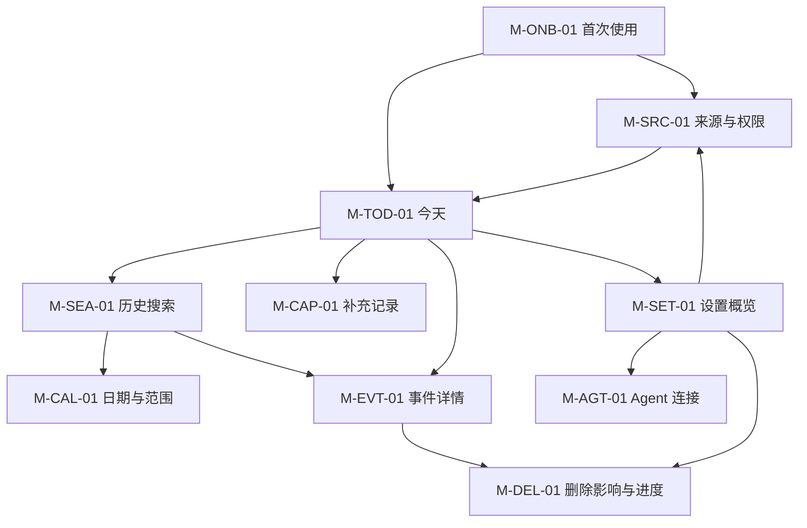

# Ameme Mobile 双端原生页面规格 v0.2

> 文档状态：已接受；MVP 双端实现正本\
> 更新日期：2026-07-14\
> 适用版本：iOS/Android Native Mobile MVP\
> 上游正本：`MVP产品设计规格.md`、`Mobile交互设计规格.md`、`Mobile原生UI与流畅性基线.md`\
> 目标：把共同页面语义落实到双端原生组件、查询/命令、状态、恢复、指标和验收；不作为像素稿。

## 1. 页面清单与导航

| Page ID | 页面 | 主要任务 | 入口 | 退出/返回 |
|---|---|---|---|---|
| M-ONB-01 | 首次价值与来源选择 | 明白产品、选择一个可用入口 | 首次启动 | 进入 `今天` 或系统授权 |
| M-TOD-01 | 今天 | 浏览、补充、进入搜索或详情 | 启动默认、保存返回 | Search/Event/Settings/Capture |
| M-SEA-01 | 历史搜索 | 连续日流、日期锚定、关键词筛选 | `今天` 搜索按钮/日期 | 返回 `今天`，保留短期状态 |
| M-CAL-01 | 日期与范围 | 选择单日或日期范围 | Search 日期入口 | 应用/取消回 Search |
| M-CAP-01 | 补充记录 | 选择语音、照片、文字或导入并先保存 | `今天` 主动作/系统分享 | 返回原上下文并显示保存状态 |
| M-EVT-01 | 事件详情 | 看懂、补充、纠错、来源、删除 | Today/Search 事件 | 返回原日流位置 |
| M-SET-01 | 设置概览 | 进入来源、空间/同步、Agent、隐私 | 顶部设置按钮 | 返回原页面 |
| M-SRC-01 | 来源与权限 | 理解、开启、限制、暂停、修复来源 | Onboarding/Settings/异常入口 | 返回原上下文并局部刷新 |
| M-AGT-01 | Agent 连接与访问 | 配对、授权用途/空间/期限、查看和撤销 | Settings | 返回 Settings |
| M-DEL-01 | 删除影响与进度 | 确认范围、查看传播和重试 | Event/Settings | 返回来源页或安全落点 |



## 2. 共同页面状态契约

每个页面只从统一状态集合映射用户表达，不自行创造同义状态：

| State | 用户含义 | 可用内容 | 必须动作 |
|---|---|---|---|
| `ready_local` | 本机内容可用 | 本地 Event/DayLedger/索引 | 允许完整本机操作 |
| `syncing` | 正在补充跨端数据 | 已有本地/同步结果 | 保留内容，显示范围 |
| `partial` | 某设备/空间未参与 | 当前可见范围结果 | 查看范围/重试，不宣称完整 |
| `processing` | 转写、归并、索引或 Summary 处理中 | 原始补充/旧结果 | 允许离开，不阻塞主路径 |
| `empty` | 当前范围没有可见对象 | 页面壳、范围、补充入口 | 不推断“没有发生” |
| `sparse` | 当前范围只有少量对象 | 已有事件 | 允许补充，不显示覆盖率 |
| `permission_limited` | 来源未授权或有限授权 | 其他来源和主动补充 | 解释影响和系统设置路径 |
| `offline` | 网络不可用 | 本机结果和写入队列 | 继续本机使用 |
| `recoverable_error` | 当前步骤失败但内容安全 | 已保存对象/已有结果 | 重试、降级或改成文字 |
| `destructive_pending` | 删除/撤权正在传播 | 完成范围和失败项 | 允许查看状态、重试 |

## 3. M-ONB-01 首次价值与来源选择

### 3.1 页面任务

用户在不理解 Event、MCP 或权限术语的情况下，知道 Ameme 会整理获准信息为“今天”，并选择最容易产生第一条事件的入口。

| 项目 | iOS | Android | 共同规则 |
|---|---|---|---|
| 页面壳 | `NavigationStack` + 系统 Scroll/Form | `Scaffold` + Top App Bar + `LazyColumn` | 不做多页品牌轮播 |
| 来源选择 | 原生 Button/Toggle 只表示产品选择；实际权限在使用时请求 | Material Button/Switch 同语义 | 不把 Toggle 伪装成系统已授权 |
| 主动作 | “用照片开始”“说一句”“稍后进入今天” | 同文案语义 | 至少有一个无需权限墙的继续入口 |
| 系统授权 | Photos Picker/实际录音时请求 | Photo Picker/实际录音时请求 | 拒绝后返回并保留其他路径 |

立即查询：`get_capability_snapshot()`、`list_source_contracts()`。\
写入命令：`choose_source_package`、`request_acquisition_contract`。\
埋点：首次页可见、来源说明展开、系统授权请求/结果、第一条本地记录时间；不记录所选照片或用户文字。

### 3.2 验收

- 用户拒绝照片、位置或健康后仍能用文字/语音形成第一条本地记录。
- 系统权限弹窗前存在一屏内的用途、范围、处理位置和关闭方式说明。
- 首次路径不要求注册云账户才能进入本机 `今天`。

## 4. M-TOD-01 今天

| 项目 | iOS | Android | 数据/命令 |
|---|---|---|---|
| 壳 | `NavigationStack` + Toolbar | `Scaffold` + Top App Bar | `get_day_ledger(local_date, scope)` |
| 日流 | `List` 或可访问惰性列表，系统滚动/动态字体 | `LazyColumn`、稳定 key、Material 列表语义 | `DayLedgerPage`、`EventSummary` |
| 搜索 | Toolbar search icon | Top App Bar search icon | 打开 M-SEA-01，不执行隐藏查询 |
| 设置 | Toolbar menu 后 push/sheet | Top App Bar menu，可打开 drawer/页面 | 打开 M-SET-01 |
| 记录 | 安全区内单一悬浮 Button，打开原生 Sheet | Material FAB，打开 `ModalBottomSheet` | 打开 M-CAP-01，展示文字/语音/照片/导入 |
| 小结 | 列表末尾 Disclosure/Section | 列表末尾可展开 section | `get_summary(day_ledger_revision)` |

首帧顺序：本地页面壳 → 本地 DayLedger/事件 → 来源/同步状态 → 后台增量与 Summary。网络、模型和媒体缩略不得阻塞前两步。

悬浮按钮只承担“记录一件事”，不在首页展开 AI 对话。按钮不遮挡最后一条事件和今日小结；大字体/横屏时跟随安全区。点击后 Sheet 展示四种方式，文字提交成功以本地事务为准，目标 300ms 内给出“已保存”反馈。首页不使用底部 Tab Bar、常驻聊天输入框或重复 FAB。

必须状态：空白、数据稀疏、本机可用、同步中、部分范围、事件处理中、来源异常、小结过期。后台更新使用稳定 Event ID 局部刷新，不抢焦点、不把用户滚回顶部。

## 5. M-SEA-01 历史搜索与 M-CAL-01 日期范围

| 项目 | iOS | Android | 数据/命令 |
|---|---|---|---|
| 搜索输入 | `.searchable`、系统取消/键盘 | Material 3 Search、系统 IME | `execute_recall_query` |
| 日流 | `List`/惰性列表按日 section | `LazyColumn` sticky/date header 可选 | `RecallPage` + cursor |
| 日期 | Toolbar/内容入口打开 sheet/popover | Date Picker/Date Range Picker dialog/sheet | 更新 `date_anchor/range` |
| 加载 | 系统 Progress，保留已有结果 | Material Progress，保留已有结果 | `IndexState`/`DeviceSyncState` |

查询规则：

1. 无词无日期：最近可见日流，向上滑增量加载更早日期。
2. 单日：跳转同一日流锚点，不创建单日新页面。
3. 范围：只筛选同一日流。
4. 关键词：在当前 scope 内执行，结果仍按日分组。
5. 部分设备/索引不可用：返回已有结果和 `partial_reasons[]`。
6. 无结果：说明查询和范围，不写“你没有做过”。

返回恢复：查询词、日期/范围、scope、cursor、滚动锚点和已展开条目保留于页面级状态；冷启动仍默认进入今天。

## 6. M-CAP-01 补充记录

| 阶段 | iOS | Android | 共同规则 |
|---|---|---|---|
| 进入方式 | 悬浮记录 Button 打开 Sheet | FAB 打开 `ModalBottomSheet` | Sheet 展示文字、语音、照片、导入四种方式 |
| 采集 | Photos Picker、相机、录音、文件/Share Sheet | Photo Picker、相机、录音、文件/Sharesheet | 只在实际动作时请求权限 |
| 草稿 | Sheet/Form，系统键盘和焦点 | Bottom Sheet/Screen，系统 IME | 默认当前时间/空间，可改所指时间 |
| 提交 | 原生主 Button | Material 主 Button | 事务先写 `SourceObject + UserAddendum` |
| 后台 | Activity/Progress/inline status | Progress/inline status | OCR/转写/归并/同步异步 |

成功定义：本地事务持久化并返回稳定 ID；不是 AI 整理完成。失败时必须区分未保存、已保存待处理、处理失败和待同步。

## 7. M-EVT-01 事件详情

信息顺序固定：发生了什么 → 我的补充 → 状态与不确定性 → 为什么这样记录 → 来源与修订 → 权限/同步 → 修改、拆分/合并、删除。

| 动作 | 命令 | 成功 | 失败/恢复 |
|---|---|---|---|
| 补充说明 | `add_user_addendum` | 立即显示原话和 Revision | 保留草稿并重试 |
| 修改事实 | `revise_event_field` | 新 revision，旧值可追溯 | 冲突时并列候选，不静默覆盖 |
| 确认/否认 | `submit_feedback` | 更新状态和派生输出 | 保留动作队列 |
| 拆分/合并 | `propose_event_structure_change` | 预览影响后提交 | 冲突时不自动提交 |
| 查看来源 | `get_event_lineage` | 只返回获准摘要/回跳引用 | 原对象失效仍保留结构化证据说明 |
| 删除 | 打开 M-DEL-01 | 展示影响范围 | 不在滑动手势中直接执行 |

iOS 使用 List/Form/Disclosure/系统 Menu；Android 使用 LazyColumn/Material sections/menu。系统 Swipe Action 只能作为快捷方式，删除必须经过影响确认。

## 8. M-SET-01、M-SRC-01 与 M-AGT-01

### 8.1 设置概览

- iOS：Toolbar 入口后 push 或 sheet，使用 Form/Section；不实现边缘 drawer。
- Android：Top App Bar 入口后页面或 `ModalNavigationDrawer`；按钮是稳定入口。
- 共同条目：账户/设备、来源、空间与同步、Agent、隐私/导出/删除、诊断支持。

### 8.2 来源与权限

每个来源卡/section 显示：价值、当前系统授权、Ameme Contract、处理位置、最近成功、同步策略、暂停/撤权、失败修复。

状态必须区分：未请求、拒绝、有限、仅前台、后台受限、已授权无数据、读取失败、系统限频、暂停、合同过期。

### 8.3 Agent 配对

MVP 候选流程：

```text
Mobile 生成一次性配对挑战
 -> 用户在受支持 Agent 中调用 pair
 -> Mobile 显示 Agent 身份、用途、空间、数据类型和有效期
 -> 用户确认
 -> 生成可撤销设备/Agent grant
 -> 每次调用进入访问记录
```

配对挑战短时有效、一次使用；不能在二维码/代码中包含长期密钥。具体协议、TTL 和设备证明由安全/架构正本冻结。

## 9. M-DEL-01 删除影响与进度

删除前展示对象、空间、原始/结构化/派生范围、已同步设备和不可逆影响。用户确认后创建 `DeletionJob`，页面展示：

```text
queued -> local_deleting -> sync_propagating -> recomputing -> completed
                    |              |
                    v              v
              partial_failed <-----
```

- 部分失败不得显示“已全部删除”。
- 离线设备显示等待 ack；设备撤销后按安全策略继续完成或记录无法证明项。
- 用户离开页面后任务继续，Settings 可重新进入查看。
- 删除事件、来源、空间、账户采用不同确认文案和影响清单。

## 10. 可访问性与本地化

1. iOS Dynamic Type/VoiceOver、Android font scaling/TalkBack 覆盖全部任务。
2. 关键动作不只依赖颜色、边缘手势、长按、滑动或图片。
3. 图标必须有平台语义标签；搜索按钮名称为“搜索历史记录”。
4. 日期、时间、时区、周起始和 12/24 小时制由系统区域设置呈现，领域层保存标准时间和原时区。
5. 大字体下允许事件摘要换行，不能把状态和删除动作挤出可访问区域。
6. 遵循减少动态效果；后台更新不抢焦点、不自动朗读整页。

## 11. 流畅性与恢复验收

| 任务 | 必须测量 | 不允许 |
|---|---|---|
| 启动今天 | 冷/热启动、首个可滚动帧、本地数据量 | 等网络/AI 后显示空白页 |
| 滚动长日流 | 慢帧、内存、分页、缩略加载 | 列表整体重建和跳位 |
| 输入搜索 | 键盘、输入响应、提交/取消、结果首屏 | 每个字符触发阻塞主线程请求 |
| 补充保存 | 点击提交到本地确认、离线/失败 | 等转写/模型完成才显示成功 |
| 返回恢复 | 详情、Picker、设置、进程回收 | 查询、草稿、滚动无说明丢失 |
| 删除 | 提交、后台传播、重进状态 | 部分失败伪装完成 |

研发前采用初始体验预算：触控反馈 `<=100ms`、冷启动到 `今天` 可用 `<=1200ms`、热启动 `<=500ms`、本地保存确认 `<=300ms`、本地搜索首屏 `<=700ms`、关键旅程慢帧占比 `<5%`、Crash-free session `>=99.5%`、确认保存丢失 `=0`。这些是 Prototype 的验证/否决线，不是未经实测的达成结论；所有测量必须按 iOS/Android、设备档位和数据量分开记录。

## 12. 低保真验收任务

1. 无 Agent 用户拒绝照片和位置，用文字形成第一条今天事件。
2. 用户离线录音，立即看到已保存；联网后完成转写和关联。
3. 用户从今天搜索三天历史、日历跳转、关键词筛选，返回后恢复位置。
4. 一台设备未同步时，搜索保留本机结果并说明范围。
5. 用户修正一个推测事件，小结标记过期并重算。
6. 用户查看来源、删除事件，并看到离线设备的删除传播状态。
7. 用户配对 Agent，只授权 Personal 空间 24 小时，Work 读取被拒绝且有访问记录。
8. 大字体和屏幕阅读器用户完成今天浏览、补充、搜索和删除。
