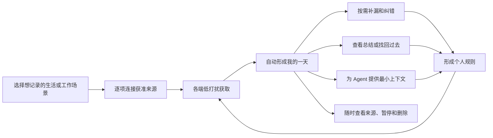

# Ameme 多端使用与体验闭环 v0.1

> 文档状态：第 5 步评审候选，等待产品负责人确认\
> 更新日期：2026-07-13\
> 目标：定义数据被获取和形成事件之后，用户如何低负担查看、补漏、找回、总结并交给 Agent 使用。\
> 非目标：现在确定页面视觉、具体导航、MVP 功能清单或通知文案。

## 1. 核心体验判断

Ameme 不能把“无感记录”变成“每天晚上必须审核 AI 作业”。完整体验应满足：

1. 普通一天允许用户零输入；系统仍能用获准来源形成带置信度的“我的一天”。
2. 用户主动记录时，一次分享、一句话、一次拍摄或一次 Agent 指令就能完成。
3. 高置信事件自动保存为带状态的事件记录，不要求逐条确认。
4. 中低置信、冲突和高价值遗漏只在值得问时出现；不确定内容明确标记，不伪装成事实。
5. 每日复盘是提高覆盖和个性化的可选路径，不是产品使用前提。
6. Summary、Memory 和 Agent 回答都能回到 Event、用户补充和来源证据。
7. 授权、暂停、删除和空间边界在每个使用入口都可见，不依赖一个隐藏管理后台。

用户侧的核心对象是“我的一天”和其中的一件件事，不展示 `SourceObject`、`Observation`、`DayLedger` 等内部术语。

## 2. 完整体验闭环



闭环不是以“用户确认全部事件”为完成条件。系统要保留每个事件的状态：已确认、高置信推断、待核验、冲突或仅用户陈述；不同输出按用途决定可以使用哪些状态。

## 3. 六个用户阶段

### 3.1 第一次建立信任

路径：

`选择希望解决的问题 -> 看到推荐来源组合 -> 逐项授权 -> 预览会得到什么 -> 设置排除和同步范围 -> 生成第一段“我的一天”`

产品先问用户想解决什么，例如“回忆每天做了什么”“保留生活时刻”“让 Agent 理解最近工作”，再解释需要哪些来源；不先展示一整页系统权限。

成功条件：

- 用户能说清当前开启了哪些来源、保存在哪里、哪些内容会同步。
- 用户能在当前端直接暂停、撤权和删除。
- 第一个来源连接后就能产生可理解的事件或示例，不要求先连接所有来源。

### 3.2 一天中的低打扰记录

来源有四种自然入口：

- Mobile：相机、照片/文件选择、分享、语音、日历以及分项授权的系统来源。
- Agent：当前任务、获准文件/工作区、工具调用、决定和结果写回。
- Connector：邮件、会议、游戏、运动、出行、账单等官方接口或用户导入。
- Web/小程序/Browser：主动补充、网页一键记录和跨端查看。

系统不为每个来源动作都弹通知。采集状态通过常驻但低打扰的状态入口表达；只有来源中断、权限变化或高价值不确定性才主动提示。

### 3.3 关键时刻主动记录

用户可以在任意端表达：

- “记一下这个。”
- 分享一张照片、一个网页、文件或账单。
- 说一句“今天这个决定很重要”。
- 在 Agent 中要求记录当前任务、结论或踩坑。

最小动作只要求内容和目标空间。项目、人物、类型和长期价值可以由系统推断或以后补充，不能把一次记录变成填表。

### 3.4 查看和补齐“我的一天”

Mobile 是主查看和控制端；Web/小程序提供轻量跨端入口；Agent 可以用对话返回当天获准的部分。

“我的一天”按时间展示 Event/Episode，并提供：

- 事件状态：确认、推断、待核验或冲突。
- 来源解释：为什么系统认为发生了这件事。
- 覆盖状态：哪些时段有来源，哪些时段可能存在未同步或未覆盖事件。
- 低负担动作：对、修改、没有发生/不记录、补一件事。

复盘采用风险分层：

| 情况 | 默认体验 |
|---|---|
| 高置信、低风险日常事件 | 自动进入时间线，不要求确认 |
| 高置信但敏感或将被跨空间使用 | 使用前确认授权范围 |
| 中置信且可能影响总结 | 在“需要你看一下”中批量出现 |
| 低置信、低价值噪声 | 不打扰用户，保留短期候选或按策略丢弃 |
| 来源冲突或高价值遗漏 | 用一个具体问题请求补充 |

用户没有复盘时，系统仍可保存带状态的事件；摘要必须表达不确定性，不能把“未确认”升级成“已确认”。

### 3.5 找回、总结和理解

使用按时间尺度分成三层：

| 使用层 | 用户问题 | 主要依据 | 反馈 |
|---|---|---|---|
| 今天 | 今天发生了什么，还有什么漏了 | Event、Episode、覆盖状态 | 对/修改/补充 |
| 找回 | 我什么时候做过、看过、去过、决定过什么 | Event、Artifact、来源索引 | 找到了/不相关/缺上下文 |
| 反思 | 这一周/月有什么变化和模式 | 已确认或足够可信的跨日事件与 Memory | 有用/错误/偶然/不希望分析 |

总结是同一批事件的不同表达，不创建另一套事实。日总结、工作总结、旅行回顾可以共用 Event，但必须按当前空间和用途重新过滤。

### 3.6 在 Agent 中使用并写回

Agent 侧形成一个闭环，而不只是只读搜索：

```text
Agent 声明任务目的和需要的空间/时间
 -> Ameme 返回最小 ContextPack
 -> Agent 执行任务
 -> 写回本次过程、决定、结果或用户补充
 -> 形成 EventCandidate/EventRevision
 -> Mobile 或 Agent 中可查看和纠正
```

Agent 入口支持四类动作：

- `capture`：记录当前任务、决定、产物、结果或用户补充。
- `recall`：按时间、人物、项目和主题找回获准历史。
- `context`：为明确任务生成最小上下文包。
- `feedback`：报告有用、不相关、过时、缺失或越权。

第三方 Agent 不直接获得数据库访问权；每次请求都声明目的、空间、时间和数据类型，并留下访问记录。

## 4. 多端体验分工

| 能力 | Native Mobile | Agent MCP/Skill/API | Web/小程序 | Browser Extension |
|---|---|---|---|---|
| 连接独占来源 | 主入口 | 仅宿主与获准工作上下文 | 少量 Connector/上传 | 当前网页 |
| 无感/低打扰采集 | 手机系统允许的分项能力 | 当前 Agent 任务内 | 不承担 | 用户触发当前页 |
| 一键记录 | 相机、语音、分享、文字 | 对话指令/任务结束写回 | 文字、语音、上传 | 保存当前页并补一句 |
| “我的一天” | 主界面 | 对话查看获准部分 | 跨端轻量查看 | 只显示当前页相关事件 |
| 补漏与纠错 | 主入口 | 在当前任务中更正 | 轻量入口 | 只纠正当前捕获 |
| 搜索与总结 | 完整 C 端体验 | 面向当前任务使用 | 跨端查看 | 当前网页相关找回 |
| 权限与删除 | 当前设备及账户级入口 | 当前任务授权与访问日志 | 账户和同步管理 | 域名和页面权限 |

不同端共享事件状态、修订和权限语义，不要求共享相同界面。

## 5. 跨端典型路径

### 普通生活日

手机从用户允许的照片、日历和活动来源生成若干事件；晚上用户可以直接看“我的一天”，也可以不打开。系统只对一个高价值冲突发出问题，用户用一句话补充同行人和事件意义。之后可以生成带来源的日总结。

### AI Native 工作日

Agent 记录项目任务、修改过程和产物，Mobile 记录通勤、会议日历、餐饮和生活事件。获准的结构化事件进入同一时间线，但 Work 和 Personal 仍属于不同空间。用户可以在 Mobile 查看整天，也可以让 Agent 只查询 Work。

### 找回并继续任务

用户在 Agent 中问“上次讨论这个方案时为什么没选另一条路线”。Ameme 只检索获准的 Work 事件、决定和来源，返回带时间与证据的 ContextPack；Agent 使用后回报是否有用和缺少什么。

### 敏感空间

Health 保持 `device_local` 时，其他 LAN peer 和 Work Agent 只能看到“该空间未授权/该设备有未同步记录”，不能看到健康事件，也不能以跨端完整为由自动请求整库。

## 6. 反馈不只发生在每日复盘

| 反馈时机 | 解决的问题 | 形成的系统结果 |
|---|---|---|
| 捕获当下 | 这件事是否值得记、属于哪个空间 | EventCandidate、显式重要性 |
| 看“我的一天”时 | 事实、时间、合并和遗漏是否正确 | EventRevision、UserAddendum |
| 搜索/总结后 | 结果是否正确、相关、过时 | 使用反馈和重算依据 |
| Agent 完成任务后 | 上下文是否帮助完成任务 | ContextPack 结果、缺失上下文 |
| 周/月模式出现时 | 这是真实模式还是偶然 | MemoryRevision、PersonalMemoryPolicy |
| 权限或删除时 | 哪些内容以后不能获取或使用 | 授权变更、删除传播和审计 |

重复反馈可以形成可查看、可暂停、可撤销的个人规则。系统不能以“个性化”为理由静默扩大采集范围。

## 7. 主动提示原则

系统只在以下情况主动打扰：

1. 用户设置的回顾或提醒时间到达。
2. 重要事件存在一个用户可以快速回答的关键缺口。
3. 来源失效、权限变化、同步中断或删除失败。
4. 一个推断将被用于长期记忆、跨空间分析或第三方 Agent。

默认不发送“今天还没写日记”式催促，也不逐条请求确认。通知频率、静默时段和各空间策略由用户控制。

## 8. 第 5 步需要确认的产品边界

1. `我的一天` 是 C 端核心组织方式；Summary 是其派生视图，不是首页唯一内容。
2. 用户不需要每天逐条确认；高置信事件自动保存并标记状态。
3. Mobile 是完整 C 端主入口；Agent 是工作获取、找回、上下文和写回主入口；Web/小程序负责低门槛触达和跨端补充。
4. 反馈分散在捕获、每日查看、搜索、总结和 Agent 使用后，不集中成一次繁重审核。
5. 主动提示只处理高价值不确定性、用户设置提醒和系统异常。
6. 未同步、未授权和未覆盖必须在跨端体验中明确显示。

本层确认后，再从完整闭环裁剪 Prototype、MVP 和 Usable v1；不以本文件中的全部能力作为首版范围。
